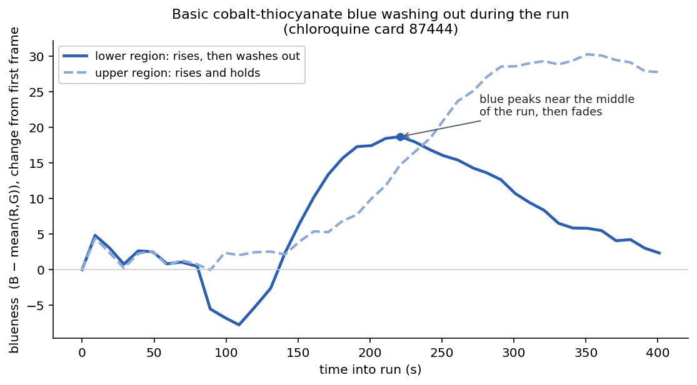

## What a paper drug test does

A paper analytical device (PAD) is a low-cost card for checking whether a pill contains the drug it should, at roughly the right amount. Twelve narrow lanes each hold a different chemical reagent. You swipe the crushed sample across the card, stand its lower edge in water, and the water rises through the paper by capillary action, carrying the sample up each lane to react with that lane's reagent and produce a color. The set of twelve colors is a barcode that a model reads to identify the drug and estimate the dose. The standard readout is one photograph, taken after the card has finished developing.

## What a single photo misses

The colors are not fixed once they appear. A reaction can keep changing while the water is still moving, and some reagents, cobalt thiocyanate among them, can produce a blue that partly washes out before the run ends. A single end-of-run photo cannot tell a color that rose and held from one that rose and then faded. Photographing the same card at a fixed interval, about every ten seconds, records the whole time course, so a change that happens partway through is no longer invisible.

## Building the capture and the analysis quickly

The capture side is a phone app that re-photographs the card on the ten-second cadence while it develops upright in a 3D-printed holder.

{width=62%}

Two parts made the analysis quick to put together, and they do different jobs. The lab's PAD data (the card database, the images, the project records, and each lane's reagent and where it is deposited) is reachable through an MCP server. (MCP, the Model Context Protocol, is an open standard that lets an AI agent connect to outside tools and data.) That is the access layer: an agent used it to find the right cards, read the lane geometry and reagents, and download the frames, then build the interactive [time-lapse viewer](https://claude.ai/code/artifact/ba5f3730-0dbb-4f74-b083-ad4b3807caa2) and measure each lane over time, with no data-handling code written ahead of time.

Access is not memory. What the project learns is kept in an LLM-wiki, a knowledge base the agent writes to and reads back, so findings and caveats (including that this azithromycin card does not wash out while chloroquine and procaine cards do) build up across sessions instead of resetting each time. The wiki is also how the work reached beyond this project: when the first color measurements depended on the lighting, the agent drew on an earlier drug-concentration project in the same group and reused its color-sampling and white-balance code. Access came through MCP; the memory, and the link to another project's methods, came through the wikis.

## What the measurement shows

Measuring the lanes over the run makes the transient visible. On a chloroquine card, part of the Basic Cobalt Thiocyanate lane develops a blue that rises to a peak partway through the run and then washes out, falling back toward its starting value by the end, while a region just above it keeps its color.

A single end-of-run photo would record only the faded lower region and the held upper one, with no sign that the lower blue had ever formed. Because the measurement is taken per lane and per region, from the layout's lane boxes on every frame, a rise-and-fade like this is captured as a shape rather than a single endpoint number.

## Scope

This is a proof of concept on a handful of cards. The lane boxes come from a fixed layout, and each card sits slightly differently under the camera, so the per-lane and per-region positions are approximate. The color that forms depends on the drug present as much as on the reagent, and the wash-out shown above is one card, not yet a characterized, repeated effect. Whether these time courses help tell one drug from another is a separate question, and careful cross-session tests on this dataset have so far come out near chance. What the work does show is a method: a way to capture a card's whole run and measure it lane by lane, including transients like the wash-out above, put together quickly from tools that already existed.

*Ekezie Okorigwe is a graduate student in the Marya Lieberman lab at the University of Notre Dame, which runs the [Paper Analytical Device (PAD) project](https://padproject.nd.edu). The card images and database come from the PAD project. An agent reached that data through the project's MCP interface and kept its analysis in the project's LLM-wiki.*
