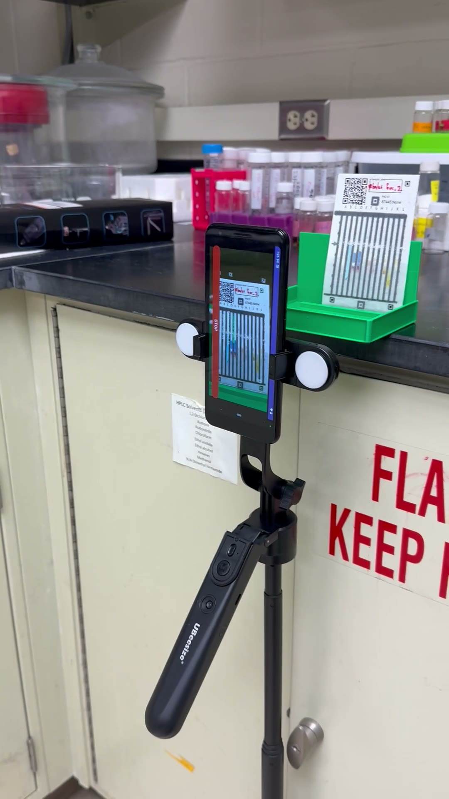

## What a paper drug test does

A paper analytical device (PAD) is a cheap way to check whether a pill is the real drug at the right dose. The card has twelve vertical lanes, each pre-loaded with a different chemical reagent. You swipe the crushed sample across the card, stand its lower edge in water, and the water climbs the paper by capillary action. As it rises it carries the drug up through each lane, where it meets that lane's reagent and reacts, producing a color. Twelve lanes give twelve colors: a **color barcode** specific to the drug and its concentration. Normally you let it finish, take one photo with a phone, rectify the image, and run a machine-learning model on the barcode to read off the drug and dose.

That single end-of-run photo throws away everything that happened on the way there.

## The kinetic idea

The reaction is not instantaneous, and it is not uniform across lanes. So instead of one photo at the end, take a series: photograph the same card on a roughly ten-second cadence and watch the barcode form. One card becomes a short movie of its own chemistry.

{width=62%}

Here is a single card sampled at four times across five minutes. You can see the wetting front climb and the lanes color up, but not all together:

Those are four frozen moments; the development reads more clearly in motion, in the [interactive time-lapse viewer](https://claude.ai/code/artifact/ba5f3730-0dbb-4f74-b083-ad4b3807caa2) an agent generated for the full runs. Some lanes color almost immediately; others are still deepening minutes later. Each lane runs on its own clock, set by its reagent chemistry and the drug it is reacting with.

## The part that made this quick: an MCP interface

None of this required building a data pipeline first. The Notre Dame PAD project exposes its card database through an **MCP interface**, so an agent can query it directly: list projects, get a card layout (the pixel geometry of all twelve lanes and which reagent is in each), pull every frame of a given card, and fetch the processed images. That is what turned a research question into something you could look at the same afternoon.

Two things came out of the same interface, with no custom code written ahead of time:

1. **A viewer, generated on demand.** Given access to the frames, an agent produced a complete [interactive time-lapse viewer](https://claude.ai/code/artifact/ba5f3730-0dbb-4f74-b083-ad4b3807caa2) with no hand-written frontend: pick a card, then play or scrub its run as the barcode forms. The interface itself was auto-generated from the shape of the data, not coded in advance. The viewer shows an early 11-card pilot (381 frames); the underlying archive keeps growing as capture continues, past a hundred cards and several thousand frames so far.
2. **A measurement.** The same MCP interface hands back the card layout, so the lane boxes are known exactly. An agent used them to measure each lane's development directly, turning "they look different" into a number.

## Measuring the rates

For one card (sample 85990, an azithromycin card, 25 frames over five minutes), each lane's color change from the dry first frame was measured across all frames, using the layout's lane boxes. Normalizing each lane to its own final color shows the shapes; the summary is the time each lane takes to reach half of its final development:

The spread is large. On this card, time-to-half-development runs from about **9 seconds to 82 seconds**, roughly a ninefold range, and it tracks which reagent is in each lane. A striking pair is the two cobalt-thiocyanate lanes, D and E: the acidic formulation reaches half-development in about 9 seconds, the basic one in about 82. Biuret and Basic Cobalt Thiocyanate are the slow pair; Acidic Cobalt Thiocyanate, Triiodide, and Phenols are among the fast ones.

The exact ordering is specific to this azithromycin card, because the color forms when the drug meets the reagent, so the rates reflect the drug as much as the reagent. What is not card-specific is the shape of the finding: the lanes run on very different clocks, which is exactly what a single end-of-run photo cannot show. Two lanes can end at the same color while getting there on completely different schedules.

## Why it matters, and what is next

If different lanes develop on different clocks, then *when* you take the reading changes the barcode, and a fixed wait is a compromise: too early for the slow lanes, needlessly late for the fast ones. A kinetic readout could in principle use each lane's rate as extra signal, or pick a per-lane sampling time, which is information a static image does not carry. Whether that actually helps *tell drugs apart* is a separate and harder question, and so far an unsettled one: on this dataset, careful cross-session tests of kinetic features for drug classification have come back close to chance. The descriptive fact is solid; its diagnostic value is not yet demonstrated.

Honest scope: this is one card, a proof of concept, and the caveats are real. The numbers quantify a single run; the metric is color change from the dry first frame, a development proxy rather than a literal capillary-front height. The lane windows come from a fixed layout, and per-card physical alignment varies by up to about a lane's width, so read the exact per-lane numbers as approximate. Some lanes also rise and then fade rather than climbing to a plateau, which a single time-to-half-of-final number does not capture. The natural next steps are to measure across many cards and drugs, correct the per-card lane alignment, and separate the wetting front from the color reaction.

The workflow point generalizes past PADs. The data sat behind an MCP interface, so an agent could discover it, build a bespoke viewer, and run a fresh quantitative analysis on demand, without anyone writing the plumbing first. The interface is what made the card database usable as a live instrument rather than a static archive.

*Ekezie Okorigwe is a graduate student in the Marya Lieberman lab at the University of Notre Dame, which runs the [Paper Analytical Device (PAD) project](https://padproject.nd.edu). The kinetic idea and the time-lapse capture are his; the card images and database come from the PAD project. The viewer and the per-lane rate analysis were generated by an agent through the project's MCP interface.*
