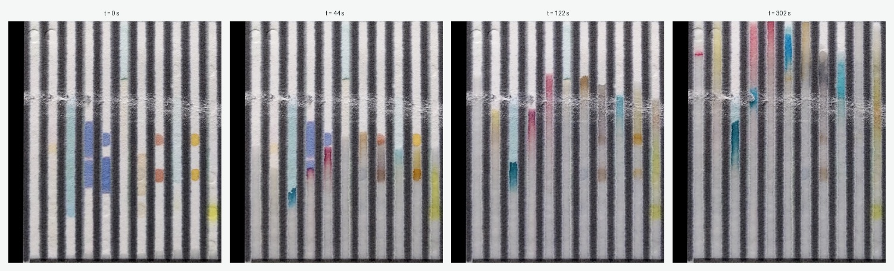
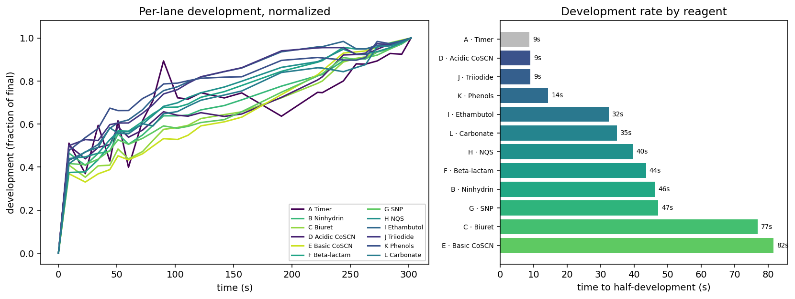

## What a paper drug test does

A paper analytical device (PAD) is a cheap way to check whether a pill is the real drug at the right dose. The card has twelve vertical lanes, each pre-loaded with a different chemical reagent. You swipe the crushed sample across the card, stand its lower edge in water, and the water climbs the paper by capillary action. As it rises it carries the drug up through each lane, where it meets that lane's reagent and reacts, producing a color. Twelve lanes give twelve colors: a **color barcode** specific to the drug and its concentration. Normally you let it finish, take one photo with a phone, rectify the image, and run a machine-learning model on the barcode to read off the drug and dose.

That single end-of-run photo throws away everything that happened on the way there.

## The kinetic idea

The reaction is not instantaneous, and it is not uniform across lanes. So instead of one photo at the end, take a series: photograph the same card on a roughly ten-second cadence and watch the barcode form. One card becomes a short movie of its own chemistry.

Here is a single card sampled at four times across five minutes. You can see the wetting front climb and the lanes color up, but not all together:

Some lanes are colored almost immediately; others are still deepening minutes later. The interesting variable is the **reagent**: each lane's chemistry has its own rate.

## The part that made this quick: an MCP interface

None of this required building a data pipeline first. The Notre Dame PAD project exposes its card database through an **MCP interface**, so an agent can query it directly: list projects, get a card layout (the pixel geometry of all twelve lanes and which reagent is in each), pull every frame of a given card, and fetch the processed images. That is what turned a research question into something you could look at the same afternoon.

Two things came out of the same interface, with no custom code written ahead of time:

1. **A viewer.** Given access to the frames, an agent generated an interactive time-lapse viewer: pick a card, then play or scrub its run. That is the qualitative tool, useful for *seeing* that lanes develop unevenly. The dataset behind it is 381 frames across 11 cards.
2. **A measurement.** The same MCP interface hands back the card layout, so the lane boxes are known exactly. An agent used them to measure each lane's development directly, turning "they look different" into a number.

## Measuring the rates

For one card (sample 85990, 25 frames over five minutes), each lane's color change from the dry first frame was measured across all frames, using the layout's lane boxes. Normalizing each lane to its own final color shows the shapes; the summary is the time each lane takes to reach half of its final development:

The spread is large and it tracks the chemistry. Time-to-half-development runs from about **9 seconds to 82 seconds**, roughly a ninefold range, set by which reagent is in the lane. The cleanest contrast is lanes D and E: **Acidic** Cobalt Thiocyanate develops in about 9 seconds, **Basic** Cobalt Thiocyanate in about 82. Same base chemistry, opposite ends of the rate scale. Biuret and Basic Cobalt Thiocyanate are the slow pair; Acidic Cobalt Thiocyanate, Triiodide, and Phenols are among the fast ones.

This is a real, interpretable signal rather than measurement noise, and it is exactly the kind of thing the single end-of-run photo cannot show. Two lanes can end at the same color while getting there on completely different clocks.

## Why it matters, and what is next

If different lanes develop on different clocks, then *when* you take the reading changes the barcode, and a fixed wait is a compromise: too early for the slow lanes, needlessly late for the fast ones. A kinetic readout could instead use each lane's rate as extra signal, or pick a per-lane sampling time, which is information a static image simply does not carry.

Honest scope: this is one card, a proof of concept. The effect has shown up across cards, but the numbers here quantify a single run, and the metric is color change from the dry baseline, a development-rate proxy rather than a literal measurement of the capillary front's height. The natural next steps are to run the same measurement across many cards and drugs to see how stable the per-reagent rates are, and to separate the wetting front from the color reaction.

The workflow point generalizes past PADs. The data sat behind an MCP interface, so an agent could discover it, build a bespoke viewer, and run a fresh quantitative analysis on demand, without anyone writing the plumbing first. The interface is what made the card database usable as a live instrument rather than a static archive.

*PAD card images and database: the Notre Dame PAD project. Kinetic idea and time-lapse capture: Ekezie Okorigwe. The viewer and the per-lane rate analysis were generated by an agent through the project's MCP interface.*
