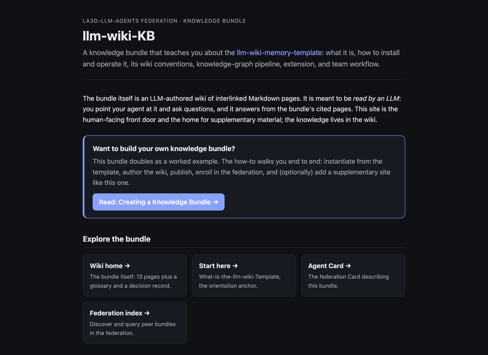

**The general idea: package knowledge for reuse.** A knowledge base has historically been trapped in a tool, a proprietary format, a specific RAG index, one vendor's platform. The move a *knowledge bundle* makes is to package curated knowledge so that any LLM or agent can consume it, with no SDK and no lock-in. This is a real industry direction, not a local coinage. In June 2026, Google Cloud published the [**Open Knowledge Format (OKF)**](https://cloud.google.com/blog/products/data-analytics/how-the-open-knowledge-format-can-improve-data-sharing/), a vendor-neutral open specification that represents knowledge as a directory of markdown files with YAML front matter (one required field, `type`), explicitly so that knowledge written by one producer can be read by a different agent. It is positioned as a portable alternative to RAG for "AI memory." In practice an OKF bundle is just a directory of markdown you could open in any editor:

```
knowledge-engineering-bundle/
├── index.md               # a catalog of the pages
├── ontologies.md          # each page: YAML front matter + prose
└── expert-systems.md
```

The relationship is worth stating carefully: OKF is the general standard, and the llm-wiki pattern this project uses is *one instance that conforms to it*, not the other way around.

**What a bundle is here.** A bundle is a wiki authored with the intent that other people consume it through their own LLMs. Bundles are wikis, but not every wiki is a bundle; the distinguishing property is intent to share and be queried by non-authors. The point is that a bundle ships *compiled competence*, not just searchable content: a student opens a query session against a bundle on knowledge engineering and gets the group's accumulated judgment, not a reading list. Bundles come in two shapes: a *reference* bundle uses a neutral retrieve-synthesize-cite protocol; a *pedagogical* bundle ships a Socratic or worked-example protocol embedded in its own content, so the teaching travels with the material.

Because a bundle is just a git repo of markdown plus its graph, it is portable, and OKF import and export is on the roadmap so bundles interoperate with the wider open-knowledge world rather than living in a walled garden. Your memory is yours, and it moves.

**A real example: `llm-wiki-KB`.** Our own reference bundle, [llm-wiki-KB](https://la3d-llm-agents.github.io/llm-wiki-KB/), takes the template itself as its topic. It is an LLM-authored wiki you point an agent at and ask; the page below is its human-facing front door and the home for supplementary material, while the knowledge lives in the wiki behind it.



## Related

- [Agent federation](../agent-federation/), how a bundle gets discovered and queried across groups.
- [Our recipe: a collaborative llm-wiki](../our-collaborative-recipe/), what a bundle is made of.
- [A marketplace for tools](../marketplace/), the sibling distribution channel for tools.

## Sources

- [Google Cloud: the Open Knowledge Format](https://cloud.google.com/blog/products/data-analytics/how-the-open-knowledge-format-can-improve-data-sharing/), the OKF spec announcement (June 2026).
- [Google Cloud announces the Open Knowledge Format (Search Engine Journal)](https://www.searchenginejournal.com/google-cloud-announces-the-open-knowledge-format/579253/), independent coverage.
