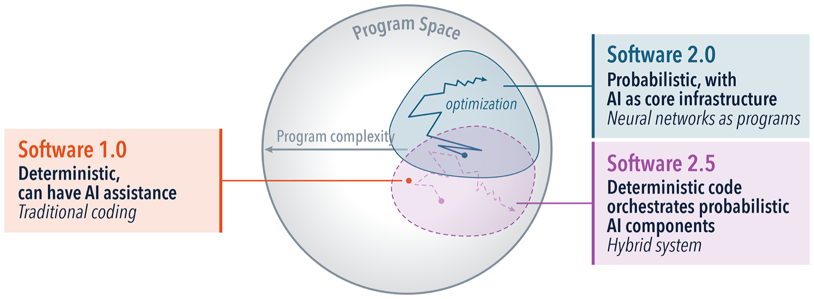
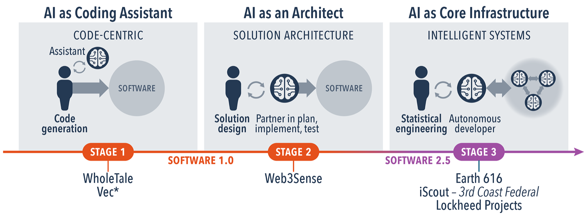

::: {.callout-note title="Developing with stochastic models: a series"}
1. **Software 2.5** *(this post)*. The shift from deterministic to stochastic development, and the three problems it creates.
2. [Where harnesses overlap](https://la3d.github.io/WGRA/blog/posts/where-harnesses-overlap/). One architecture, four harnesses; the surfaces converged, the wiring did not.
3. [One run is one sample](https://la3d.github.io/WGRA/blog/posts/one-run-one-sample/). Measuring stability: why a single measurement misleads.
4. [The variance cascade](https://la3d.github.io/WGRA/blog/posts/variance-cascade/). How uncertainty compounds through a chain of agents.
5. [0.988 is not a win](https://la3d.github.io/WGRA/blog/posts/deciding-not-guessing/). Deciding under noise: the Bayesian layer.
:::

Most software advice rests on an assumption so basic that nobody states it: a program, given the same input, returns the same output. Debugging depends on it. Unit tests depend on it. The whole idea of "correct" depends on it. Build a system on large language models and that assumption quietly stops holding, and a lot of hard-won engineering instinct stops working with it.

## Three kinds of software

It helps to name where the determinism went.

**Software 1.0** is code you write. It executes the same way every time. An AI assistant can help you write it, and the shipped program still runs without the AI and behaves identically on every call. This is almost all software ever written.

**Software 2.0**, in Andrej Karpathy's framing, is the case where the program *is* a neural network. You do not write the logic; you specify behavior with data, and the trained weights are the code. The artifact is probabilistic, but it usually sits behind a deterministic boundary (a classifier returns a label, a model returns a fixed embedding).

**Software 2.5** is the one most teams building with LLMs actually inhabit, and the one this series is about: deterministic code orchestrating probabilistic components. The loop, the tool wiring, the pipeline structure are all ordinary code. The pieces that code calls, the model, the agent, the chain of agents, are not. The scaffolding is deterministic; what runs inside it is a distribution.

That mix is the whole problem. In Software 1.0 the stochastic parts were walled off. In 2.5 they are load-bearing components of the running system, and the determinism you relied on is gone from the middle of your program.

## Where the wall is

The skills that made someone good at Software 1.0 do not merely get harder in 2.5. Some of them stop applying.

- "Does it work?" becomes "How often does it work?"
- "Fix the bug" becomes "Reduce the variance."
- "Write a unit test with a fixed expected output" becomes "Check that the output distribution stays inside acceptable bounds."
- "The output is correct" becomes "Correctness is a rate, not a boolean."

None of that is philosophical. In one experiment, Priscila Moreira ran four versions of a knowledge-graph extraction pipeline over the same scanned documents, five runs per version, and counted the relationships each produced:

| version | avg relationships | std dev |
|---|---|---|
| v0 | 11.6 | 12.52 |
| v1 | 7.6 | 15.37 |
| v2 | 20.0 | 13.36 |
| v3 | 10.2 | 0.84 |

Read that the way a Software 1.0 engineer would and you conclude "v2 is best, it produces the most relationships." But v2's standard deviation is 13.36 on a mean of 20, so a single run could hand you anywhere from about 7 to 33 relationships. The one number you happened to see tells you very little. In deterministic software a spread like that would read as "broken." Here it is just what the system is, and "v2 is best" is a claim the data does not actually support. The interesting version might be v3, which produces fewer relationships but is the only one that produces about the same number twice.

That is the shift in one table: the output is a distribution, a single run is one draw from it, and the questions worth asking are statistical. It is a move from software engineering to what is really **statistical engineering**, building systems that are robust to randomness rather than free of it.

## The three problems, and the rest of this series

Once you accept that the output is a distribution, three specific problems show up, and each one is a post in this series.

**Measuring stability.** When every run is different, how do you even know whether your system is consistent, let alone whether a change improved it? A single run cannot tell a real difference from run-to-run noise, and the noise is larger and stranger than people expect. That is *[One run is one sample](https://la3d.github.io/WGRA/blog/posts/one-run-one-sample/)*.

**Propagating uncertainty.** Real systems are chains: one agent's output feeds the next. The randomness does not just add up as you go, it compounds, and correlations between stages can amplify it or, sometimes, cancel it. Reasoning about a chain's reliability from its parts is harder than it looks. That is the forthcoming *Variance cascade*.

**Deciding under noise.** When outputs keep changing, how do you know an iterative process has settled? When one configuration scores higher than another, how do you know the difference is real rather than a lucky run? Answering that needs a posterior and a decision rule, not a score comparison. That is *[0.988 is not a win](https://la3d.github.io/WGRA/blog/posts/deciding-not-guessing/)*.

There is one more piece underneath all three. Even the *same* model behaves differently depending on the harness wrapped around it, which is often where the variability starts. That is *[Where harnesses overlap](https://la3d.github.io/WGRA/blog/posts/where-harnesses-overlap/)*.

## Why this is a team problem, not a reading list

The developer's own role shifts along the same axis: from prompting an assistant inside an editor, to designing solutions with the model as a partner, to orchestrating autonomous components in production. By that last stage the work is closer to statistical engineering than to traditional coding.

It would be convenient if a programmer could pick up variance propagation and convergence diagnostics from a weekend of tutorials. They cannot, any more than a statistician picks up production systems that way. This is a staffing and training question, not something to expect people to self-teach while shipping. The practical version is to put statisticians and data scientists inside the engineering team as first-class members, pair them with the programmers, and change what counts as success from "features shipped" to "reliability under uncertainty." The rest of the series is the concrete tools; this is the reason to invest in them.
