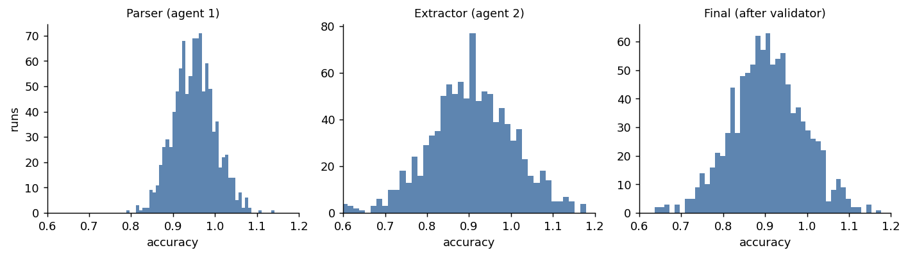

::: {.callout-note title="Developing with stochastic models: a series"}
1. [Software 2.5](https://la3d.github.io/WGRA/blog/posts/software-2-5/). The shift from deterministic to stochastic development, and the three problems it creates.
2. [Where harnesses overlap](https://la3d.github.io/WGRA/blog/posts/where-harnesses-overlap/). One architecture, four harnesses; the surfaces converged, the wiring did not.
3. [One run is one sample](https://la3d.github.io/WGRA/blog/posts/one-run-one-sample/). Measuring stability: why a single measurement misleads.
4. **The variance cascade** *(this post)*. How uncertainty compounds through a chain of agents.
5. [0.988 is not a win](https://la3d.github.io/WGRA/blog/posts/deciding-not-guessing/). Deciding under noise: the Bayesian layer.
:::

The previous post was about a single stochastic step and how much its output wobbles from run to run. Real systems are rarely a single step. They are chains: a parser feeds an extractor, which feeds a validator; a query generator feeds a query executor. The question this post is about is what happens to the uncertainty as it moves down the chain, and the short answer is that it does not behave the way most engineers expect.

## Reliability multiplies, it does not average

Start with a real pipeline. Priscila Moreira measured a two-stage SPARQL system that turns a natural-language question into a query and then runs it. Over 35 questions:

- **Stage 1, query generation:** a query was produced for 28 of 35 questions, an 80% success rate.
- **Stage 2, execution given a query:** of those 28, only 5 returned results, a 17.9% success rate.
- **End to end:** 5 of 35, or 14.3%.

The end-to-end number is not the average of 80% and 17.9%, and it is not the smaller of the two. It is close to their product (0.80 times 0.179 is 0.143). Success in a chain multiplies, so each additional stage can only hold or lower the reliability of the ones before it. A programmer looking at either stage alone would form a much rosier picture than the pipeline actually delivers, and a single end-to-end run, landing on a yes or a no, tells you even less than a single run of one stage does.

That is the failure-rate version. The variance version is subtler, and more surprising.

## The cross-term intuition drops

For a chain whose stages carry noise, the variance of the combined output is not the sum of the stages' variances. For two stages it is

```
Var(a + b) = Var(a) + Var(b) + 2 Cov(a, b)
```

The first two terms are what people add up in their heads. The third, the covariance, is the one that gets dropped, and it is often the one that dominates. If two stages fail in correlated ways, it makes the total worse than the sum. If a later stage is anti-correlated with an earlier one, because it is built to catch that stage's mistakes, it can make the total better than either stage alone. Intuition has no reliable sign for that term, which is why chains surprise people.

## A three-agent chain, simulated

Here is a small chain that makes the effect concrete: a parser (95% accurate, some noise), an extractor whose errors are mildly correlated with the parser's, and a validator that is anti-correlated with the extractor because its job is to catch extraction mistakes. Running the chain 1000 times gives a distribution at each stage (numbers are from a reproducible simulation, seed fixed):



The variances tell the story the histograms only hint at:

| stage | variance | std |
|---|---|---|
| parser (agent 1) | 0.0024 | ~5% |
| extractor (agent 2) | 0.0100 | ~10% |
| final (after validator) | 0.0073 | ~8.5% |

Three things fall out of this, and none of them is the naive answer:

1. **The chain is about three times noisier than its first agent** (final variance 0.0073 versus the parser's 0.0024). Uncertainty amplified as it flowed downstream.
2. **The chain is also less variable than its worst agent.** The final variance (0.0073) is about 28% below the extractor's (0.0100), because the validator is anti-correlated with it and cancels some of its noise. A well-placed stage can *reduce* downstream variance, not just pass it along.
3. **The naive estimate is badly wrong in the other direction.** Adding the stage variances (0.0134) overestimates the real final variance by about 46%, because it ignores every correlation. Someone reasoning "5% plus 10% plus 3%" would be confidently off.

So the same chain is both an amplifier (3x the first stage) and a dampener (below the worst stage), depending on which comparison you make, and the plain sum of variances matches none of it. The sign and size of the effect live entirely in the correlations between stages, which you cannot read off the individual agents.

## The tool is Monte Carlo, not algebra

The practical consequence is that you do not compute a chain's reliability, you measure it. Run the whole pipeline many times on the same inputs and look at the distribution of the end-to-end result. That is the only way the correlations, which are where the action is, actually show up. Two things follow once you do:

- **Where you spend to reduce variance is not obvious.** In the example above, tightening the extractor helps, but adding a stage that is anti-correlated with the extractor helped more, and cost less. A variance decomposition (which stage contributes most to the end-to-end spread) tells you where to spend; the per-stage error rates do not.
- **You have to measure end to end.** Per-stage numbers, however good, do not compose into the pipeline's behavior. The 80% and the 17.9% were both real, and neither predicted the 14.3%.

## Where this sits in the series

This is the second of the three problems the [opener](https://la3d.github.io/WGRA/blog/posts/software-2-5/) named. The [first](https://la3d.github.io/WGRA/blog/posts/one-run-one-sample/) was measuring stability in a single step; this one is what happens when steps are chained; the [third](https://la3d.github.io/WGRA/blog/posts/deciding-not-guessing/) is deciding, under all this noise, whether a change actually helped. The common thread is the same as the rest of the series: the output is a distribution, a single run is one draw, and the questions worth asking are statistical.

*The SPARQL pipeline measurements are Priscila Moreira's. The three-agent chain is a reproducible simulation.*
