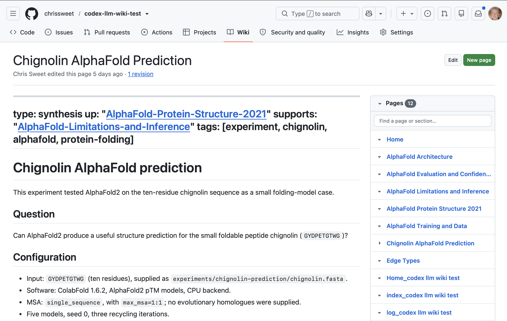
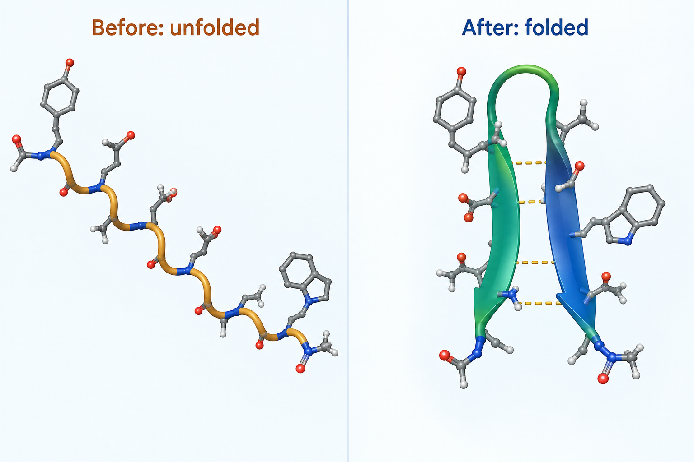

## The bottleneck moved {.smaller}

[The problem with a fast, plausible collaborator]{.kicker}

Research is a loop: hypothesize, write the code, analyze, test, revise, and go round again. Producing each result used to be the slow part.

AI now appears to remove that bottleneck. It writes complex code, carries a vast working knowledge of statistics and analysis methods, and returns test results ready to present.

::: {.callout-highlight}
So the bottleneck of research is no longer producing results. It is knowing which results deserve belief.
:::

**Plausibility is the enemy.** From our own project record, the AI describing its own failure, verbatim:

::: {.ed-quote}
"The worst failure of this project: I built a tractable proxy instead of the user's hypothesis, and let loose language hide the substitution."
[Lessons-Learned.md, project wiki, 2026-08-19, recorded by the AI and found on query]{.src}
:::

Nothing was wrong with the output. It ran, it passed, it read well. It just was not the thing we set out to know. We only caught it because the AI had written the failure into a durable memory we could go back and read.

::: {.ed-tip}
**Tip 1.** Have the LLM record what it learns into a durable memory you keep and can read back, not a chat window that vanishes. The quote above is from ours.
:::

::: {.notes}
Open cold with the quote if comfortable. Land in the first minute: this failure was caught, recorded by the AI in its own words, and became a rule. End on the memory seed: we only know about it because it was written into a durable memory we could query, which is exactly what the rest of the deck builds. The talk is about the machinery that makes that the normal outcome, not a lucky catch. Do not name the domain yet; the problem is universal.
:::

## What epistemic discipline is {.smaller}

[Habits you already have, that AI speed breaks]{.kicker}

:::: {.columns}

::: {.column width="50%"}
**Epistemic discipline** turns a produced result into something you actually *know*: justified, not merely generated. In practice, a few rules about what must be recorded, and carried with the claim, before it enters the record.

You already practice this. Each one is a standard scientific habit.
:::

::: {.column width="50%"}

```{=html}
<table class="ed-req"><thead><tr><th>The habit</th><th>What you already call it</th></tr></thead><tbody><tr><td><span class="req">Provenance.</span> a claim carries where it came from, and its scope</td><td class="prac">citation</td></tr><tr><td><span class="req">Durable memory.</span> what was tried, decided, and abandoned is written down</td><td class="prac">a lab notebook</td></tr><tr><td><span class="req">Pre-commitment.</span> targets declared before the data arrives</td><td class="prac">pre-registration</td></tr></tbody></table>
```

:::

::::

```{=html}
<div class="ed-probs-h">Why it breaks with AI</div>
<div class="ed-probs">
<div class="ed-prob">The habits live in your head and in a chat window that vanishes when the session ends. At AI speed they are the first thing skipped: when a result arrives in minutes, the provenance and the notes are what get dropped.</div>
<div class="ed-prob">And AI discards and regenerates work at each step, instead of a small, preserving <em>epsilon</em> step that keeps what was already verified.<div class="ex"><b>Seen here:</b> asked to consolidate three reports into one paper, it regenerated rather than preserved, and the draft did not even describe the framework the reports exist to present. Filed as a dead end.</div></div>
</div>
```

::: {.callout-highlight}
So stop *remembering* the discipline. Its key element is <span style="color:#b8860b; font-weight:800; font-size:1.15em">memory</span>: move the provenance and the notes out of your head into an artifact the AI writes and you read. Get the memory right and the discipline holds.
:::

::: {.notes}
This is the motivation slide; its job is to hand off to the wiki. The claim is not that AI needs a new epistemology; it is that AI-speed research needs the old habits moved out of your head, because no one, human or AI, keeps habits at that pace. Dropped the fourth "witnessed failure / positive control" leg on purpose: it is testing vocabulary and points at gates, not the durable memory this talk builds. Surviving example source: consolidation regenerated and lost the framework the reports exist to present (Capabilities-Ledger dead ends). The next slides name that artifact, an llm-wiki, and build one live in Codex.
:::

## What kind of memory? {.smaller}

[Five kinds, only one is durable and yours to read]{.kicker}

An agent has several memories. Most are frozen, optional, scoped, or temporary. The question that matters: which one still holds your project's knowledge after the session ends?

```{=html}
<table class="ed-req"><thead><tr><th>The memory</th><th>What it is</th><th>How long it lasts</th></tr></thead><tbody><tr><td><span class="req">Embedded</span> (training)</td><td>the model's learned world knowledge</td><td class="prac">frozen at the cutoff</td></tr><tr><td><span class="req">Local memories</span></td><td>optional machine-local cross-session store (Codex <code>/memories</code>)</td><td class="prac">off by default, empty here</td></tr><tr><td><span class="req">AGENTS.md</span></td><td>scoped instructions, loaded per folder at startup</td><td class="prac">rules, not a knowledge base</td></tr><tr><td><span class="req">Session context</span></td><td>the live conversation and tool results</td><td class="prac">gone when the session ends</td></tr><tr><td><span class="req">llm-wiki</span></td><td>pages the agent writes and you read, in git</td><td class="prac">durable, versioned, yours</td></tr></tbody></table>
```

```{=html}
<div class="ed-probs"><div class="ed-prob"><b>And local memories are not yours to control.</b> The agent decides whether to write one, and can overwrite or delete it. There is no version history and no backup: if a memory is lost or silently changed, you cannot see what happened or roll it back.</div></div>
```

::: {.callout-highlight}
Only the **llm-wiki** is durable *and under your control*: the agent writes it, you read it, and it lives in git, so every change is visible, reviewable, and reversible.
:::

::: {.notes}
Kinds of memory, verified on 2026-09-19 by asking the running Codex session, which inspected its own machine: embedded/parametric in the weights; a local cross-session memory feature (`~/.codex/memories_1.sqlite`, `/memories`) that exists but was empty here and is NOT a universal global memory; `AGENTS.md` scoped instructions loaded global-to-cwd at startup (none in this project); the session context window, bounded and lost after the session; and the llm-wiki, a separate human-readable git repo the agent reads and writes. The control point is the crux: local memories are agent-generated (Codex `memories.generate_memories` / `use_memories`), unversioned, and overwritable, so there is no audit trail or backup; the llm-wiki is git-backed, so writes are explicit, reviewable, and reversible. Do not call the local-memory feature "global." Next slide defines the llm-wiki.
:::

## What an llm-wiki is {.smaller}

[The memory the LLM writes and you read]{.kicker}

:::: {.columns}

::: {.column width="60%"}
- **Proposed by Andrej Karpathy** (OpenAI founding member, former director of AI at Tesla)**:** dense, interlinked wiki pages as a **persistent memory the LLM authors and maintains**, kept as plain Markdown in version control.
- **A read-write loop that compounds.** The LLM **reads the wiki at the start of a session to recall** where things stand, and **writes back at the end to remember** what it learned. Each session builds on the last instead of starting cold.
- **Auditable by you.** Because it is Markdown in git, you can read exactly what the agent knows and see every change it makes.
- **Portable as a knowledge bundle:** you can share the whole knowledge base and another person's LLM can read it.
:::

::: {.column width="40%"}
::: {.ed-tip}
**Trusted AI.** The human stays in the loop: audit what the agent knows and check any claim at its source. When something is wrong, you catch it and direct the fix, which the agent makes and logs. Accountable and explainable, the trust our group builds toward, not a black box.
:::
:::

::::

::: {.callout-highlight}
A persistent, compounding project memory the LLM writes and you read, not retrieval re-run from scratch on every question.
:::

::: {.notes}
Zoom into the winner from the memory ladder; do not re-argue the contrast, slide 3 did that. Three beats: (1) the definition and Karpathy provenance; (2) the read-write loop that compounds, read to recall at session start, write to remember at the end; (3) it is plain Markdown in git, so it is auditable and correctable. The one contrast worth keeping is "not RAG re-run per question." Framing from llm-wiki.md (persistent, compounding artifact the LLM owns and writes, you read). Next: build one live in Codex.
:::


## How to build an llm-wiki with Codex {.smaller}

[The tutorial, run with students on 2026-09-15]{.kicker}

:::: {.columns}

::: {.column width="40%"}
llm-wiki is a Gist from Andrej Karpathy, an idea rather than an implementation. Our implementation assumes the following:

- We assume **project-based** work, so there is a base GitHub repo for code, data, and artifacts.
- By default we create the wiki as a **GitHub wiki**, a special repository GitHub uses for its wiki functionality, so you can view it in the online GitHub interface, shown here.
- Other wiki destinations are available.

::: {.ed-tip}
The next slides walk the whole process, built live in Codex: install, initialize, ingest a paper, run a real prediction, and record it as a durable wiki page.
:::
:::

::: {.column width="60%"}

<span class="ed-cap">github.com/chrissweet/codex-llm-wiki-test/wiki</span>
:::

::::

::: {.notes}
Transition. The rest is not slides, it is the thing itself. If running live is risky, these are captured screenshots of the same session. Keep it moving; the payoff slide (does it work) comes right after.
:::

## Demo 1: install the plugin, make the repo {.smaller}

[One marketplace, two commands]{.kicker}

Our implementation of llm-wiki provides our own **marketplace**, a storefront for plugins, and we have versions for the AI harnesses Codex, Claude, and Cursor.

Install the plugin from the LA3D marketplace:

```{=html}
<div class="ed-term"><div><span class="cmd">$ codex plugin marketplace add LA3D-LLM-Agents/llm-wiki-colab</span></div><div><span class="pass">Marketplace `llm-wiki-colab` added.</span></div><div><span class="cmd">$ codex plugin add llm-wiki@llm-wiki-colab</span></div><div><span class="pass">Added plugin `llm-wiki` from marketplace `llm-wiki-colab` (0.4.0).</span></div></div>
```

Codex loads plugins at startup, so **exit and restart Codex**, and **accept the plugin's hooks** when prompted. Then create the project repo:

```{=html}
<div class="ed-term"><div><span class="cmd">$ gh repo create chrissweet/codex-llm-wiki-test --public</span></div><div><span class="pass">✓ Created repository chrissweet/codex-llm-wiki-test on GitHub</span></div></div>
```

::: {.ed-tip}
**Same wiki, any harness.** The identical plugin installs in Claude Code (`/plugin marketplace add`, `/plugin install`), Codex (`codex plugin marketplace add`, `codex plugin add`), and Cursor (`cursor-agent plugin marketplace add`).
:::

::: {.notes}
The marketplace is the LA3D-LLM-Agents/llm-wiki-colab repo; the plugin is llm-wiki. Restart and the hook-trust prompt are the two Codex-specific gotchas. The empty repo is where the wiki will attach.
:::

## Demo 2: initialize the wiki {.smaller}

[wiki-init, GitHub-backed]{.kicker}

Run the init skill and choose GitHub:

```{=html}
<div class="ed-term"><div><span class="cmd">$ $llm-wiki:wiki-init</span></div><div><span class="rev">? storage backend &rarr;</span> <span class="mut">GitHub</span></div><div><span class="cmd">$ bash "$SKILL_DIRECTORY/scripts/init-wiki.sh" --github --agent "codex"</span></div><div><span class="pass">created .llm-wiki/  (own git repo, attached to the wiki remote)</span></div></div>
```

It scaffolds `.llm-wiki/` as its own git repository, attaches it to the repository's GitHub wiki remote, and writes the SCHEMA plus navigation pages. Result: a blank llm-wiki, ready to push.

Those pages make the wiki self-describing:

- **SCHEMA**: the conventions, page format, required frontmatter, and the typed links between pages.
- **index**: the catalog of every page, the wiki's table of contents.
- **log**: the append-only, dated record of what was done, by who and using which agent.

Each is namespaced to the project (`index_codex-llm-wiki-test`, `SCHEMA_codex-llm-wiki-test`, `log_codex-llm-wiki-test`), so pages stay unambiguous when wikis are shared or merged.

::: {.callout-highlight}
The wiki is a separate repo from your code. Code and artifacts live in the project; durable knowledge lives in `.llm-wiki/`.
:::

::: {.notes}
If GitHub reports the wiki is unavailable, enable the repo wiki and create its first page, then rerun init. Show the two-history point: git -C .llm-wiki log is separate from the code repo.
:::

## Demo 3: ingest the AlphaFold paper {.smaller}

[wiki-source: one paper, five pages]{.kicker}

**Ingest** turns an external source into wiki pages: the agent reads it and writes summarized, linked, cited pages. **AlphaFold** is DeepMind's protein-structure predictor; our source is its 2021 Nature paper.

:::: {.columns}

::: {.column width="52%"}
```{=html}
<div class="ed-term"><div><span class="cmd">ingest paper AlphaFold-Protein-Structure-2021.pdf</span></div><div><span class="pass">+ source summary + 4 concept pages</span></div></div>
```

Plain language is enough: asking to *ingest* makes Codex call the `$llm-wiki:wiki-source` skill.

One ingest produced a **source summary** plus four linked concept pages:

- **Architecture** — Evoformer and structure module.
- **Training and data** — datasets and training cutoff.
- **Evaluation and confidence** — the pLDDT and pTM metrics.
- **Limitations and inference** — where it is unreliable.
- All **cross-linked wiki style**, with links typed where the relationship is clear.
:::

::: {.column width="48%"}
::: {.ed-tip}
**Pages, not chunks.** Preserve what a future reader needs: dataset scope, training cutoffs, named methods, exact metrics, confidence intervals, limitations. A number without a source page does not exist for the project.
:::

::: {.callout-highlight}
The ingested pages integrate into the existing wiki: related pages are updated, any contradiction with what the wiki already claims is reconciled, and back-references are fixed both ways. The ingest is recorded in the index and log, then a verification gate checks every page for unsupported claims and missing provenance before it is committed.
:::
:::

::::

::: {.notes}
For a PDF, the PDF skill extracts text and figures. The pattern: capture detail a future session will need, so the wiki answers without re-reading the paper.
:::

## Demo 4: run AlphaFold on chignolin {.smaller}

[A ten-residue mini-protein: GYDPETGTWG]{.kicker}

The power of AI removes friction and accelerates understanding. Just from the paper, I can test the ideas by getting Codex to find the code repository, install the software, and run it locally without intervention. In this demonstration I asked it to find a small molecule (it suggested chignolin) and get it to fold it.

:::: {.columns}

::: {.column width="56%"}
ColabFold 1.6.2, AlphaFold2 pTM, single-sequence MSA, five models, seed 0, three recycles, CPU.

```{=html}
<div class="ed-term"><div><span class="cmd">JAX_PLATFORMS=cpu colabfold_batch chignolin.fasta results/</span></div><div><span class="cmd">  --msa-mode single_sequence --model-type alphafold2_ptm</span></div><div><span class="cmd">  --num-models 5 --num-recycle 3 --random-seed 0 --max-msa 1:1</span></div><div><span class="pass">ranked PDB + pLDDT/PAE plots + run log</span></div></div>
```
:::

::: {.column width="44%"}
```{=html}
<table class="ed-mini"><thead><tr><th>Output</th><th>Value</th></tr></thead><tbody><tr><td>Mean pLDDT (10 res)</td><td>93.4</td></tr><tr><td>pTM</td><td>0.06</td></tr><tr><td>Max aligned error</td><td>5.35 &Aring;</td></tr></tbody></table>
```
:::

::::

::: {.callout-highlight}
High pLDDT is confident local geometry; pTM 0.06 is poor global-fold confidence, expected here because a single-sequence MSA gives AlphaFold no evolutionary signal. These are model outputs, not experimental validation.
:::

::: {.ed-tip}
**Experiment skill.** The llm-wiki plugin includes an Experiment skill that documents an activity like this as a scientific experiment. It is called silently when a run produces results worth keeping.
:::

::: {.notes}
Chignolin is small and fast, with a known beta-hairpin folded state. The test is structure prediction, not folding kinetics or a free-energy landscape. The honest caveat on pTM is the point: the wiki records the metric and its limit together.

Exact run (for Q&A). Full command: `MPLCONFIGDIR=/tmp/chignolin-mpl JAX_PLATFORMS=cpu .venv-colabfold/bin/colabfold_batch experiments/chignolin-prediction/chignolin.fasta experiments/chignolin-prediction/results --msa-mode single_sequence --model-type alphafold2_ptm --num-models 5 --num-recycle 3 --random-seed 0 --max-msa 1:1 --data .cache-colabfold`. Input FASTA: `>chignolin / GYDPETGTWG`. Inspect the outputs with `find experiments/chignolin-prediction/results -maxdepth 2 -type f -print | sort`, then a small `python3` json reader over `*scores*.json` / `*rank_001*.json` for `ptm`, `iptm`, `mean_plddt`, `max_pae`. Measured: mean pLDDT 93.4, pTM 0.06, max PAE 5.34765625 Angstrom. Outputs in `experiments/chignolin-prediction/results/`.
:::

## Demo 5: the result becomes a wiki page {.smaller}

[Run in, durable page out]{.kicker}

:::: {.columns}

::: {.column width="42%"}


One plain-language line produced the figure:

> *can you generate a pre and post image for the molecule?*

Codex used its built-in image tool to make this unfolded &rarr; folded illustration of chignolin.
:::

::: {.column width="58%"}
`$llm-wiki:wiki-experiment` filed **Chignolin-AlphaFold-Prediction**. The skill:

- captures the **configuration and metrics**: parameters, seeds, dataset, headline numbers;
- keeps the **interpretation limits with the numbers**, filing results honestly;
- notes **what changed** vs. a previous run, and anything surprising;
- records **provenance**: links to the results directory and the commit;
- **integrates** with related pages and reconciles contradictions;
- updates the **index and log**, runs the **verification gate**, then commits.

::: {.ed-tip}
**Live page:** `github.com/chrissweet/codex-llm-wiki-test/wiki`
:::
:::

::::

::: {.notes}
End of demo. The run, its numbers, and its images are now one linked, queryable page, not scattered files that vanish when the session ends. Hand to the payoff: does this memory actually work?

The before/after image is an AI-generated illustration: asked to "generate a pre and post image for the molecule," Codex used its image-generation tool to make a side-by-side unfolded/folded depiction of chignolin (beta-hairpin), saved to experiments/chignolin-prediction/chignolin-before-after.png. It is explicitly not a measured folding trajectory, an MD result, or a rendering of the AlphaFold PDB.
:::

## More skills: maintain, share, consult {.smaller}

[Beyond building the wiki]{.kicker}

Building the wiki is the start. Three more skills keep it healthy and connect it to other projects:

- **`wiki-lint`** — a health check over the wiki: finds orphan pages, dead links, stale claims, missing frontmatter, and one-way cross-references, then offers fixes. Keeps the compounding memory honest as it grows.
- **`wiki-enroll`** — publishes an agent Card and a discovery topic so this wiki becomes findable by peer llm-wiki agents in the federation.
- **`wiki-ask`** — consults another project's wiki via the *ask* primitive: it clones that agent's wiki and queries it, so you draw on another project's durable memory without leaving your session.

::: {.callout-highlight}
One wiki you maintain (lint), publish (enroll), and query across (ask): durable memory that compounds and connects.
:::

::: {.notes}
These round out the toolkit. wiki-lint is the periodic health pass (orphans, dead links, stale claims, missing back-references, run every several sessions or after a big ingest). wiki-enroll makes the repo discoverable in the LA3D federation by writing a Card and adding the nd-llm-wiki topic. wiki-ask is the federation consumer: clone-and-invoke another agent's wiki to answer a question from its memory, direct mode (name the agent) or discovery mode (pick from candidates). Not covered here: message/post async modes are not part of ask.
:::

## Turning results into knowledge {.smaller}

[The discipline, made concrete]{.kicker}

```{=html}
<style>
.reveal .ctl-box { background:#14213d; color:#fff; border-radius:6px; padding:0.5em 0.65em; height:100%; box-sizing:border-box; font-family:"Helvetica Neue",Arial,sans-serif; }
.reveal .ctl-box strong { display:block; color:#d4a835; font-size:0.86em; margin-bottom:0.25em; }
.reveal .ctl-box span { color:#cdd6e0; font-size:0.74em; line-height:1.32; }
.reveal .ed-flow { display:flex; align-items:stretch; gap:0.3em; margin:0.5em 0 0.35em; }
.reveal .ed-flow .step { flex:1; background:#f4f1ea; border:1px solid #d8cfb6; border-top:3px solid #b8860b; border-radius:6px; padding:0.4em 0.5em; font-size:0.74em; line-height:1.3; text-align:left; }
.reveal .ed-flow .step b { display:block; color:#14213d; font-size:1.05em; margin-bottom:0.15em; }
.reveal .ed-flow .step span { color:#5a4a4a; }
.reveal .ed-flow .arrow { align-self:center; color:#b8860b; font-weight:800; font-size:1em; }
.reveal .ctl-row { display:flex; gap:0.4em; align-items:stretch; margin-top:0.35em; }
.reveal .ctl-row .ctl-box { flex:1; height:auto; }
</style>
```

Trustworthy results are not automatic enforcement; they come from encoded discipline the agent follows, plus reminders, run by the harness:

```{=html}
<div class="ctl-row"><div class="ctl-box"><strong>1 &middot; Real-output guidance</strong><span>use real outputs; scope every number to its corpus; report failures truthfully</span></div><div class="ctl-box"><strong>2 &middot; Verification gate</strong><span>before committing, the agent re-reads each page against a checklist and fixes failures</span></div><div class="ctl-box"><strong>3 &middot; Discipline gates</strong><span>a named list of always-wrong shortcuts the agent must reject</span></div><div class="ctl-box"><strong>4 &middot; Advisory hooks</strong><span>session-start and post-edit hooks inject context and reminders; the gate does the content check</span></div></div>
```

**How it runs, one loop:**

```{=html}
<div class="ed-flow"><div class="step"><b>1 &middot; Session start</b><span>a hook loads the guidance + the wiki's index and recent log into the agent</span></div><div class="arrow">&rarr;</div><div class="step"><b>2 &middot; Work</b><span>skills carry the read and write procedures for pages</span></div><div class="arrow">&rarr;</div><div class="step"><b>3 &middot; After an edit</b><span>a hook reminds; the agent runs the gate and fixes failures</span></div><div class="arrow">&rarr;</div><div class="step"><b>4 &middot; Commit</b><span>to git; plain Markdown, so every step is auditable</span></div></div>
```

*A chat app runs none of this loop, which is why we build in Codex and Claude Code.*

::: {.notes}
Corrected against Codex for accuracy on both harnesses: these are agent-followed discipline plus advisory reminders, not automated blocking. Box 1 guidance lives in the plugin (`core/templates/guidance.md`, `core/agents/discipline-gates.md`, skill instructions), injected at session start. Box 2 verification gate is an agent-run pre-commit checklist (`core/agents/verification-gate.md`): re-read each page, apply the criteria, fix, then commit, not an automatic blocker. Box 3 discipline-gates names the "Universal Rationalizations (Always Wrong)". Box 4: the PostToolUse hook is advisory and exits 0, it does not inspect content or block writes, it only reminds the agent to run the gate; headless `codex exec` runs no hooks and is a separate mode. This slide is the payoff of the epistemic-discipline setup on "What epistemic discipline is", and it precedes the measurement so the zero fabrications arrives already explained.
:::

## Does the memory actually work? {.smaller}

[A first controlled measurement, on a real research project]{.kicker}

Forty questions on one real project. Reading the llm-wiki answered **90% correctly and fabricated nothing**, roughly double RAG's 42% (10 fabrications); the model with no context scored 2%.

:::: {.columns}

::: {.column width="55%"}
| Approach | Correct | Overall (0-3) | Fabricated |
|---|---|---|---|
| Model alone, no context | 2% | 0.10 | 2 |
| Plain RAG over the sources | 42% | 1.32 | 10 |
| **llm-wiki read path** | **90%** | **2.65** | **0** |
:::

::: {.column width="45%" .rag-stats}
<div class="stat-big">90%</div>
<div class="stat-caption">correct, versus 42% for RAG. Roughly double.</div>
<div class="stat-big">0</div>
<div class="stat-caption">fabricated, versus 10 for RAG.</div>
:::

::::

::: {.notes}
Source: the WGRA post "llm-wiki vs RAG" and Wiki-vs-RAG-First-Run-Results / Cross-Model-Wiki-Reading. n=40 on one real research project, blind judge. Message: the memory works, and works well, 90% vs RAG's 42%, a perfect 3.00 on method and judgment questions, and zero fabrications. The model alone at 2% shows the wiki is adding the value, not the base model. This slide follows the honesty mechanism; the zero fabrications is the visible payoff of that discipline. Keep it clean and promotional; the graph-walk arm and the within-noise detail are omitted on purpose.
:::


## Questions {.center}

[Thank you]{.kicker}

**Agentic research workflows.** In one session in Codex we installed a plugin, stood up a durable llm-wiki, ingested a paper, ran a real AlphaFold prediction, and recorded it as a linked, queryable page. And the memory measurably works: it beat plain RAG and fabricated nothing.

Chris Sweet, Charles Vardeman, Priscila Moreira, James Sweet

::: {.notes}
Close. Point back at the public wiki as the thing they can go build today: github.com/chrissweet/codex-llm-wiki-test/wiki. Offer the tutorial guide as the step-by-step.
:::
