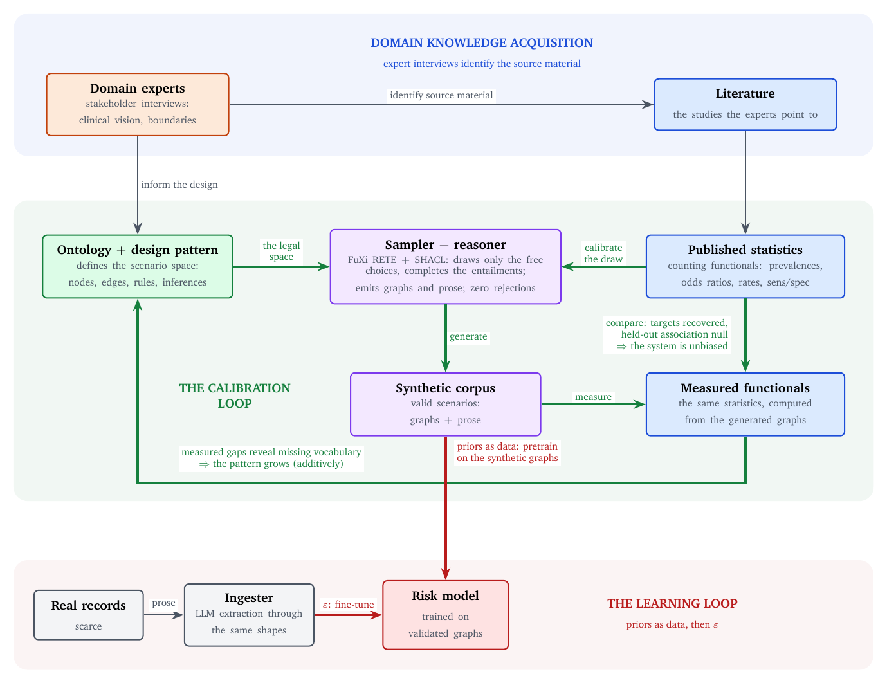
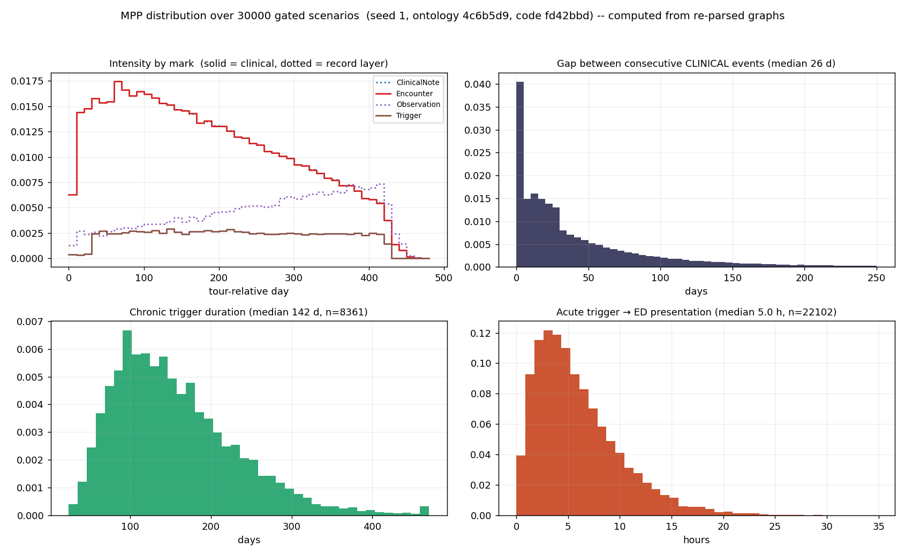
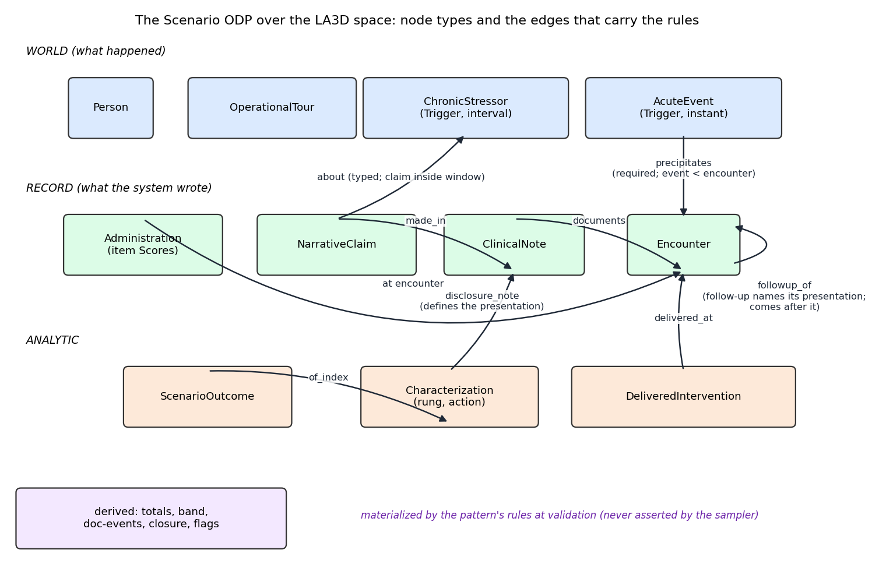

## The bottleneck moved {.smaller}

[The problem with a fast, plausible collaborator]{.kicker}

Research used to be a loop: form a hypothesis, write the code, analyze the data, test the hypothesis, revise the conclusions, and go round again, many times over. Producing each result was the slow part.

AI now appears to remove that bottleneck. It writes complex code, carries a vast working knowledge of statistics and analysis methods, and returns test results ready to present.

::: {.callout-highlight}
So the bottleneck of research is no longer producing results. It is knowing which results deserve belief.
:::

**Plausibility is the enemy.** From our own project record, the AI describing its own failure, verbatim:

::: {.ed-quote}
"The worst failure of this project: I built a tractable proxy instead of the user's hypothesis, and let loose language hide the substitution."
[Lessons-Learned.md, project wiki, 2026-08-19, surfaced only when the user queried]{.src}
:::

Nothing was wrong with the output. It ran, it passed, it read well. It just was not the thing we set out to know.

::: {.ed-tip}
**Tip 1.** Get the LLM to write and keep a `Lessons-Learned.md`. The quote above is from ours.
:::

::: {.notes}
Open cold with the quote if comfortable. Land in the first minute: this failure was caught, recorded by the AI in its own words, and became a rule. The talk is about the machinery that makes that the normal outcome, not a lucky catch. Do not name the domain yet; the problem is universal.
:::

## What epistemic discipline is {.smaller}

[Four requirements you already believe in]{.kicker}

:::: {.columns}

::: {.column width="50%"}
::: {.callout-highlight}
One way to solve this is **epistemic discipline**: turning a produced result into something you actually *know*, justified rather than merely generated. In practice, the pre-committed rules that decide what evidence must exist, and in what order it must be produced, before a claim enters the record.
:::

You already practice this. Each requirement is a standard scientific habit.
:::

::: {.column width="50%"}

```{=html}
<table class="ed-req"><thead><tr><th>The requirement</th><th>What you already call it</th></tr></thead><tbody><tr><td><span class="req">Provenance.</span> a claim carries where it came from</td><td class="prac">citation</td></tr><tr><td><span class="req">Pre-commitment.</span> targets and margins declared before the data arrives</td><td class="prac">pre-registration</td></tr><tr><td><span class="req">Witnessed failure.</span> a test counts only if you saw it fail when it should</td><td class="prac">a positive control</td></tr><tr><td><span class="req">Durable memory.</span> what was tried, decided, and abandoned is written down</td><td class="prac">a lab notebook</td></tr></tbody></table>
```

:::

::::

```{=html}
<div class="ed-probs-h">AI problems</div>
<div class="ed-probs">
<div class="ed-prob">These live in habits, and AI speed breaks habits. When results arrive in minutes, the habits are the first thing skipped.<div class="ex"><b>Seen here:</b> the wiki and the plan both recorded a stage as "built and done." Running it crashed on a missing field (KeyError). The habit, run it and inspect the output, had been skipped; the false claim survived until someone ran the code.</div></div>
<div class="ed-prob">Picture what we know as a surface that research nudges forward by a small step, an <em>epsilon</em> that preserves everything already verified. AI defaults to the opposite, discarding and regenerating work at each step, without the discipline to take small, preserving steps.<div class="ex"><b>Seen here:</b> asked to consolidate three reports into one paper, it regenerated rather than preserved, and the draft did not even describe the MPP, the framework the reports exist to present. Filed as a dead end.</div><div class="ex"><b>In miniature:</b> we had agreed the severity space must stay continuous; at build time it computed the continuous score and then bucketed it into four discrete levels, throwing the agreed design away.</div></div>
</div>
```

::: {.notes}
The philosophical center and the definition slide for the title. Say explicitly: the claim is not that AI needs new epistemology. It is that AI-speed research needs the old epistemology made mechanical, because no one, human or AI, keeps habits at that pace. AI-problem example sources: built-without-running (Lessons-Learned.md, "A plotting script is not a generator"; the stage was missing five fields and crashed on KeyError trigger_kinds); consolidation lost the MPP framework (Capabilities-Ledger.md dead ends); continuous score bucketed to four levels (Lessons-Learned.md, "Carry the agreed abstraction into the build", 2026-08-19). Two more for Q&A, both caught by the process: the unfaithful replay, same-law samples read instead of the actual disk members (log, 2026-08-23 correction), and the inert mutation, a check that could not fail accepted green until a real corruption reddened it (log, 2026-08-24, C4).
:::

## Encode it, do not remember it {.smaller}

[The move: discipline as artifacts, not intentions]{.kicker}

:::: {.columns}

::: {.column width="58%"}
Move each requirement out of your head and into an artifact the process enforces.

- **Memory** lives in a project wiki the AI reads to recall and writes to remember: llm-wiki.
- **The gates** live in rule files the AI must follow: no green counts without a witnessed red, no number enters without verification at the cited source, no measurement before its margins are declared.
- **The control surface** lives in a charter the human owns: what is protected, what is out of scope, what a plan must state before work starts.

The process refuses the shortcut, so no one has to decline it.

Running example: a statistics project, 13 days, generating ontology-valid synthetic scenarios calibrated to published studies. Five prototypes, 102 wiki pages, 119 log entries, a 188-test suite. All data synthetic.
:::

::: {.column width="42%"}

:::

::::

::: {.notes}
One sentence on the domain and move on; the synthetic frame is stated here once. The next three slides are the howto: one artifact class per slide, with the literal template on screen. Source: counts on wiki/prism_synthesis.wiki/, log_prism_synthesis.md, suite on P5-Stage-2-Hazard-Machinery.md.
:::

## Howto: memory that compounds {.smaller}

[The wiki is the lab notebook, and the AI keeps it]{.kicker}

:::: {.columns}

::: {.column width="55%"}
Three page types do the work. The formats are copyable:

- **A log entry:** date, type, subject, attribution, then bullets. Types across our 119 entries: 20 experiment, 19 ingest, 11 decision, 5 correction.
- **A dead end:** what was tried, and the reason it failed. Re-entry requires addressing the reason. Nine on our books; none re-entered.
- **A source page:** a published number, the page it was verified on, and its scope caveats. A number without this page does not exist for the project.

:::

::: {.column width="45%"}

```{=html}
<div class="ed-fig"><div class="ed-logcard"><div class="h">## [2026-08-23] experiment | Move 3.2 (Bernecker concealment) ACCEPTED</div><div class="by">- by: Chris Sweet via claude-code</div><ul><li>Corpus p3m2 (n=1000, zero violations): concealment ratio 3.647 vs target 3.0 (inside source CI 1.8 to 5.0); holdout null 1.476 [0.609, 3.579]</li><li>Headline: the record can now lie (recorded tier differs from latent tier; solve against the recorded tier)</li></ul></div><div class="ed-deadcard"><div class="h">Dead end</div>Rejection sampling as the coherence mechanism (deleted and mislabeled the acute-after-presentation class) &rarr; constructive conditioning</div></div>
```

:::

::::

What this buys: sessions resume where they left off, decisions are cited instead of re-litigated, and the same mistake is not paid for twice.

::: {.callout-highlight}
Memory that compounds already exists as tools like **llm-wiki**: a persistent, interlinked memory attached to the LLM. The AI reads it to recall at the start of a session and writes to it to remember at the end, so what the project knows lives in the artifact, not in a chat window that vanishes when the session ends.
:::

::: {.notes}
How is this different from RAG over your papers? The wiki stores syntheses, decisions, and verdicts with provenance and current status (confirmed, superseded, dead end); a stale claim gets flagged and corrected, not re-retrieved forever. Sources: log_prism_synthesis.md type counts; Capabilities-Ledger.md dead ends.
:::

## Howto: the gates {.smaller}

[No green without a witnessed red]{.kicker}

:::: {.columns}

::: {.column width="55%"}
The rule, from the project's rules file: evidence is only evidence if it could have come out the other way. The procedure, four steps, mechanical:

1. Write the check. If it passes on first run, you have learned nothing yet.
2. Corrupt the exact thing the check guards. Watch it fail, for that reason.
3. Revert. Watch it pass.
4. Record all three observations.

:::

::: {.column width="45%"}

```{=html}
<div class="ed-fig"><div class="ed-term"><div><span class="cmd">$ pytest -q test_known_deltas</span></div><div><span class="pass">4 passed</span></div><div>&nbsp;</div><div><span class="cmd">$ mutate: negate the selection filter</span></div><div><span class="mut">MUTATED</span> <span class="cmd">filter negated</span></div><div><span class="cmd">$ pytest -q test_known_deltas</span></div><div><span class="fail">FAILED</span> test_known_deltas: <span class="fail">assert 0 == 4</span></div><div><span class="cmd">$ git checkout -- .   # revert</span></div><div><span class="rev">REVERTED</span></div><div><span class="cmd">$ pytest -q test_known_deltas</span></div><div><span class="pass">4 passed</span></div></div></div>
```

:::

::::

A green you cannot show the red for is a green you have not earned. Two more gates, same spirit: margins and targets are committed before the data is generated, and a literature number enters only after being re-read at the cited page.

::: {.callout-highlight}
The gates exist in tools like **llm-wiki**: rule files the LLM must follow. The discipline, no green without a witnessed red, every number verified at its source, margins declared before measuring, is enforced by the process, not left to anyone remembering to apply it.
:::

::: {.notes}
Tie back to slide 2: this is a positive control plus pre-registration, mechanized. Q&A depth: the record also holds an honest case where a mutation did NOT redden one test because its expectation routed through the corrupted formula; the docstring now says what it actually guards (P5-Stage-2-Hazard-Machinery.md). Sources: assert 0 == 4 on P5-Stage-1-Time-To-Repeat.md commit 416074e; two citation errors caught (table cited p. 37, found p. 38), log 2026-08-28.
:::

## Howto: the human's control surface {.smaller}

[What you write down so the AI cannot drift]{.kicker}

:::: {.columns}

::: {.column width="42%"}
Templates that the scientist maintains:

- **A charter** with two tiers: inviolate rules, and rulings (standing scope decisions, each with the condition that reopens it).
- **A five-line plan contract** at the top of every plan. Consent applies to those five lines.
- **A protected ledger** of working capabilities. Replacement requires demonstrated equivalence first.
- **A declared modification surface** before each phase; the rest frozen at a git tag.

:::

::: {.column width="58%"}

```{=html}
<div class="ed-tmpl"><div class="ed-card mono"><div class="t">Charter ruling</div><div class="kv"><b>R2:</b> classifier out of scope</div><div class="kv"><b>Expires when:</b> SBIR accord with colleagues AND substantial calibration exist</div><div class="kv" style="color:#8a7a4a">applied and cited, never re-asked</div></div><div class="ed-card mono"><div class="t">Five-line plan contract</div><div class="kv"><b>goal:</b> add umbrella sampling</div><div class="kv"><b>added:</b> tilted sampler + analytic weights</div><div class="kv"><b>REMOVED:</b> none</div><div class="kv"><b>risky:</b> random-stream change</div><div class="kv"><b>untouched:</b> default corpus (bit-identical)</div></div><div class="ed-card"><div class="t">Protected ledger row</div><table class="ed-mini"><thead><tr><th>capability</th><th>where</th><th>verified by</th><th>status</th></tr></thead><tbody><tr><td>C8: concealment as disclosure downgrade (A15-A17)</td><td>spec draw + fit_calibration</td><td>ratio RED 1.097, green 3.09 (n=60k)</td><td>ACTIVE</td></tr></tbody></table></div><div class="ed-card"><div class="t">Declared modification surface</div><div class="ed-surf"><span>Ontology</span><span>ODP</span><span>Draw code</span><span>Calibration</span><span class="frozen">Untouched</span></div><div class="kv" style="color:#8a7a4a;margin-top:.35em">which artifacts change; the rest frozen at a git tag</div></div></div>
```

:::

::::

**What only the human does:** set the goal, adopt or defer, scope, judge which ideas have supporting data.

::: {.callout-highlight}
The control surface lives in llm-wiki too: the charter, ledger, and rulings are pages the AI reads at the start of every session, so it works inside the structure instead of around it.
:::

::: {.notes}
The slide that must actually TELL them how. Walk each card in one sentence; someone can photograph it and reproduce the structure. The deep answer to "who does the science": the human owns everything here; the AI owns execution and verification labor inside it. Sources: R2 from Charter.md; five-line contract from the user-level CLAUDE.md; ledger columns and 24 rows from Capabilities-Ledger.md; modification-surface columns from Prototype-Registry.md.
:::

## The loop corrects itself {.smaller}

[The test of a knowledge process: can it retire its own beliefs?]{.kicker}

:::: {.columns}

::: {.column width="52%"}
**Episode one:** a number we invented, refuted by evidence, filed without a fight. A behavioral gradient was set at ratio 2.33 from expert interviews, always carrying the label "ours alone, no published source". When two independent DoD sources were ingested and verified at the page, they put it at 1.2 to 1.3, and the probability sample's entire confidence interval excluded our value. The record now reads: direction confirmed, magnitude refuted, revision scoped as the next move.

```{=html}
<div class="ed-fig"><svg viewBox="0 0 430 210" style="width:100%;max-height:230px;font-family:ui-monospace,Menlo,monospace"><line x1="55" y1="176" x2="395" y2="176" stroke="#bbb" stroke-width="1"/><line x1="60.0" y1="173" x2="60.0" y2="179" stroke="#bbb"/><text x="60.0" y="192" font-size="9" fill="#888" text-anchor="middle">1.0</text><line x1="166.7" y1="173" x2="166.7" y2="179" stroke="#bbb"/><text x="166.7" y="192" font-size="9" fill="#888" text-anchor="middle">1.5</text><line x1="273.3" y1="173" x2="273.3" y2="179" stroke="#bbb"/><text x="273.3" y="192" font-size="9" fill="#888" text-anchor="middle">2.0</text><line x1="380.0" y1="173" x2="380.0" y2="179" stroke="#bbb"/><text x="380.0" y="192" font-size="9" fill="#888" text-anchor="middle">2.5</text><line x1="343.7" y1="34" x2="343.7" y2="176" stroke="#a13a30" stroke-width="1.5" stroke-dasharray="4 3"/><circle cx="343.7" cy="50" r="6" fill="#a13a30"/><text x="331.7" y="53" font-size="10" fill="#a13a30" text-anchor="end" font-weight="700">ours (interviews) 2.33</text><rect x="72.8" y="96" width="70.4" height="8" rx="2" fill="#14213d" opacity="0.28"/><circle cx="109.1" cy="100" r="5" fill="#14213d"/><text x="151.2" y="103" font-size="10" fill="#14213d" text-anchor="start">probability sample  1.23 (CI 1.06 to 1.39)</text><circle cx="106.9" cy="140" r="5" fill="#14213d"/><text x="116.9" y="143" font-size="10" fill="#14213d" text-anchor="start">second survey  1.22</text><text x="225" y="207" font-size="9.5" fill="#a13a30" text-anchor="middle" font-style="italic">the 2.33 assumption sits outside the evidence</text></svg></div>
```

:::

::: {.column width="48%"}

```{=html}
<div class="ed-corr"><b>Episode two: corrected before the code existed.</b><ul><li><span class="ck">&check;</span> a missing preservation tag surfaced</li><li><span class="ck">&check;</span> a math argument that did not transfer between model laws</li><li><span class="ck">&check;</span> a planned test that was null by construction and could never have failed</li></ul><div style="color:#8a7a4a">process catches what enthusiasm would ship</div></div>
```

:::

::::

::: {.notes}
Keep the domain abstract ("a behavioral gradient"); name it if asked. The philosophical point: a process that can only accumulate beliefs is not a knowledge process. A recorded, unresisted retirement of a belief is the strongest evidence the discipline is real. Sources: assumed 2.33 from derivegen/spec.py CONCEAL_P, Stakeholder-Interviews-2026-06.md; PERSEREC 2018 OR 1.48 [1.11,1.97], risk ratio ~1.23 [1.06,1.39], n=14,088, Table 6; LIS 2022 1.22; B2 corrections in log 2026-08-28.
:::

## The payoff: ideas become cheap {.smaller}

[Safety is what makes trying inexpensive]{.kicker}

:::: {.columns}

::: {.column width="52%"}
Mid-conversation, the domain scientist: in molecular dynamics we use umbrella sampling to see rare states without waiting for them. Could we do that here?

Same day, it existed: the sampler tilted toward the rare classes, corrected with analytic weights, and, the part that matters, proven bit-for-bit identical to the frozen system with the feature off.

Measured: weighted base rate 0.1085 against the 0.10 design, effective sample size 1,837, and the held-out null association stayed null at 0.846, interval 0.593 to 1.207, now at 847 rare-class members instead of about 100.

The lesson is not speed. A cross-domain idea got a fair trial because the preservation proof made trying it reversible, and reversible is what makes it cheap.
:::

::: {.column width="48%"}

:::

::::

::: {.notes}
Umbrella sampling citation if asked: Torrie and Valleau 1977. This answers "what do I get for all this discipline": the freedom to try things, because every trial is provably reversible. Connect to slide 6: pinned prototypes and the ledger make reversibility a checkout, not archaeology. Source: P4-Move-1-Umbrella-Corpus.md, corpus_out_u1 umbrella-summary.json.
:::

## Getting started {.smaller}

[The minimal kit, priced honestly]{.kicker}

You do not need our whole apparatus. The starter kit is four artifacts:

1. **A project wiki** the AI reads at session start and writes at session end. llm-wiki gives you this with the schema and gates built in.
2. **One rules file:** no green without a witnessed red; no number without verification at source; declare targets before measuring.
3. **One charter page:** the goal, what is protected, your standing scope decisions with their reopening conditions.
4. **A log habit:** every session ends with dated, typed entries, including the failures.

The costs, stated plainly: the discipline is real work, the wiki needs maintenance, and the gates slow the happy path on purpose.

::: {.callout-highlight}
The claim is not that AI made the research fast. It is that this structure made fast research trustworthy.
:::

::: {.notes}
End on costs; it buys credibility. Q&A: team scale (llm-wiki has a multi-writer push protocol, lightly exercised); model dependence (the wiki is model-agnostic content; an external review by a different AI session was addressed item by item); human time (Chris speaks to this; the record captures outcomes, not hours).
:::

## Backup slides {.center}

## Backup: the case study in numbers {.smaller}

[The running example, quantified]{.kicker}

Thirteen days, 2026-08-16 to 28. The peak, August 23, is the day five literature-calibrated mechanisms landed, each with its baseline observed red first: 0.170 vs target 0.4535; 1.097 before 3.09; 0.997 before green.

```{=html}
<div class="ed-fig"><svg viewBox="0 0 920 300" style="width:100%;max-height:430px;font-family:ui-monospace,Menlo,monospace"><line x1="42" y1="264" x2="892" y2="264" stroke="#bbb"/><rect x="54.4" y="205.0" width="40.5" height="59.0" rx="2" fill="#14213d"/><text x="74.7" y="202.0" font-size="9" fill="#14213d" text-anchor="middle" font-weight="700">9</text><text x="74.7" y="277.0" font-size="9" fill="#888" text-anchor="middle">16</text><rect x="119.8" y="250.9" width="40.5" height="13.1" rx="2" fill="#14213d"/><text x="140.1" y="247.9" font-size="9" fill="#14213d" text-anchor="middle" font-weight="700">2</text><text x="140.1" y="277.0" font-size="9" fill="#888" text-anchor="middle">17</text><text x="205.5" y="277.0" font-size="9" fill="#888" text-anchor="middle">18</text><rect x="250.6" y="257.4" width="40.5" height="6.6" rx="2" fill="#14213d"/><text x="270.8" y="254.4" font-size="9" fill="#14213d" text-anchor="middle" font-weight="700">1</text><text x="270.8" y="277.0" font-size="9" fill="#888" text-anchor="middle">19</text><rect x="316.0" y="178.8" width="40.5" height="85.2" rx="2" fill="#14213d"/><text x="336.2" y="175.8" font-size="9" fill="#14213d" text-anchor="middle" font-weight="700">13</text><text x="336.2" y="277.0" font-size="9" fill="#888" text-anchor="middle">20</text><rect x="381.3" y="152.6" width="40.5" height="111.4" rx="2" fill="#14213d"/><text x="401.6" y="149.6" font-size="9" fill="#14213d" text-anchor="middle" font-weight="700">17</text><text x="401.6" y="277.0" font-size="9" fill="#888" text-anchor="middle">21</text><text x="401.6" y="26.0" font-size="8" fill="#0d666e" text-anchor="middle" font-weight="700">P1/2</text><rect x="446.7" y="152.6" width="40.5" height="111.4" rx="2" fill="#14213d"/><text x="467.0" y="149.6" font-size="9" fill="#14213d" text-anchor="middle" font-weight="700">17</text><text x="467.0" y="277.0" font-size="9" fill="#888" text-anchor="middle">22</text><text x="467.0" y="26.0" font-size="8" fill="#0d666e" text-anchor="middle" font-weight="700">P1/2</text><rect x="512.1" y="28.0" width="40.5" height="236.0" rx="2" fill="#b8860b"/><text x="532.4" y="25.0" font-size="9" fill="#b8860b" text-anchor="middle" font-weight="700">36</text><text x="532.4" y="277.0" font-size="9" fill="#888" text-anchor="middle">23</text><text x="532.4" y="26.0" font-size="8" fill="#0d666e" text-anchor="middle" font-weight="700">P3</text><rect x="577.5" y="211.6" width="40.5" height="52.4" rx="2" fill="#14213d"/><text x="597.8" y="208.6" font-size="9" fill="#14213d" text-anchor="middle" font-weight="700">8</text><text x="597.8" y="277.0" font-size="9" fill="#888" text-anchor="middle">24</text><text x="597.8" y="26.0" font-size="8" fill="#0d666e" text-anchor="middle" font-weight="700">P4</text><text x="663.2" y="277.0" font-size="9" fill="#888" text-anchor="middle">25</text><rect x="708.3" y="211.6" width="40.5" height="52.4" rx="2" fill="#14213d"/><text x="728.5" y="208.6" font-size="9" fill="#14213d" text-anchor="middle" font-weight="700">8</text><text x="728.5" y="277.0" font-size="9" fill="#888" text-anchor="middle">26</text><text x="728.5" y="26.0" font-size="8" fill="#0d666e" text-anchor="middle" font-weight="700">reports</text><rect x="773.7" y="250.9" width="40.5" height="13.1" rx="2" fill="#14213d"/><text x="793.9" y="247.9" font-size="9" fill="#14213d" text-anchor="middle" font-weight="700">2</text><text x="793.9" y="277.0" font-size="9" fill="#888" text-anchor="middle">27</text><rect x="839.0" y="224.7" width="40.5" height="39.3" rx="2" fill="#14213d"/><text x="859.3" y="221.7" font-size="9" fill="#14213d" text-anchor="middle" font-weight="700">6</text><text x="859.3" y="277.0" font-size="9" fill="#888" text-anchor="middle">28</text><text x="859.3" y="26.0" font-size="8" fill="#0d666e" text-anchor="middle" font-weight="700">P5</text><text x="42" y="294" font-size="10" fill="#888">Log entries per day, August 16 to 28. Peak Aug 23 (36): five calibrated mechanisms landed, prototype 3 closed.</text></svg></div>
```

::: {.notes}
Use if the room wants the speed story; keep the framing "cadence enabled by discipline". Source: per-day counts from log_prism_synthesis.md; the three red-first baselines, Capabilities-Ledger.md rows C7 to C9.
:::

## Backup: the formalism and its null {.smaller}

[Solve, then measure, then try to fail]{.kicker}

:::: {.columns}

::: {.column width="52%"}
Scenarios are marked point processes; every statistic is computed from re-parsed output graphs, never from generator state. Calibration is solve-then-measure with a pre-declared held-out association (published odds ratio 12.9) that must measure null. It did: 0.879 with interval 0.74 to 1.04 at prototype 1, and 0.846 with interval 0.593 to 1.207 at umbrella precision.
:::

::: {.column width="48%"}

:::

::::

::: {.notes}
For the statistician asking how calibration avoids circularity: the holdout is the answer, and it is declared before any corpus. Sources: 0.879 [0.74,1.04] Prototype-Registry.md; 0.846 [0.593,1.207] P4-Move-1-Umbrella-Corpus.md; published 12.9 MSMR-Non-Medical-Risk-Factors-2025.md.
:::

## Backup: what the ontology adds {.smaller}

[Construction, not generate-and-test]{.kicker}

:::: {.columns}

::: {.column width="52%"}
One ontology design pattern is the single semantic authority. The sampler draws free choices; a reasoner completes the entailments; validation is an always-pass contract, so a violation is a bug, not a rejection. Zero rejections means the corpus distribution is exactly the sampler's law, which is what makes the calibration argument sound.
:::

::: {.column width="48%"}

:::

::::

::: {.notes}
For the knowledge-representation audience member. Sources: zero rejections, delete-a-shape and planted-violation proofs, Prototype-Registry.md prototype 2; hybrid reasoning 3.3x speedup, Capabilities-Ledger.md row E3.
:::
