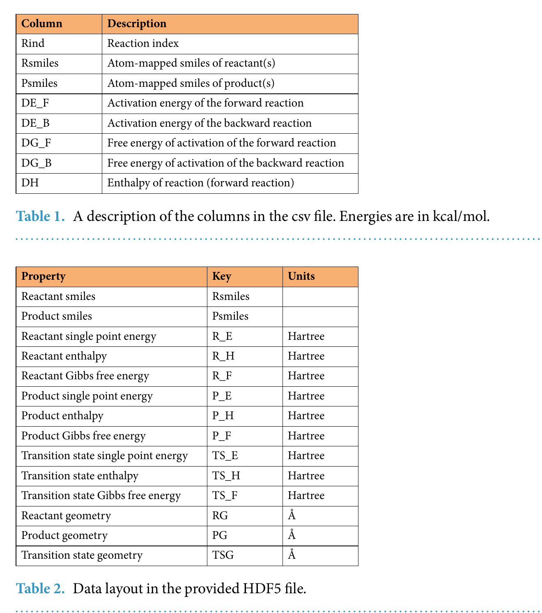
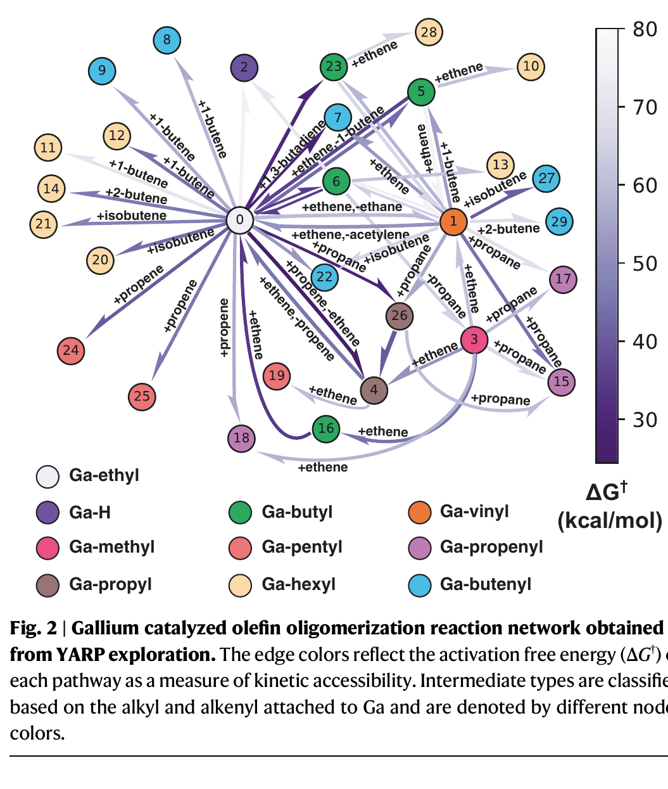
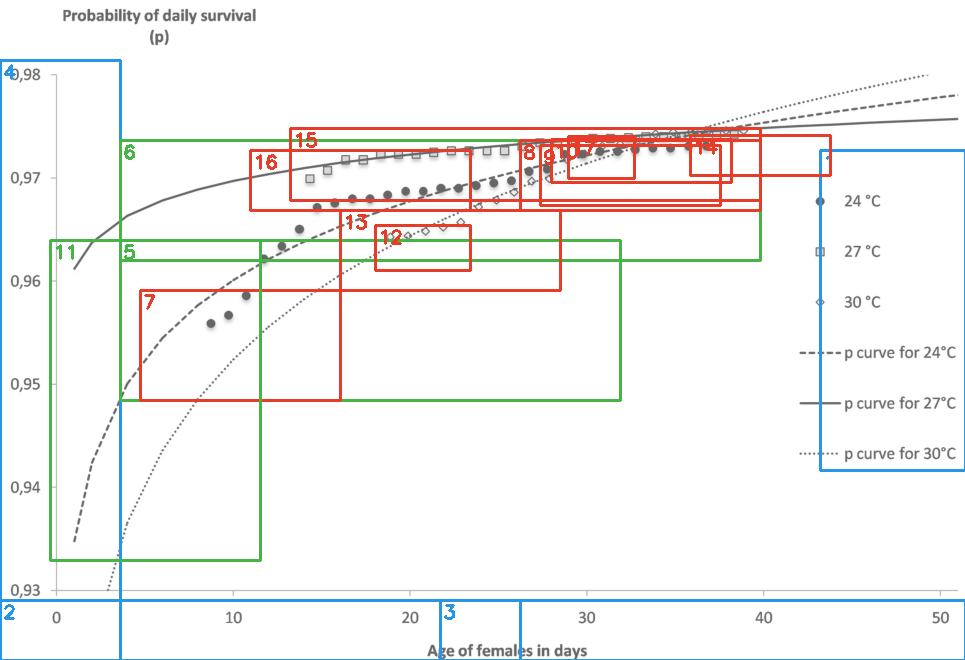
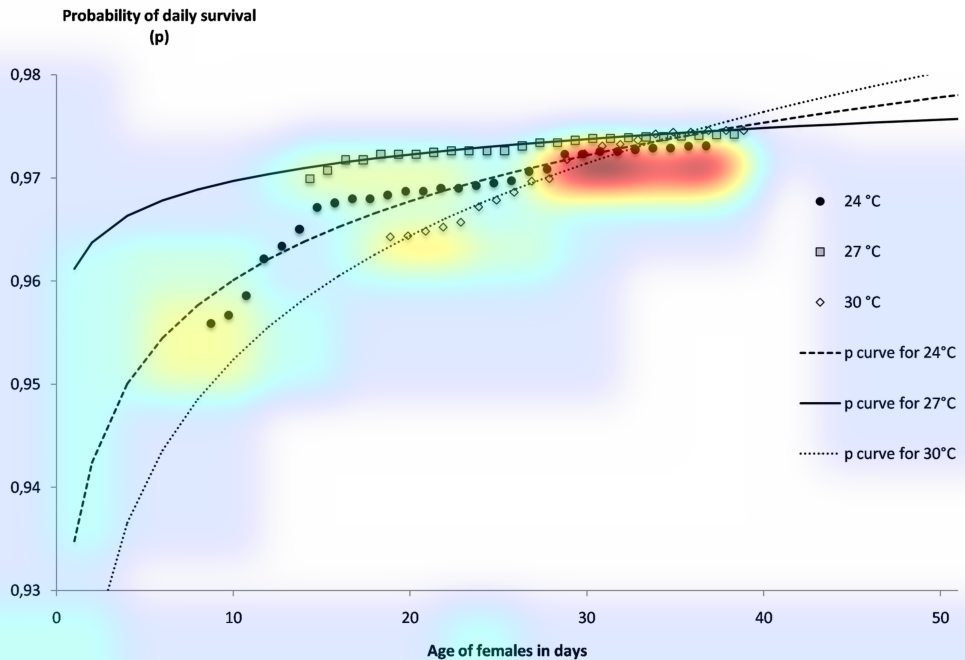
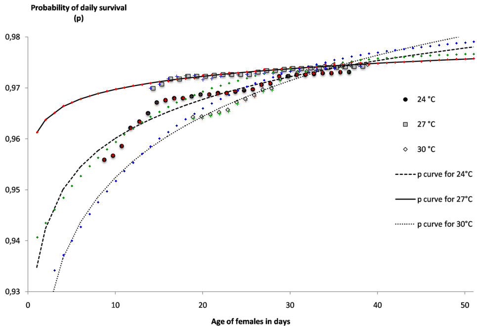
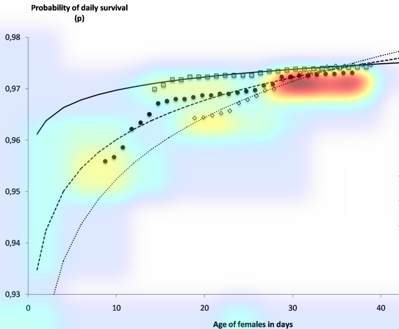
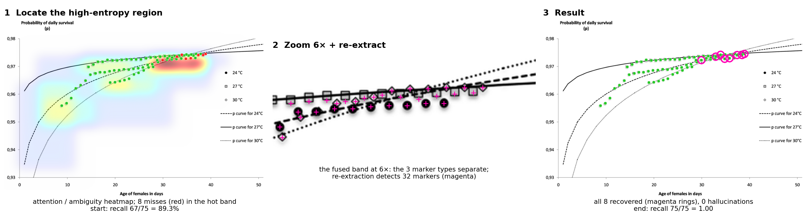
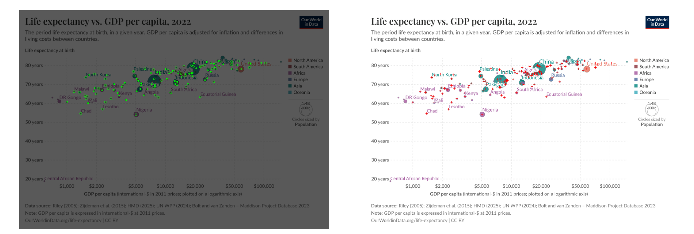
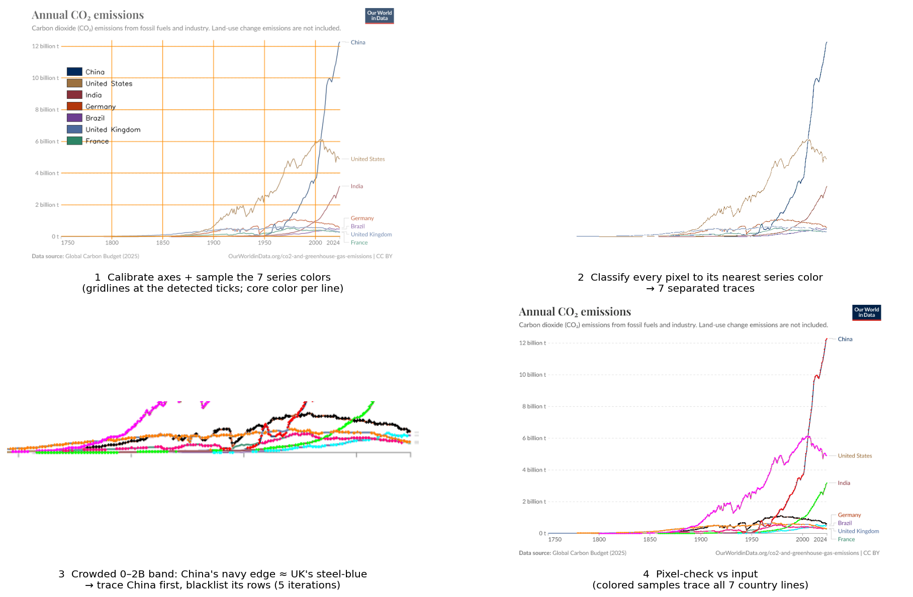
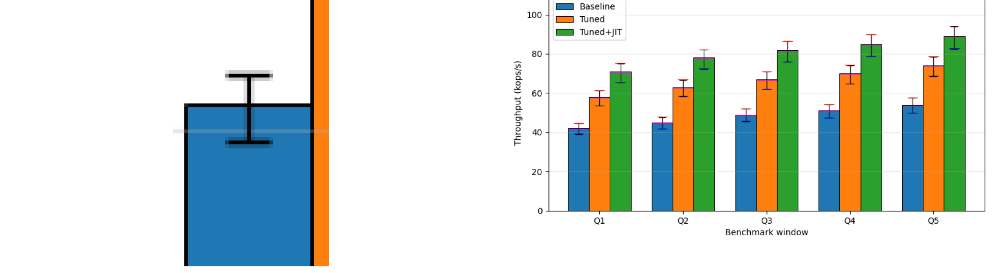

## What an llm-wiki is {.smaller}

[The setup, and the alternative]{.kicker}

- **LLMs are trained on a vast array of human knowledge.** But science is a broad landscape, each domain its own deep dive; incorporating all of it into a model is challenging.
- **The training data is stale by design.** Recent advances are simply not in it.
- **Harnesses now add "project data",** files you upload as the basis for a project. Useful, but it is a RAG approach: nothing persists, and the context is re-extracted from scratch on every question.
- **llm-wiki, proposed by Andrej Karpathy, is the alternative:** dense, connected wiki pages as a **persistent memory, authored and maintained by the LLM** itself.
- **Visible and queryable by the human,** so the memory stays trusted and auditable, not a black box.

::: {.callout-highlight}
A persistent, compounding memory the LLM writes and the human can read, not retrieval re-run on every question.
:::

::: {.notes}
Story arc: LLMs know a great deal, but science is broad, deep, and advancing, and training data is stale by design. Harness "project data" (uploaded files) is a RAG approach: nothing persists, context is re-extracted per query. llm-wiki (Andrej Karpathy) is the alternative: dense connected wiki pages as a persistent, LLM-authored and LLM-maintained memory, visible and queryable by the human for trusted, auditable operation. Framing from llm-wiki.md (persistent, compounding artifact; the LLM owns and writes the wiki, you read it).
:::

## Does the memory actually work? {.smaller}

[A first controlled measurement, on a real research project]{.kicker}

```{=html}
<style>
.reveal .ctl-box { background:#14213d; color:#fff; border-radius:6px; padding:0.5em 0.65em; height:100%; box-sizing:border-box; font-family:"Helvetica Neue",Arial,sans-serif; }
.reveal .ctl-box strong { display:block; color:#d4a835; font-size:0.72em; margin-bottom:0.25em; }
.reveal .ctl-box span { color:#cdd6e0; font-size:0.62em; line-height:1.32; }
</style>
```

Forty questions on one real project. Reading the llm-wiki answered **90% correctly and fabricated nothing**, roughly double RAG's 42% (10 fabrications); the model with no context scored 2%.

:::: {.columns}

::: {.column width="55%"}
| Approach | Correct | Overall (0-3) | Fabricated |
|---|---|---|---|
| Model alone, no context | 2% | 0.10 | 2 |
| Plain RAG over the sources | 42% | 1.32 | 10 |
| **llm-wiki read path** | **90%** | **2.65** | **0** |
:::

::: {.column width="45%" .rag-stats}
<div class="stat-big">90%</div>
<div class="stat-caption">correct, versus 42% for RAG. Roughly double.</div>
<div class="stat-big">0</div>
<div class="stat-caption">fabricated, versus 10 for RAG.</div>
:::

::::

**The zero is by design, a layered control stack that keeps every claim honest:**

:::: {.columns}

::: {.column width="25%"}
<div class="ctl-box"><strong>1 · Honest-reporting rules</strong><span>real outputs only; tag every number's corpus; file failures truthfully</span></div>
:::

::: {.column width="25%"}
<div class="ctl-box"><strong>2 · Verification gate</strong><span>blocks unsupported claims and untagged numbers before a commit</span></div>
:::

::: {.column width="25%"}
<div class="ctl-box"><strong>3 · Discipline gates</strong><span>name the always-wrong shortcuts so the agent self-catches</span></div>
:::

::: {.column width="25%"}
<div class="ctl-box"><strong>4 · Blocking hooks</strong><span>fire the checks and can halt a bad write, exit-code enforced</span></div>
:::

::::

*Gates and hooks need an agentic harness that can run them, which is why we build in Claude Code and Codex, not the Claude or ChatGPT chat apps. Plain Markdown keeps every claim auditable.*

::: {.notes}
Source: the WGRA post "llm-wiki vs RAG" and Wiki-vs-RAG-First-Run-Results / Cross-Model-Wiki-Reading. n=40 on one real research project, blind judge. Message: the memory works, and works well, 90% vs RAG's 42%, a perfect 3.00 on method and judgment questions, and zero fabrications. The model alone at 2% shows the wiki is adding the value, not the base model. Keep it clean and promotional; the graph-walk arm and the within-noise detail are omitted on purpose.
:::

## llm-wiki operational architecture {.smaller}

[How the agent writes, reads, and greps its memory, reconstructed from real transcripts]{.kicker}

:::: {.columns}

::: {.column width="55%"}
Reconstructed from real transcripts, this is the YARP wiki as the agent actually used it. It works in three channels: it **writes** pages (red arrows: authoring, editing, committing), it **reads** a page into context (blue arrows), and it **greps** to check its own work (green self-loops).

The mix is lopsided. By tool call it is **88% writes, 7% reads, 6% greps.** Reads are rare because of caching: once a page is loaded it stays in the context window, so the agent reuses it instead of re-reading. Its moves go into building and maintaining the memory, not re-fetching it.

Everything routes through two hubs, **log (touched 58 times) and index (45)**. The agent rarely walks the typed edges it wrote: only **24 of 136 moves follow an authored frontmatter link** (solid). The rest, the dashed edges, are links it **discovers dynamically by search**, not ones it was handed.

**The LLM builds the memory and reads it back, hub-organized.**
:::

::: {.column width="45%"}
```{=html}
<div id="read-graph" style="width:100%; height:440px; border:1px solid #ccc; background:#fff; border-radius:4px;"></div>
```
*The full YARP wiki, 40 pages. Red = write, blue = read, green = grep or re-read; dark = index/log hubs; dashed = link found by search.*
:::

::::

```{=html}
<script>
(function(){
  const ELEMENTS = [{"data":{"id":"log_yarp.md","label":"log","name":"log","size":32.0,"hub":"yes","shown":"yes"}},{"data":{"id":"index_yarp.md","label":"index","name":"index","size":29.4,"hub":"yes","shown":"yes"}},{"data":{"id":"KHP-Fruitfly-Regression.md","label":"KHP Fruitfly","name":"KHP Fruitfly Regression","size":24.7,"hub":"no","shown":"yes"}},{"data":{"id":"Lessons-Learned.md","label":"Lessons Learned","name":"Lessons Learned","size":24.4,"hub":"no","shown":"yes"}},{"data":{"id":"Home_yarp.md","label":"Home","name":"Home","size":24.2,"hub":"yes","shown":"yes"}},{"data":{"id":"Project-Objective.md","label":"Project Objective","name":"Project Objective","size":23.9,"hub":"no","shown":"yes"}},{"data":{"id":"First-Time-Guide.md","label":"","name":"First Time Guide","size":19.6,"hub":"no","shown":"no"}},{"data":{"id":"Phase2-Project1-Pilot.md","label":"","name":"Phase2 Project1 Pilot","size":19.1,"hub":"no","shown":"no"}},{"data":{"id":"Package-Architecture.md","label":"","name":"Package Architecture","size":18.2,"hub":"no","shown":"no"}},{"data":{"id":"YARP-Overview.md","label":"","name":"YARP Overview","size":17.1,"hub":"no","shown":"no"}},{"data":{"id":"Agentic-YARP-Test-Cases.md","label":"","name":"Agentic YARP Test Cases","size":17.1,"hub":"no","shown":"no"}},{"data":{"id":"Onboarding-Claude-Code.md","label":"","name":"Onboarding Claude Code","size":17.1,"hub":"no","shown":"no"}},{"data":{"id":"Zhao-Savoie-YARP-2021.md","label":"","name":"Zhao Savoie YARP 2021","size":16.5,"hub":"no","shown":"no"}},{"data":{"id":"Lewis-Structure-Score.md","label":"","name":"Lewis Structure Score","size":16.5,"hub":"no","shown":"no"}},{"data":{"id":"Publications.md","label":"","name":"Publications","size":15.8,"hub":"no","shown":"no"}},{"data":{"id":"Zhao-Savoie-YARP-v2-2022.md","label":"","name":"Zhao Savoie YARP v2 2022","size":15.0,"hub":"no","shown":"no"}},{"data":{"id":"Phase1-M4-CRC-xTB-Path.md","label":"","name":"Phase1 M4 CRC xTB Path","size":15.0,"hub":"no","shown":"no"}},{"data":{"id":"Phase1-M5-CRC-DFT.md","label":"","name":"Phase1 M5 CRC DFT","size":15.0,"hub":"no","shown":"no"}},{"data":{"id":"Ericka-Claude-Code-Onboarding.md","label":"","name":"Ericka Claude Code Onboarding","size":15.0,"hub":"no","shown":"no"}},{"data":{"id":"SCHEMA_yarp.md","label":"","name":"SCHEMA","size":14.1,"hub":"no","shown":"no"}},{"data":{"id":"Documentation-Build.md","label":"","name":"Documentation Build","size":14.1,"hub":"no","shown":"no"}},{"data":{"id":"Zhao-Conformational-Sampling-2022.md","label":"","name":"Zhao Conformational Sampling 2022","size":14.1,"hub":"no","shown":"no"}},{"data":{"id":"Zhao-Heterogeneous-Catalysis-2022.md","label":"","name":"Zhao Heterogeneous Catalysis 2022","size":14.1,"hub":"no","shown":"no"}},{"data":{"id":"Zhao-Glucose-Pyrolysis-2023.md","label":"","name":"Zhao Glucose Pyrolysis 2023","size":14.1,"hub":"no","shown":"no"}},{"data":{"id":"RGD1-Dataset-2023.md","label":"","name":"RGD1 Dataset 2023","size":14.1,"hub":"no","shown":"no"}},{"data":{"id":"Woulfe-YAKS-2025.md","label":"","name":"Woulfe YAKS 2025","size":14.1,"hub":"no","shown":"no"}},{"data":{"id":"Model-Reactions-2025.md","label":"","name":"Model Reactions 2025","size":14.1,"hub":"no","shown":"no"}},{"data":{"id":"Concerted-vs-Sequential-Enumeration.md","label":"","name":"Concerted vs Sequential Enumeration","size":14.1,"hub":"no","shown":"no"}},{"data":{"id":"Phase1-M1-Local-EGAT.md","label":"","name":"Phase1 M1 Local EGAT","size":14.1,"hub":"no","shown":"no"}},{"data":{"id":"Phase1-M3-CRC-EGAT.md","label":"","name":"Phase1 M3 CRC EGAT","size":14.1,"hub":"no","shown":"no"}},{"data":{"id":"Papers-Code-Coupling.md","label":"","name":"Papers Code Coupling","size":14.1,"hub":"no","shown":"no"}},{"data":{"id":"Timing-Profile.md","label":"","name":"Timing Profile","size":14.1,"hub":"no","shown":"no"}},{"data":{"id":"Running-YARP-on-CRC-First-Time-Guide.md","label":"","name":"Running YARP on CRC First Time Guide","size":14.1,"hub":"no","shown":"no"}},{"data":{"id":"CRC-Infrastructure.md","label":"","name":"CRC Infrastructure","size":14.1,"hub":"no","shown":"no"}},{"data":{"id":"Run-Monitoring-Workflow.md","label":"","name":"Run Monitoring Workflow","size":14.1,"hub":"no","shown":"no"}},{"data":{"id":"AI-Driven-Discovery-Vision.md","label":"","name":"AI Driven Discovery Vision","size":14.1,"hub":"no","shown":"no"}},{"data":{"id":"CLAUDE.md","label":"","name":"CLAUDE","size":12.9,"hub":"no","shown":"no"}},{"data":{"id":"YARP-3.0-Tutorial.md","label":"","name":"YARP 3.0 Tutorial","size":12.9,"hub":"no","shown":"no"}},{"data":{"id":"CRC-Bringup-Retrospective.md","label":"","name":"CRC Bringup Retrospective","size":12.9,"hub":"no","shown":"no"}},{"data":{"id":"Agentic-YARP-Phase2-Project1-Pilot.md","label":"","name":"Agentic YARP Phase2 Project1 Pilot","size":12.9,"hub":"no","shown":"no"}},{"data":{"id":"e0","source":"index_yarp.md","target":"log_yarp.md","w":2.5,"kind":"write","fm":"no"}},{"data":{"id":"e1","source":"index_yarp.md","target":"Home_yarp.md","w":1.78,"kind":"write","fm":"yes"}},{"data":{"id":"e2","source":"Project-Objective.md","target":"index_yarp.md","w":1.78,"kind":"write","fm":"no"}},{"data":{"id":"e3","source":"Project-Objective.md","target":"log_yarp.md","w":1.78,"kind":"write","fm":"no"}},{"data":{"id":"e4","source":"Lessons-Learned.md","target":"Project-Objective.md","w":1.6,"kind":"write","fm":"yes"}},{"data":{"id":"e5","source":"Home_yarp.md","target":"log_yarp.md","w":1.53,"kind":"write","fm":"no"}},{"data":{"id":"e6","source":"log_yarp.md","target":"Lessons-Learned.md","w":1.53,"kind":"write","fm":"no"}},{"data":{"id":"e7","source":"KHP-Fruitfly-Regression.md","target":"log_yarp.md","w":1.38,"kind":"write","fm":"no"}},{"data":{"id":"e8","source":"Home_yarp.md","target":"index_yarp.md","w":1.29,"kind":"write","fm":"no"}},{"data":{"id":"e9","source":"YARP-Overview.md","target":"Package-Architecture.md","w":1.29,"kind":"write","fm":"no"}},{"data":{"id":"e10","source":"Package-Architecture.md","target":"index_yarp.md","w":1.29,"kind":"write","fm":"no"}},{"data":{"id":"e11","source":"log_yarp.md","target":"Agentic-YARP-Test-Cases.md","w":1.29,"kind":"write","fm":"no"}},{"data":{"id":"e12","source":"Lessons-Learned.md","target":"index_yarp.md","w":1.29,"kind":"write","fm":"no"}},{"data":{"id":"e13","source":"Home_yarp.md","target":"index_yarp.md","w":2.5,"kind":"read","fm":"no"}},{"data":{"id":"e14","source":"index_yarp.md","target":"log_yarp.md","w":2.5,"kind":"read","fm":"no"}},{"data":{"id":"e15","source":"Package-Architecture.md","target":"YARP-Overview.md","w":1.18,"kind":"write","fm":"yes"}},{"data":{"id":"e16","source":"YARP-Overview.md","target":"index_yarp.md","w":1.18,"kind":"write","fm":"no"}},{"data":{"id":"e17","source":"RGD1-Dataset-2023.md","target":"Woulfe-YAKS-2025.md","w":1.18,"kind":"write","fm":"no"}},{"data":{"id":"e18","source":"log_yarp.md","target":"Home_yarp.md","w":1.18,"kind":"write","fm":"yes"}},{"data":{"id":"e19","source":"Lewis-Structure-Score.md","target":"log_yarp.md","w":1.18,"kind":"write","fm":"no"}},{"data":{"id":"e20","source":"Agentic-YARP-Test-Cases.md","target":"index_yarp.md","w":1.18,"kind":"write","fm":"no"}},{"data":{"id":"e21","source":"index_yarp.md","target":"Project-Objective.md","w":1.18,"kind":"write","fm":"no"}},{"data":{"id":"e22","source":"Phase1-M3-CRC-EGAT.md","target":"Project-Objective.md","w":1.18,"kind":"write","fm":"yes"}},{"data":{"id":"e23","source":"Phase1-M4-CRC-xTB-Path.md","target":"Project-Objective.md","w":1.18,"kind":"write","fm":"yes"}},{"data":{"id":"e24","source":"Papers-Code-Coupling.md","target":"Publications.md","w":1.18,"kind":"write","fm":"yes"}},{"data":{"id":"e25","source":"Phase2-Project1-Pilot.md","target":"Lessons-Learned.md","w":1.18,"kind":"write","fm":"yes"}},{"data":{"id":"e26","source":"Lessons-Learned.md","target":"Phase2-Project1-Pilot.md","w":1.18,"kind":"write","fm":"no"}},{"data":{"id":"e27","source":"Phase2-Project1-Pilot.md","target":"Project-Objective.md","w":1.18,"kind":"write","fm":"no"}},{"data":{"id":"e28","source":"Phase1-M5-CRC-DFT.md","target":"Project-Objective.md","w":1.18,"kind":"write","fm":"yes"}},{"data":{"id":"e29","source":"Timing-Profile.md","target":"index_yarp.md","w":1.18,"kind":"write","fm":"no"}},{"data":{"id":"e30","source":"First-Time-Guide.md","target":"index_yarp.md","w":1.18,"kind":"write","fm":"no"}},{"data":{"id":"e31","source":"Running-YARP-on-CRC-First-Time-Guide.md","target":"index_yarp.md","w":1.18,"kind":"write","fm":"no"}},{"data":{"id":"e32","source":"CRC-Infrastructure.md","target":"First-Time-Guide.md","w":1.18,"kind":"write","fm":"yes"}},{"data":{"id":"e33","source":"KHP-Fruitfly-Regression.md","target":"index_yarp.md","w":1.18,"kind":"write","fm":"no"}},{"data":{"id":"e34","source":"Lessons-Learned.md","target":"Zhao-Savoie-YARP-2021.md","w":1.18,"kind":"write","fm":"no"}},{"data":{"id":"e35","source":"Zhao-Savoie-YARP-2021.md","target":"KHP-Fruitfly-Regression.md","w":1.18,"kind":"write","fm":"no"}},{"data":{"id":"e36","source":"Run-Monitoring-Workflow.md","target":"index_yarp.md","w":1.18,"kind":"write","fm":"no"}},{"data":{"id":"e37","source":"First-Time-Guide.md","target":"Lessons-Learned.md","w":1.18,"kind":"write","fm":"yes"}},{"data":{"id":"e38","source":"Lessons-Learned.md","target":"log_yarp.md","w":1.18,"kind":"write","fm":"no"}},{"data":{"id":"e39","source":"Onboarding-Claude-Code.md","target":"Ericka-Claude-Code-Onboarding.md","w":2.5,"kind":"read","fm":"no"}},{"data":{"id":"e40","source":"Ericka-Claude-Code-Onboarding.md","target":"Onboarding-Claude-Code.md","w":2.5,"kind":"read","fm":"no"}},{"data":{"id":"e41","source":"SCHEMA_yarp.md","target":"Home_yarp.md","w":1.97,"kind":"read","fm":"yes"}},{"data":{"id":"e42","source":"log_yarp.md","target":"CLAUDE.md","w":1.04,"kind":"write","fm":"no"}},{"data":{"id":"e43","source":"CLAUDE.md","target":"YARP-Overview.md","w":1.04,"kind":"write","fm":"no"}},{"data":{"id":"e44","source":"Package-Architecture.md","target":"Documentation-Build.md","w":1.04,"kind":"write","fm":"no"}},{"data":{"id":"e45","source":"Documentation-Build.md","target":"index_yarp.md","w":1.04,"kind":"write","fm":"no"}},{"data":{"id":"e46","source":"log_yarp.md","target":"Documentation-Build.md","w":1.04,"kind":"write","fm":"no"}},{"data":{"id":"e47","source":"Documentation-Build.md","target":"Home_yarp.md","w":1.04,"kind":"write","fm":"yes"}},{"data":{"id":"e48","source":"Home_yarp.md","target":"Package-Architecture.md","w":1.04,"kind":"write","fm":"no"}},{"data":{"id":"e49","source":"Publications.md","target":"Zhao-Savoie-YARP-2021.md","w":1.04,"kind":"write","fm":"no"}},{"data":{"id":"e50","source":"Zhao-Savoie-YARP-2021.md","target":"Zhao-Conformational-Sampling-2022.md","w":1.04,"kind":"write","fm":"no"}},{"data":{"id":"e51","source":"Zhao-Conformational-Sampling-2022.md","target":"Zhao-Savoie-YARP-v2-2022.md","w":1.04,"kind":"write","fm":"no"}},{"data":{"id":"e52","source":"Zhao-Savoie-YARP-v2-2022.md","target":"Zhao-Heterogeneous-Catalysis-2022.md","w":1.04,"kind":"write","fm":"no"}},{"data":{"id":"e53","source":"Zhao-Heterogeneous-Catalysis-2022.md","target":"Zhao-Glucose-Pyrolysis-2023.md","w":1.04,"kind":"write","fm":"no"}},{"data":{"id":"e54","source":"Zhao-Glucose-Pyrolysis-2023.md","target":"RGD1-Dataset-2023.md","w":1.04,"kind":"write","fm":"no"}},{"data":{"id":"e55","source":"Woulfe-YAKS-2025.md","target":"Model-Reactions-2025.md","w":1.04,"kind":"write","fm":"no"}},{"data":{"id":"e56","source":"Model-Reactions-2025.md","target":"Zhao-Savoie-YARP-v2-2022.md","w":1.04,"kind":"write","fm":"yes"}},{"data":{"id":"e57","source":"Zhao-Savoie-YARP-v2-2022.md","target":"YARP-Overview.md","w":1.04,"kind":"write","fm":"no"}},{"data":{"id":"e58","source":"Home_yarp.md","target":"Model-Reactions-2025.md","w":1.04,"kind":"write","fm":"no"}},{"data":{"id":"e59","source":"Model-Reactions-2025.md","target":"Package-Architecture.md","w":1.04,"kind":"write","fm":"no"}},{"data":{"id":"e60","source":"Package-Architecture.md","target":"Publications.md","w":1.04,"kind":"write","fm":"no"}},{"data":{"id":"e61","source":"Publications.md","target":"RGD1-Dataset-2023.md","w":1.04,"kind":"write","fm":"no"}},{"data":{"id":"e62","source":"Woulfe-YAKS-2025.md","target":"YARP-Overview.md","w":1.04,"kind":"write","fm":"no"}},{"data":{"id":"e63","source":"YARP-Overview.md","target":"Zhao-Conformational-Sampling-2022.md","w":1.04,"kind":"write","fm":"no"}},{"data":{"id":"e64","source":"Zhao-Conformational-Sampling-2022.md","target":"Zhao-Glucose-Pyrolysis-2023.md","w":1.04,"kind":"write","fm":"no"}},{"data":{"id":"e65","source":"Zhao-Glucose-Pyrolysis-2023.md","target":"Zhao-Heterogeneous-Catalysis-2022.md","w":1.04,"kind":"write","fm":"no"}},{"data":{"id":"e66","source":"Zhao-Heterogeneous-Catalysis-2022.md","target":"Zhao-Savoie-YARP-2021.md","w":1.04,"kind":"write","fm":"yes"}},{"data":{"id":"e67","source":"Zhao-Savoie-YARP-2021.md","target":"Zhao-Savoie-YARP-v2-2022.md","w":1.04,"kind":"write","fm":"no"}},{"data":{"id":"e68","source":"Zhao-Savoie-YARP-v2-2022.md","target":"index_yarp.md","w":1.04,"kind":"write","fm":"no"}},{"data":{"id":"e69","source":"YARP-3.0-Tutorial.md","target":"Concerted-vs-Sequential-Enumeration.md","w":1.04,"kind":"write","fm":"no"}},{"data":{"id":"e70","source":"Concerted-vs-Sequential-Enumeration.md","target":"Lewis-Structure-Score.md","w":1.04,"kind":"write","fm":"no"}},{"data":{"id":"e71","source":"Lewis-Structure-Score.md","target":"Agentic-YARP-Test-Cases.md","w":1.04,"kind":"write","fm":"no"}},{"data":{"id":"e72","source":"Agentic-YARP-Test-Cases.md","target":"YARP-Overview.md","w":1.04,"kind":"write","fm":"no"}},{"data":{"id":"e73","source":"Agentic-YARP-Test-Cases.md","target":"Concerted-vs-Sequential-Enumeration.md","w":1.04,"kind":"write","fm":"no"}},{"data":{"id":"e74","source":"Concerted-vs-Sequential-Enumeration.md","target":"Home_yarp.md","w":1.04,"kind":"write","fm":"no"}},{"data":{"id":"e75","source":"Home_yarp.md","target":"Lewis-Structure-Score.md","w":1.04,"kind":"write","fm":"no"}},{"data":{"id":"e76","source":"Lewis-Structure-Score.md","target":"Package-Architecture.md","w":1.04,"kind":"write","fm":"yes"}},{"data":{"id":"e77","source":"log_yarp.md","target":"Lewis-Structure-Score.md","w":1.04,"kind":"write","fm":"no"}},{"data":{"id":"e78","source":"Project-Objective.md","target":"Agentic-YARP-Test-Cases.md","w":1.04,"kind":"write","fm":"yes"}},{"data":{"id":"e79","source":"Agentic-YARP-Test-Cases.md","target":"Home_yarp.md","w":1.04,"kind":"write","fm":"yes"}},{"data":{"id":"e80","source":"Home_yarp.md","target":"Project-Objective.md","w":1.04,"kind":"write","fm":"no"}},{"data":{"id":"e81","source":"Phase1-M1-Local-EGAT.md","target":"index_yarp.md","w":1.04,"kind":"write","fm":"no"}},{"data":{"id":"e82","source":"log_yarp.md","target":"Phase1-M1-Local-EGAT.md","w":1.04,"kind":"write","fm":"no"}},{"data":{"id":"e83","source":"Phase1-M1-Local-EGAT.md","target":"Project-Objective.md","w":1.04,"kind":"write","fm":"yes"}},{"data":{"id":"e84","source":"log_yarp.md","target":"Phase1-M3-CRC-EGAT.md","w":1.04,"kind":"write","fm":"no"}},{"data":{"id":"e85","source":"log_yarp.md","target":"Phase1-M4-CRC-xTB-Path.md","w":1.04,"kind":"write","fm":"no"}},{"data":{"id":"e86","source":"Publications.md","target":"Package-Architecture.md","w":1.04,"kind":"write","fm":"no"}},{"data":{"id":"e87","source":"log_yarp.md","target":"Package-Architecture.md","w":1.04,"kind":"write","fm":"no"}},{"data":{"id":"e88","source":"Package-Architecture.md","target":"Papers-Code-Coupling.md","w":1.04,"kind":"write","fm":"no"}},{"data":{"id":"e89","source":"Publications.md","target":"index_yarp.md","w":1.04,"kind":"write","fm":"no"}},{"data":{"id":"e90","source":"Lessons-Learned.md","target":"Agentic-YARP-Test-Cases.md","w":1.04,"kind":"write","fm":"no"}},{"data":{"id":"e91","source":"Agentic-YARP-Test-Cases.md","target":"Lessons-Learned.md","w":1.04,"kind":"write","fm":"no"}},{"data":{"id":"e92","source":"Phase2-Project1-Pilot.md","target":"log_yarp.md","w":1.04,"kind":"write","fm":"no"}},{"data":{"id":"e93","source":"CRC-Bringup-Retrospective.md","target":"Lessons-Learned.md","w":1.04,"kind":"write","fm":"yes"}},{"data":{"id":"e94","source":"log_yarp.md","target":"Phase1-M5-CRC-DFT.md","w":1.04,"kind":"write","fm":"no"}},{"data":{"id":"e95","source":"log_yarp.md","target":"Timing-Profile.md","w":1.04,"kind":"write","fm":"no"}},{"data":{"id":"e96","source":"log_yarp.md","target":"Agentic-YARP-Phase2-Project1-Pilot.md","w":1.04,"kind":"write","fm":"no"}},{"data":{"id":"e97","source":"Agentic-YARP-Phase2-Project1-Pilot.md","target":"First-Time-Guide.md","w":1.04,"kind":"write","fm":"no"}},{"data":{"id":"e98","source":"First-Time-Guide.md","target":"Home_yarp.md","w":1.97,"kind":"read","fm":"no"}},{"data":{"id":"e99","source":"First-Time-Guide.md","target":"Home_yarp.md","w":1.04,"kind":"write","fm":"no"}},{"data":{"id":"e100","source":"Home_yarp.md","target":"Running-YARP-on-CRC-First-Time-Guide.md","w":1.04,"kind":"write","fm":"no"}},{"data":{"id":"e101","source":"index_yarp.md","target":"CRC-Infrastructure.md","w":1.04,"kind":"write","fm":"no"}},{"data":{"id":"e102","source":"First-Time-Guide.md","target":"Running-YARP-on-CRC-First-Time-Guide.md","w":1.04,"kind":"write","fm":"no"}},{"data":{"id":"e103","source":"SCHEMA_yarp.md","target":"Phase1-M4-CRC-xTB-Path.md","w":1.97,"kind":"read","fm":"no"}},{"data":{"id":"e104","source":"Phase1-M4-CRC-xTB-Path.md","target":"Phase1-M5-CRC-DFT.md","w":1.97,"kind":"read","fm":"no"}},{"data":{"id":"e105","source":"Phase1-M5-CRC-DFT.md","target":"Phase2-Project1-Pilot.md","w":1.97,"kind":"read","fm":"no"}},{"data":{"id":"e106","source":"Phase2-Project1-Pilot.md","target":"KHP-Fruitfly-Regression.md","w":1.04,"kind":"write","fm":"no"}},{"data":{"id":"e107","source":"log_yarp.md","target":"KHP-Fruitfly-Regression.md","w":1.97,"kind":"read","fm":"no"}},{"data":{"id":"e108","source":"log_yarp.md","target":"KHP-Fruitfly-Regression.md","w":1.04,"kind":"write","fm":"no"}},{"data":{"id":"e109","source":"KHP-Fruitfly-Regression.md","target":"Lessons-Learned.md","w":1.97,"kind":"read","fm":"yes"}},{"data":{"id":"e110","source":"KHP-Fruitfly-Regression.md","target":"Lessons-Learned.md","w":1.04,"kind":"write","fm":"yes"}},{"data":{"id":"e111","source":"Lessons-Learned.md","target":"Zhao-Savoie-YARP-2021.md","w":1.97,"kind":"read","fm":"no"}},{"data":{"id":"e112","source":"KHP-Fruitfly-Regression.md","target":"log_yarp.md","w":1.97,"kind":"read","fm":"no"}},{"data":{"id":"e113","source":"Zhao-Savoie-YARP-2021.md","target":"index_yarp.md","w":1.04,"kind":"write","fm":"no"}},{"data":{"id":"e114","source":"log_yarp.md","target":"index_yarp.md","w":1.04,"kind":"write","fm":"no"}},{"data":{"id":"e115","source":"index_yarp.md","target":"KHP-Fruitfly-Regression.md","w":1.04,"kind":"write","fm":"no"}},{"data":{"id":"e116","source":"log_yarp.md","target":"First-Time-Guide.md","w":1.04,"kind":"write","fm":"no"}},{"data":{"id":"e117","source":"Lessons-Learned.md","target":"First-Time-Guide.md","w":1.04,"kind":"write","fm":"no"}},{"data":{"id":"e118","source":"Lessons-Learned.md","target":"Run-Monitoring-Workflow.md","w":1.04,"kind":"write","fm":"no"}},{"data":{"id":"e119","source":"AI-Driven-Discovery-Vision.md","target":"index_yarp.md","w":1.04,"kind":"write","fm":"no"}},{"data":{"id":"e120","source":"Home_yarp.md","target":"KHP-Fruitfly-Regression.md","w":1.97,"kind":"read","fm":"no"}},{"data":{"id":"e121","source":"Home_yarp.md","target":"KHP-Fruitfly-Regression.md","w":1.04,"kind":"write","fm":"no"}},{"data":{"id":"e122","source":"KHP-Fruitfly-Regression.md","target":"Project-Objective.md","w":1.97,"kind":"read","fm":"yes"}},{"data":{"id":"e123","source":"KHP-Fruitfly-Regression.md","target":"Project-Objective.md","w":1.04,"kind":"write","fm":"yes"}},{"data":{"id":"e124","source":"Project-Objective.md","target":"KHP-Fruitfly-Regression.md","w":1.04,"kind":"write","fm":"no"}},{"data":{"id":"e125","source":"KHP-Fruitfly-Regression.md","target":"AI-Driven-Discovery-Vision.md","w":1.04,"kind":"write","fm":"no"}},{"data":{"id":"e126","source":"AI-Driven-Discovery-Vision.md","target":"Home_yarp.md","w":1.04,"kind":"write","fm":"no"}},{"data":{"id":"e127","source":"First-Time-Guide.md","target":"Onboarding-Claude-Code.md","w":1.04,"kind":"write","fm":"no"}},{"data":{"id":"e128","source":"Onboarding-Claude-Code.md","target":"index_yarp.md","w":1.97,"kind":"read","fm":"no"}},{"data":{"id":"e129","source":"Onboarding-Claude-Code.md","target":"index_yarp.md","w":1.04,"kind":"write","fm":"no"}},{"data":{"id":"e130","source":"Home_yarp.md","target":"First-Time-Guide.md","w":1.04,"kind":"write","fm":"no"}},{"data":{"id":"e131","source":"First-Time-Guide.md","target":"Ericka-Claude-Code-Onboarding.md","w":1.97,"kind":"read","fm":"no"}},{"data":{"id":"e132","source":"Ericka-Claude-Code-Onboarding.md","target":"First-Time-Guide.md","w":1.97,"kind":"read","fm":"no"}},{"data":{"id":"e133","source":"Home_yarp.md","target":"Onboarding-Claude-Code.md","w":1.97,"kind":"read","fm":"no"}},{"data":{"id":"e134","source":"Onboarding-Claude-Code.md","target":"log_yarp.md","w":1.97,"kind":"read","fm":"no"}},{"data":{"id":"e135","source":"log_yarp.md","target":"Onboarding-Claude-Code.md","w":1.97,"kind":"read","fm":"no"}},{"data":{"id":"lv1","source":"index_yarp.md","target":"index_yarp.md","loop":"verify"}},{"data":{"id":"lr2","source":"KHP-Fruitfly-Regression.md","target":"KHP-Fruitfly-Regression.md","loop":"reread"}},{"data":{"id":"lv2","source":"KHP-Fruitfly-Regression.md","target":"KHP-Fruitfly-Regression.md","loop":"verify"}},{"data":{"id":"lv4","source":"Home_yarp.md","target":"Home_yarp.md","loop":"verify"}},{"data":{"id":"lv6","source":"First-Time-Guide.md","target":"First-Time-Guide.md","loop":"verify"}},{"data":{"id":"lv11","source":"Onboarding-Claude-Code.md","target":"Onboarding-Claude-Code.md","loop":"verify"}}];
  const STYLE = [{selector:'node',style:{'background-color':'#c9d2de','border-color':'#8a94a6','border-width':1,'width':'data(size)','height':'data(size)','label':'data(label)','color':'#1a1a1a','text-outline-color':'#fbfdff','text-outline-width':2.5,'font-size':9,'font-weight':'bold','font-family':'Menlo, Consolas, monospace','text-valign':'bottom','text-margin-y':2}},{selector:'node[hub = "yes"]',style:{'background-color':'#3f4b5e','border-color':'#3f4b5e'}},{selector:'node.sel',style:{'font-size':11,'color':'#111','text-background-color':'#ffffff','text-background-opacity':0.92,'text-background-padding':2,'text-background-shape':'roundrectangle','border-width':2,'border-color':'#0d4a8b','z-index':99}},{selector:'edge',style:{'width':'data(w)','curve-style':'bezier','target-arrow-shape':'triangle','arrow-scale':0.7,'opacity':0.6}},{selector:'edge[kind = "read"]',style:{'line-color':'#2f6fb0','target-arrow-color':'#2f6fb0'}},{selector:'edge[kind = "write"]',style:{'line-color':'#cf4b52','target-arrow-color':'#cf4b52'}},{selector:'edge[fm = "no"]',style:{'line-style':'dashed'}},{selector:'edge[loop = "reread"]',style:{'line-color':'#2f9e5f','target-arrow-color':'#2f9e5f','width':2,'opacity':0.95}},{selector:'edge[loop = "verify"]',style:{'line-color':'#2f9e5f','target-arrow-color':'#2f9e5f','width':2,'line-style':'dashed','opacity':0.95}}];
  const LAYOUT = {name:'cose',idealEdgeLength:70,nodeOverlap:16,animate:false,fit:true,padding:12};
  let rwCy=null;
  function tryInitRW(){
    const c=document.getElementById('read-graph');
    if(!c||!window.cytoscape||c.offsetWidth===0||c.offsetHeight===0) return false;
    if(rwCy){rwCy.resize();rwCy.fit(undefined,12);return true;}
    rwCy=cytoscape({container:c,elements:ELEMENTS,style:STYLE,layout:LAYOUT,minZoom:0.4,maxZoom:2.5,wheelSensitivity:0.2});
    rwCy.on('tap','node',function(e){ e.target.data('label', e.target.data('name')); e.target.addClass('sel'); });
    rwCy.on('tap',function(e){ if(e.target===rwCy){ rwCy.nodes().removeClass('sel'); rwCy.nodes('[shown = "no"]').forEach(function(n){ n.data('label',''); }); } });
    rwCy.fit(undefined,12);
    return true;
  }
  (function poll(){ if(!tryInitRW()) setTimeout(poll,200); })();
  function hookRW(){ if(!window.Reveal){setTimeout(hookRW,150);return;} Reveal.on('slidechanged',function(){tryInitRW(); if(rwCy){rwCy.resize();rwCy.fit(undefined,12);}}); Reveal.on('resize',function(){if(rwCy){rwCy.resize();rwCy.fit(undefined,12);}}); }
  hookRW();
})();
</script>
```

::: {.notes}
From the Reading-the-wiki study; this is the full YARP graph (40 nodes, 136 moves), which we return to later. Channels: writes (red) 88% of tool calls, reads (blue) 7%, greps (green loops) 6%. Make the caching point out loud: reads are few because loaded pages stay cached in context, so the agent reuses rather than re-reads. Everything routes through the index and log hubs; only 24 of 136 moves follow a frontmatter link, the rest are search jumps. This is the llm-wiki architecture in action: the LLM authors the memory and reads it back, hub-organized.
:::

## Ingestion: fan out, then synthesize {.smaller}

[The write path: one paper per agent, one synthesizer above]{.kicker}

Ingesting a paper does not file the PDF. Each PDF is read natively by page range, so tables and figures come through, then the wiki keeps the **extracted, attributed knowledge and the links** plus a provenance pointer (the DOI and the local path). The source itself stays external.

```{=html}
<style>
.reveal .fx-vflow{display:flex;flex-direction:column;align-items:center;gap:0.12em;font-family:"Helvetica Neue",Arial,sans-serif;margin:0.1em 0 0.2em;}
.reveal .fx-box{background:#f4f1ea;border:1px solid #cfc7b5;border-radius:6px;padding:0.4em 0.6em;text-align:center;min-width:150px;}
.reveal .fx-box b{display:block;color:#14213d;font-size:0.6em;}
.reveal .fx-box i{font-style:normal;font-size:0.48em;color:#666;line-height:1.3;}
.reveal .fx-stack{box-shadow:4px 4px 0 #e6dfcb, 8px 8px 0 #d9d0b7;}
.reveal .fx-syn{background:#14213d;border-color:#14213d;}
.reveal .fx-syn b{color:#fff;} .reveal .fx-syn i{color:#c9d2de;}
.reveal .fx-wiki{background:#fbf3dc;border-color:#b8860b;}
.reveal .fx-arrow{color:#b8860b;font-size:1.1em;font-weight:700;line-height:1;}
.reveal .fx-proof{background:#f7f5ef;border-left:3px solid #b8860b;border-radius:4px;padding:0.45em 0.6em;margin-bottom:0.5em;}
.reveal .fx-proof b{color:#14213d;font-size:0.66em;} .reveal .fx-proof span{display:block;font-size:0.56em;color:#444;line-height:1.4;margin-top:0.15em;}
.reveal .fx-proof code{font-size:0.92em;color:#0d4a8b;}
.reveal .fx-flag{color:#a13a30;font-weight:700;}
</style>
```

:::: {.columns}

::: {.column width="40%"}
```{=html}
<div class="fx-vflow">
  <div class="fx-box"><b>8 papers</b><i>PDFs, external</i></div>
  <span class="fx-arrow">&darr;</span>
  <div class="fx-box fx-stack"><b>8 subagents &middot; parallel, ~60s</b><i>1 PDF &rarr; structured data<br>never writes the wiki</i></div>
  <span class="fx-arrow">&darr;</span>
  <div class="fx-box fx-syn"><b>1 orchestrator</b><i>sees all 8 at once</i></div>
  <span class="fx-arrow">&darr;</span>
  <div class="fx-box fx-wiki"><b>wiki pages</b><i>hub + typed edges</i></div>
</div>
```
:::

::: {.column width="60%"}
**The extraction contract, the same 7 sections for every paper:**

- **Citation**, confirmed or corrected against a pre-seeded reference
- **Contribution**, in one sentence
- **Method**, the specific techniques named
- **Results**, exact numbers only, each attributed
- **Code-relevance**, mapped to specific modules and files
- **Key terms**, anchored to where they appear (Table 1, Section 2.2)
- **Quotes**, one or two verbatim, with location
:::

::::

::: {.callout-highlight}
One paper per agent: bounded context, no cross-contamination. Each subagent returns data; the wiki's structure is decided one level up.
:::

::: {.notes}
Source: yarp/docs/Wiki-Paper-Ingestion-Process.md sections 1 (fan-out, two-layer table), 2 (the contract), 3 (native page-range reading, gets tables/figures), 4 (concepts anchored to location). Say aloud: this process report was itself reconstructed by an agent from the run's own transcripts. The subagent contract: read one PDF, return the 7 sections as data, "Return ONLY this markdown extraction as your final message." It never writes the wiki.
:::

## Worked example: tables and figures {.smaller}

[A table and a figure, captured straight off the rendered page]{.kicker}

```{=html}
<style>
.reveal .wx-band{display:flex;gap:1.1em;align-items:flex-start;margin:0.4em 0 0.2em;}
.reveal .wx-block{flex:1;display:flex;gap:0.6em;align-items:flex-start;}
.reveal .wx-img{max-height:400px;width:auto;max-width:55%;flex:0 0 auto;border:1px solid #d8cfb6;border-radius:4px;background:#fff;}
.reveal .wx-ext{flex:1;font-size:0.44em;color:#333;line-height:1.42;border-left:3px solid #d8cfb6;padding-left:0.6em;}
.reveal .wx-ext p{margin:0 0 0.45em;}
.reveal .wx-ext b{color:#14213d;}
.reveal .wx-tag{display:block;font-size:0.95em;text-transform:uppercase;letter-spacing:0.03em;font-weight:700;color:#b8860b;margin-bottom:0.35em;}
.reveal .wx-mono{font-family:Menlo,Consolas,monospace;font-size:0.95em;color:#0d4a8b;background:#eef1f5;padding:0.02em 0.25em;border-radius:3px;}
.reveal .wx-foot{font-size:0.44em;color:#777;text-align:center;margin-top:0.35em;}
</style>
<div class="wx-band">
  <div class="wx-block">
    
    <div class="wx-ext">
      <span class="wx-tag">from a table</span>
      <p>CSV <b>RGD1CHNO_smiles.csv</b>, Table 1 columns <span class="wx-mono">Rind, Rsmiles, Psmiles, DE_F, DE_B, DG_F, DG_B, DH</span>.</p>
      <p>HDF5 <b>RGD1_CHNO.h5</b>, Table 2 keys <span class="wx-mono">R_E, R_H, R_F, P_E, P_H, P_F, TS_E, TS_H, TS_F</span> (Hartree), <span class="wx-mono">RG, PG, TSG</span> (&Aring;), iterated via <span class="wx-mono">parse_data.py</span>.</p>
    </div>
  </div>
  <div class="wx-block">
    
    <div class="wx-ext">
      <span class="wx-tag">from a figure</span>
      <p>Network seeded at Ga-ethyl (node 0); all reactions with <b>&Delta;G&#8225; &lt; 80 kcal/mol</b> are presented in Fig. 2.</p>
      <p>First-step from Ga-ethyl + ethylene: Ga-n-butyl <b>44.1</b>, Ga-vinyl <b>59.8</b>, Ga-hydride <b>93.5 kcal/mol</b> (excluded, high barrier). Second-step: <b>53.2</b>, <b>51.4</b>, <b>61.3</b>, <b>36.0</b>.</p>
    </div>
  </div>
</div>
```

::: {.callout-highlight}
Reading the rendered page, not its stripped text, is what captured the table's exact schema and the figure's network as attributed data. Tables or figures were read and cited in 6 of the 8 papers.
:::

::: {.notes}
Source: yarp/docs/Slide-Handoff-Wiki-Ingestion.md (the "source page beside the extraction" version). Each right-hand block is the extractor subagent's returned text (subagent adf7292b for the RGD1 tables, ae4bd1a8 for the catalysis figure), copied from the ingest transcripts, lightly trimmed to fit. Images are 300 dpi crops of the actual source pages. Honest caveat to say aloud: for the figure, the barrier numbers are printed in the paper's body text, which Fig. 2 visualizes as edge colors; the line genuinely attributed to the figure is the structural reading, "all reactions with delta-G-double-dagger < 80 kcal/mol are presented in Fig. 2." This is reading printed labels and structure, not point-level digitization.
:::

## Worked example: graphs {.smaller}

[Given only a chart, Claude Code writes its own OpenCV pipeline to digitize it]{.kicker}

No recipe is handed to it. The agent writes code to calibrate off the axis ticks, detect every point and curve, zoom in on the ambiguous spots, and then redraw its data back on the source to check it.

```{=html}
<style>
.reveal .gx-band{display:flex;gap:0.7em;align-items:flex-start;margin:0.35em 0 0.15em;}
.reveal .gx-panel{flex:1;text-align:center;}
.reveal .gx-img{width:100%;max-height:300px;object-fit:contain;border:1px solid #d8cfb6;border-radius:4px;background:#fff;}
.reveal .gx-cap{font-size:0.46em;color:#444;line-height:1.35;margin-top:0.25em;text-align:left;}
.reveal .gx-cap b{color:#14213d;}
</style>
<div class="gx-band">
  <div class="gx-panel"><div class="gx-cap"><b>1. Writes OpenCV targets.</b> Calibrate off the axes (blue), survey the points and curves (green), zoom on ambiguity (red).</div></div>
  <div class="gx-panel"><div class="gx-cap"><b>2. Where it zoomed.</b> Effort concentrates on the day 28 to 40 band where the markers and curves fuse, not evenly.</div></div>
  <div class="gx-panel"><div class="gx-cap"><b>3. Pixel-check.</b> Redraws its extracted points and curves on the source to verify against the pixels.</div></div>
</div>
```

::: {.callout-highlight}
The model writes and runs its own extractor, then verifies it against the image. F1 0.93 on this chart, the hardest in the set, and 0.94 on average across a 28-chart corpus, beating a hand-written recipe.
:::

::: {.notes}
Source: figure-recovery-suite/docs/llm-wiki-deck-handoff/HANDOFF.md and wiki pages Experiment-Free-Rein-Transcript-Review-2026-08-06 and Analysis-Attention-Map-Visualization-2026-08-12. el-94 = the aedes-aegypti-2014 survival combo chart. Real outputs: position F1 0.93 (recall 0.88, precision 0.99); this run wrote about 25 code executions and saved 21 zoom crops, 17 regions on the attention map; corpus-wide free-rein mean 0.940 vs a hand-written recipe's 0.891. This is the point-level digitization the tables-and-figures slide said it did not do; here the numbers are locked in the chart geometry, so the agent writes code to recover them. Honest caveats to say aloud: the heatmap is reconstructed post-hoc from saved crops (a lower bound on where it looked, not a live eye-tracker, no time order); scores use a per-type prototype scorer, not a hardened benchmark; a couple of dense multi-series line charts still expose a measurement-layer gap. Not from YARP; it shows the ingestion pattern generalizes.
:::

## Behavioral salience: formal interpretation {.smaller}

[The heatmap you just saw is behavioral salience: where the model spent its effort]{.kicker}

The heatmap looks like a chart-extraction detail, but it is vital to AI development, far beyond the analysis we showed.

**The problem.** Prompt engineering cannot, on its own, separate instructed behavior from the model's implicit behavior. That one blind spot produces both failure modes: **tuning that does not converge** while you build the system (fix one case, regress another, whack-a-mole), and **silent brittleness once deployed,** where any model change, even a routine same-vendor update you did not choose, removes behavior the prompt was quietly relying on.

Behavioral salience is the differential that separates them, and the field is converging on this trace-based read. The next four slides build it, ground-truth-free:

:::: {.columns}

::: {.column width="50%"}
- **What a transcript is:** the raw work-log every read is performed on.
- **Disposition** (policy): surface the agent's implicit model of the task, then intervene on it.
- **Reducible entropy** (artifact): flag where the model worked hardest, then resolve it without ground truth.
- **Three levels:** the same read as a reference you can control, not whack-a-mole.
:::

::: {.column width="50%"}

:::

::::

::: {.notes}
Opens the behavioral-salience arc: states the problem (prompt engineering cannot separate instructed from implicit behavior, giving non-convergent tuning and silent brittleness), then previews the next four slides as behavioral salience answering it. The kicker names the attention heatmap from the previous slide. For Q&A only, not on the slide: the convergence is independent and recent, MAST (trace-based failure taxonomy, Cemri et al.), TrajTune (trajectory-based prompt optimization), and the silent-failure / entropy work (Liu). Our differentiators are ground-truth-free control and separating instructed from implicit behavior; the others diagnose, describe, or optimize prompts against error metrics.
:::

## Behavioral salience: what a transcript is {.smaller}

[Claude Code's own raw work-log: one chart extraction is **281 lines, 4.2 MB**]{.kicker}

```{=html}
<div class="wt-root">
<style>
.wt-root{
  --navy:#14213d; --ground:#0b1424; --panel:#0c1528; --edge:#24314c;
  --gold:#b8860b; --gold-lit:#e3b53d;
  --think:#6ee0a0; --act:#5bc7e6; --look:#e0a44b;
  --fg:#d7dee8; --txt:#cdd6e4; --mut:#7683a0;
  box-sizing:border-box; width:100%; max-width:1180px; margin:0 auto;
  padding:20px 30px 12px; background:var(--navy); color:var(--fg);
  font-family: ui-monospace, SFMono-Regular, Menlo, Consolas, "Liberation Mono", monospace;
  line-height:1.44; -webkit-font-smoothing:antialiased; position:relative;
}
.wt-root *{ box-sizing:border-box; }
.wt-head{ margin-bottom:12px; }
.wt-eyebrow{ font-size:11px; letter-spacing:.24em; text-transform:uppercase; font-weight:700; color:var(--gold); margin:0 0 3px 1px; }
.wt-h1{ font-size:25px; font-weight:800; color:var(--gold-lit); letter-spacing:.2px; margin:0; text-wrap:balance; }
.wt-sub{ font-size:13px; color:var(--mut); margin-top:3px; }
.wt-sub b{ color:var(--fg); font-weight:600; }
.wt-label{ font-size:11px; letter-spacing:.15em; text-transform:uppercase; font-weight:700; color:var(--gold); margin:0 0 5px 2px; }
.wt-panel{ background:var(--panel); border:1px solid var(--edge); border-radius:8px; padding:11px 15px; }
.wt-json{ margin:0; font-size:13.5px; white-space:pre-wrap; color:var(--mut); }   /* metadata dim by default */
.wt-key{ color:#7fa0c8; } .wt-role{ color:var(--act); } .wt-punc{ color:#455a7c; }
.wt-content{ color:#f3e6bd; background:rgba(184,134,11,.14); padding:0 3px; border-radius:3px; }
.wt-arrow{ text-align:center; color:var(--look); font-size:13px; letter-spacing:.05em; padding:7px 0 5px; }
.wt-arrow .a{ font-size:16px; display:block; line-height:1; margin-bottom:1px; opacity:.9; }
.wt-vwrap{ position:relative; }
.wt-viewport{ position:relative; height:232px; overflow-y:auto; overscroll-behavior:contain;
  scrollbar-width:thin; scrollbar-color:rgba(184,134,11,.55) transparent;
  -webkit-mask-image:linear-gradient(to bottom,#000 92%,transparent 100%);
          mask-image:linear-gradient(to bottom,#000 92%,transparent 100%); }
.wt-viewport::-webkit-scrollbar{ width:7px; }
.wt-viewport::-webkit-scrollbar-thumb{ background:rgba(184,134,11,.5); border-radius:4px; }
.wt-viewport::-webkit-scrollbar-track{ background:transparent; }
.wt-scroll{ padding:2px 2px 40px; }
.wt-cyc{ margin-bottom:9px; }
.wt-line{ display:flex; gap:14px; font-size:13.5px; padding:1px 0; align-items:baseline; }
.wt-tag{ flex:0 0 46px; font-weight:700; font-size:12px; letter-spacing:.05em; }
.wt-tag.think{ color:var(--think); } .wt-tag.act{ color:var(--act); } .wt-tag.look{ color:var(--look); }
.wt-txt{ color:var(--txt); }
.wt-txt.code{ color:#9db2d2; }
.wt-ribbon{ position:absolute; top:7px; right:9px; z-index:2; font-size:11px; letter-spacing:.06em;
  color:var(--gold-lit); background:rgba(11,20,36,.9); border:1px solid var(--gold);
  border-radius:999px; padding:3px 11px; font-variant-numeric:tabular-nums; }
.wt-foot{ text-align:center; color:#8b96ac; font-size:12.5px; font-style:italic; padding-top:11px; }
/* reveal.js: neutralize its <pre>/<code> theme inside our root (scoped) */
.reveal .wt-root pre, .reveal .wt-root code{
  background:transparent!important; box-shadow:none!important; border:0!important;
  margin:0!important; padding:0!important; max-width:none!important; width:auto!important;
  max-height:none!important; overflow:visible!important; font-size:inherit; text-shadow:none;
}
/* clickable ACT steps + code-card popup */
.wt-has-code{ border-radius:5px; transition:background .12s; }
.wt-has-code:hover{ background:rgba(91,199,230,.12); }
.wt-glyph{ margin-left:9px; font:inherit; font-size:11px; color:var(--act); background:none; border:0;
  opacity:.55; cursor:pointer; padding:0 3px; border-radius:4px; }
.wt-has-code:hover .wt-glyph{ opacity:1; }
.wt-glyph:focus-visible{ outline:2px solid var(--gold-lit); outline-offset:2px; opacity:1; }
.wt-backdrop{ position:absolute; inset:0; z-index:9; background:rgba(6,11,22,.62); opacity:0; pointer-events:none; transition:opacity .18s; }
.wt-backdrop.on{ opacity:1; pointer-events:auto; }
.wt-codecard{ position:absolute; top:50%; left:50%; z-index:10; width:min(560px,88%);
  transform:translate(-50%,-46%) scale(.94); opacity:0; pointer-events:none;
  background:#0a1220; border:1px solid var(--gold); border-radius:10px;
  box-shadow:0 20px 55px rgba(0,0,0,.6); transition:opacity .2s, transform .2s; }
.wt-codecard.on{ transform:translate(-50%,-50%) scale(1); opacity:1; pointer-events:auto; }
.wt-cc-bar{ display:flex; align-items:center; gap:9px; padding:9px 13px; border-bottom:1px solid #24314c; }
.wt-cc-file{ color:#9db2d2; font-size:12.5px; }
.wt-cc-badge{ margin-left:auto; font-size:10px; letter-spacing:.16em; text-transform:uppercase; color:var(--gold); font-weight:700; }
.wt-cc-close{ cursor:pointer; color:#8b96ac; font:inherit; font-size:17px; line-height:1; background:none; border:0; padding:0 4px; border-radius:4px; }
.wt-cc-close:hover{ color:var(--fg); }
.wt-cc-close:focus-visible{ outline:2px solid var(--gold-lit); outline-offset:2px; color:var(--fg); }
.wt-cc-scroll{ max-height:262px; overflow:auto; padding:13px 15px; }   /* scroll on the container, not the pre */
.wt-cc-body{ margin:0; font-size:12.5px; line-height:1.5; color:#cdd6e4; white-space:pre; }
.c-com{ color:#5f6b82; font-style:italic; } .c-str{ color:#8fd6a0; } .c-kw{ color:#e0a44b; } .c-num{ color:#cba6e6; }
@media (prefers-reduced-motion: reduce){ .wt-codecard, .wt-backdrop{ transition:none!important; } }
/* keep every cycle readable; fade only the very last couple of lines to signal "it goes on" */
.wt-cyc{ opacity:1 !important; }
.wt-cyc:last-child .wt-line:nth-child(1){ opacity:.55; }
.wt-cyc:last-child .wt-line:nth-child(2){ opacity:.34; }
.wt-cyc:last-child .wt-line:nth-child(3){ opacity:.18; }
@media (prefers-reduced-motion: reduce){ .wt-viewport{ scroll-behavior:auto; } }
/* uniform +10% scale; trimmed max-width so the zoomed figure still fits the 1280 slide */
.reveal .wt-root{ zoom:1.10; max-width:1160px; }
</style>


<div class="wt-label">Raw &mdash; one line of agent-a8a14075&hellip;.jsonl</div>
<div class="wt-panel">
<div class="wt-json">{ <span class="wt-key">"agentId"</span>:"a8a14075&hellip;", <span class="wt-key">"isSidechain"</span>:true,
  <span class="wt-key">"message"</span>:{ <span class="wt-key">"model"</span>:"claude-opus-4-8", <span class="wt-key">"role"</span>:<span class="wt-role">"assistant"</span>,
    <span class="wt-key">"content"</span>:[{ "type":"text", "text":
      <span class="wt-content">"The frame isn't a heavy box. Let me zoom into the axis
       regions to find ticks and the exact axis lines."</span> }] },
  <span class="wt-key">"timestamp"</span>:"2026-08&hellip;", <span class="wt-key">"cwd"</span>:"&hellip;", <span class="wt-key">"gitBranch"</span>:"cv-oracle-recall" }</div>
</div>

<div class="wt-arrow"><span class="a">&darr;</span>decode</div>

<div class="wt-label">Decoded &mdash; the agent's reason &rarr; act &rarr; observe loop</div>
<div class="wt-vwrap">
  <div class="wt-ribbon">281 lines &middot; 52 scripts &middot; 21 zoom crops &middot; 4.2 MB</div>
  <div class="wt-viewport" id="wt-vp">
    <div class="wt-scroll">
      <div class="wt-cyc" style="opacity:1">
        <div class="wt-line"><span class="wt-tag think">THINK</span><span class="wt-txt">the frame isn't a heavy box &mdash; zoom into the axis regions to find the ticks.</span></div>
        <div class="wt-line"><span class="wt-tag act">ACT</span><span class="wt-txt code">python3 &hellip; crop the bottom-left corner &rarr; crop_xaxis_left.png</span></div>
        <div class="wt-line"><span class="wt-tag look">LOOK</span><span class="wt-txt">opens crop_xaxis_left.png &mdash; reads the pixels back in.</span></div>
        <div class="wt-line"><span class="wt-tag think">THINK</span><span class="wt-txt">&hellip;and repeats: 52 scripts, 21 zoom crops, ending on the fused day 30&ndash;40 band it flags as partly unrecoverable.</span></div>
      </div>
      <div class="wt-cyc" style="opacity:.82">
        <div class="wt-line"><span class="wt-tag think">THINK</span><span class="wt-txt">three marker shapes &mdash; black circles, gray squares, open diamonds.</span></div>
        <div class="wt-line"><span class="wt-tag act">ACT</span><span class="wt-txt code">sample the fills; check scipy is available</span></div>
        <div class="wt-line"><span class="wt-tag look">LOOK</span><span class="wt-txt">circles ~30&ndash;70 dark, squares ~190&ndash;218 gray.</span></div>
      </div>
      <div class="wt-cyc" style="opacity:.70">
        <div class="wt-line"><span class="wt-tag think">THINK</span><span class="wt-txt">circles touch the dashed curve; naive detection merges them.</span></div>
        <div class="wt-line"><span class="wt-tag act">ACT</span><span class="wt-txt code">build a disk matched-filter</span></div>
        <div class="wt-line"><span class="wt-tag look">LOOK</span><span class="wt-txt">29 circles, days 9&ndash;37; one legend dot dropped.</span></div>
      </div>
      <div class="wt-cyc" style="opacity:.58">
        <div class="wt-line"><span class="wt-tag think">THINK</span><span class="wt-txt">squares sit ON the solid curve; the centroid is pulled.</span></div>
        <div class="wt-line"><span class="wt-tag act">ACT</span><span class="wt-txt code">take the topmost gray-fill run per column</span></div>
        <div class="wt-line"><span class="wt-tag look">LOOK</span><span class="wt-txt">25 squares, days 14&ndash;38; 4 gap days interpolated.</span></div>
      </div>
      <div class="wt-cyc" style="opacity:.47">
        <div class="wt-line"><span class="wt-tag think">THINK</span><span class="wt-txt">diamonds are open; hole-fill leaks to background.</span></div>
        <div class="wt-line"><span class="wt-tag act">ACT</span><span class="wt-txt code">template-match the diamond glyph</span></div>
        <div class="wt-line"><span class="wt-tag look">LOOK</span><span class="wt-txt">10 clean diamonds, days 19&ndash;28.</span></div>
      </div>
      <div class="wt-cyc" style="opacity:.37">
        <div class="wt-line"><span class="wt-tag think">THINK</span><span class="wt-txt">at convergence the three shapes fuse.</span></div>
        <div class="wt-line"><span class="wt-tag act">ACT</span><span class="wt-txt code">erosion + distance-transform peak finding</span></div>
        <div class="wt-line"><span class="wt-tag look">LOOK</span><span class="wt-txt">day-30 diamond hidden behind a circle &mdash; omit.</span></div>
      </div>
      <div class="wt-cyc" style="opacity:.28">
        <div class="wt-line"><span class="wt-tag think">THINK</span><span class="wt-txt">the fit curves vanish in the marker cloud.</span></div>
        <div class="wt-line"><span class="wt-tag act">ACT</span><span class="wt-txt code">3-track column tracer, mask the marker regions</span></div>
        <div class="wt-line"><span class="wt-tag look">LOOK</span><span class="wt-txt">solid curve clean; dashed/dotted lost day 22&ndash;37.</span></div>
      </div>
      <div class="wt-cyc" style="opacity:.20">
        <div class="wt-line"><span class="wt-tag think">THINK</span><span class="wt-txt">fill the curve gaps without inventing points.</span></div>
        <div class="wt-line"><span class="wt-tag act">ACT</span><span class="wt-txt code">fit p = Pinf &minus; A&middot;exp(&minus;k&middot;day)</span></div>
        <div class="wt-line"><span class="wt-tag look">LOOK</span><span class="wt-txt">rms ~0.001; threads both clean segments.</span></div>
      </div>
      <div class="wt-cyc" style="opacity:.13">
        <div class="wt-line"><span class="wt-tag think">THINK</span><span class="wt-txt">verify nothing is fabricated.</span></div>
        <div class="wt-line"><span class="wt-tag act">ACT</span><span class="wt-txt code">overlay every mark on the source image</span></div>
        <div class="wt-line"><span class="wt-tag look">LOOK</span><span class="wt-txt">crosses centered; day 33&ndash;36 hits are bright gaps &mdash; dropped.</span></div>
      </div>
    </div>
  </div>
</div>

<div class="wt-backdrop"></div>
<div class="wt-codecard" role="dialog" aria-label="Generated code">
  <div class="wt-cc-bar">
    <span class="wt-cc-file">code.py</span>
    <span class="wt-cc-badge">Claude Code wrote this</span>
    <button class="wt-cc-close" type="button" aria-label="Close" title="close">&times;</button>
  </div>
  <div class="wt-cc-scroll"><div class="wt-cc-body"></div></div>
</div>

<div class="wt-foot">The transcript is where the model reasons, writes code, and looks: the record we mine for behavioral salience.  <span style="opacity:.7">Click the <span style="color:var(--act)">&lt;/&gt;</span> on any <span style="color:var(--act)">ACT</span> to see the code it wrote.</span></div>

<script>
(function(){
  var root = document.currentScript.closest('.wt-root');
  var vp   = root.querySelector('#wt-vp');
  var card = root.querySelector('.wt-codecard');
  var back = root.querySelector('.wt-backdrop');
  var ccFile = root.querySelector('.wt-cc-file');
  var ccBody = root.querySelector('.wt-cc-body');
  var reduce = window.matchMedia && window.matchMedia('(prefers-reduced-motion: reduce)').matches;

  // the code Claude Code generated at each ACT step
  // (crop_axes and 08_circles are verbatim from the run; the rest are trimmed representatives)
  var SNIPS = [
    {file:'crop_axes.py', code:`from PIL import Image
im = Image.open('inputs/image.png').convert('RGB')
# bottom-left corner: x-axis ticks + origin
im.crop((0,600,520,660)).save('work/crop_xaxis_left.png')
im.crop((0, 60,120,660)).save('work/crop_yaxis.png')`},
    {file:'probe_fills.py', code:`import cv2
img = cv2.imread('inputs/image.png')
# read the fill colour at a known circle / square
print('circle', img[300,150], ' square', img[280,320])`},
    {file:'work/08_circles.py', code:`import numpy as np, cv2
import scipy.ndimage as ndi

img  = cv2.imread('inputs/image.png', cv2.IMREAD_GRAYSCALE)
dark = (img < 80).astype(np.float32)

# disk matched-filter, radius 4
r = 4
yy, xx = np.mgrid[-r:r+1, -r:r+1]
disk = ((xx**2 + yy**2) <= r*r).astype(np.float32)
resp = ndi.convolve(dark, disk, mode='constant')

# a circle centre = response near a full dark disk
cand = resp >= 0.82 * disk.sum()
lab, n = ndi.label(cand)
cents = ndi.center_of_mass(np.ones_like(lab), lab, range(1, n+1))
# -> 29 circle centres, days 9-37`},
    {file:'work/09_squares.py', code:`gray = cv2.imread('inputs/image.png', 0)
sq = (gray > 150) & (gray < 225)      # gray fill, not the black line
tops = {}
for col in range(56, 962):
    rows = np.where(sq[:, col])[0]
    if len(rows):
        tops[col] = rows.min()        # the square sits on top`},
    {file:'work/07_diamonds.py', code:`tpl = diamond_template(size=13)       # open glyph, hollow centre
res = cv2.matchTemplate(gray, tpl, cv2.TM_CCOEFF_NORMED)
ys, xs = np.where(res > 0.62)
# -> 10 clean diamonds, days 19-28`},
    {file:'split_fused.py', code:`mask = (gray < 90).astype('uint8')
mask = cv2.erode(mask, np.ones((3,3), 'uint8'))
dt   = cv2.distanceTransform(mask, cv2.DIST_L2, 5)
peaks = peak_local_max(dt, min_distance=6)   # split fused markers`},
    {file:'trace_curves.py', code:`for col in range(56, 962):
    dark = np.where(gray[:, col] < 110)[0]
    runs = group_runs(dark, max_gap=7)       # thin curve runs only
    for t, run in assign_tracks(runs):       # 3 fit curves
        curve[t].append((col, run.mean()))`},
    {file:'fit_gap.py', code:`from scipy.optimize import curve_fit
f = lambda d, Pinf, A, k: Pinf - A*np.exp(-k*d)
popt, _ = curve_fit(f, days_clean, p_clean, p0=[0.98, 0.04, 0.1])
# rms ~0.001 -- thread the gap, never invent points`},
    {file:'verify_overlay.py', code:`vis = cv2.imread('inputs/image.png')
for x, y, series in extracted:
    col, row = to_pixel(x, y)
    cv2.drawMarker(vis, (col,row), COLOR[series], cv2.MARKER_CROSS, 8, 1)
cv2.imwrite('work/overlay_final.png', vis)   # eyeball every mark`}
  ];

  function esc(s){ return s.replace(/&/g,'&amp;').replace(/</g,'&lt;').replace(/>/g,'&gt;'); }
  function hl(code){
    return esc(code)
      .replace(/(#[^\n]*)/g, '<span class="c-com">$1</span>')
      .replace(/('[^']*'|"[^"]*")/g, '<span class="c-str">$1</span>')
      .replace(/\b(import|from|for|in|if|return|lambda|def|print|range|and|or|not|as)\b/g, '<span class="c-kw">$1</span>')
      .replace(/\b(\d+\.?\d*)\b/g, '<span class="c-num">$1</span>');
  }
  function openCard(s){ ccFile.textContent = s.file; ccBody.innerHTML = hl(s.code);
                        back.classList.add('on'); card.classList.add('on'); }
  function closeCard(){ back.classList.remove('on'); card.classList.remove('on'); }
  root.querySelector('.wt-cc-close').addEventListener('click', function(e){ e.stopPropagation(); closeCard(); });
  back.addEventListener('click', function(e){ e.stopPropagation(); closeCard(); });
  // keep reveal's keyboard/scroll/click nav from firing while the popup is engaged
  ['click','wheel','keydown','pointerdown'].forEach(function(ev){
    card.addEventListener(ev, function(e){ e.stopPropagation(); });
  });

  // real <button> trigger per ACT line -> opens its code
  Array.prototype.slice.call(root.querySelectorAll('.wt-line'))
    .filter(function(el){ return el.querySelector('.wt-tag.act'); })
    .forEach(function(el, i){
      var snip = SNIPS[i % SNIPS.length];
      el.classList.add('wt-has-code');
      var g = document.createElement('button');
      g.type = 'button'; g.className = 'wt-glyph'; g.textContent = '</>';
      g.setAttribute('aria-label', 'View the code Claude Code wrote for this step');
      g.addEventListener('click', function(e){ e.stopPropagation(); openCard(snip); });
      el.appendChild(g);
    });

  // scroll-in on entry, with manual takeover; stopPropagation so wheel/keys don't flip slides
  var fired = false, userTook = false;
  ['wheel','touchstart','keydown'].forEach(function(ev){
    vp.addEventListener(ev, function(e){ userTook = true; e.stopPropagation(); });
  });
  function scrollIn(){
    if(fired) return; fired = true;
    var target = vp.scrollHeight - vp.clientHeight;
    if(reduce){ vp.scrollTop = Math.min(target, 40); return; }
    var dur = 4600, start = null;
    function ease(t){ return t<0.5 ? 2*t*t : -1+(4-2*t)*t; }
    (function step(ts){
      if(userTook) return;
      if(start === null) start = ts;
      var t = Math.min((ts-start)/dur, 1);
      vp.scrollTop = target * ease(t);
      if(t < 1) requestAnimationFrame(step);
    })(performance.now());
  }
  if('IntersectionObserver' in window){
    var io = new IntersectionObserver(function(es){
      es.forEach(function(e){ if(e.isIntersecting && e.intersectionRatio > 0.35) scrollIn(); });
    }, {threshold:[0,0.35,0.6]});
    io.observe(root);
  } else { scrollIn(); }
})();
</script>
</div>
```

::: {.notes}
Grounding slide for the arc: the transcript is the raw artifact behavioral salience is read from. Top cycle is the verbatim el-94 extraction step (the frame isn't a heavy box, zoom, crop, read pixels back); the faded cycles below are that same extraction continuing, shown to convey scale, not read aloud. The ribbon numbers are real (281 lines, 52 scripts, 21 zoom crops, 4.2 MB). It scrolls in once on slide-entry and hands off on any scroll; reduced-motion just shows it.
:::

## Behavioral salience: disposition {.smaller}

[Same papers, same template: what changes the memory is the agent's model of the task]{.kicker}

Twelve papers, one template, one schema, the same questions. Only the driving assistant changed, and Claude and Codex built different memories, because they hold different **dispositions**: implicit models of what the ingestion job is.

:::: {.columns}

::: {.column width="50%"}
**Codex's stance**

Build a shallow taxonomy; specifics are subordinate, raw numbers get dropped. **44 pages, no results page.** Loss scales with particularity.
:::

::: {.column width="50%"}
**Claude's stance**

Preserve the paper's particulars as first-class, retrievable nodes, because that is what future questions turn on. **78 pages; it invents the results page nobody mandated.**
:::

::::

::: {.callout-highlight}
The result: one purpose-level paragraph, no fact or rule named, fixed symptoms nobody listed. Codex build, Claude querier held constant, **13 to 20 / 24, p = 0.0156.**

*"Treat the wiki as durable, queryable memory, not a summary. Your work succeeds only if a future agent, reading only these pages, can recover this paper's specific claims, the exact quantities (with units), the named systems and methods, and the conditions, and see how they connect to other papers. Preserve those particulars as first-class, retrievable structure."*
:::

::: {.notes}
Source: llm-wiki-test-harness, "From transcript to disposition to fix" (docs/behavioural-diagnostic-playbook.md, disposition-arms-full.md). The disposition is inferred from the transcript (particularity-fate, trajectory signature), a behavioral read weighted above self-report; the transfer test validates it (a purpose-level change fixes multiple unnamed symptoms). The intervention verbatim: "Treat the wiki as durable, queryable memory, not a summary. Your work succeeds only if a future agent, reading only these pages, can recover this paper's specific claims, the exact quantities with units, the named systems and methods, and how they connect; preserve those particulars as first-class retrievable structure." Honest bounds: n=1 run per arm on a saturated fixture (full-text arms cluster 17 to 21 / 24, about 10% flip on rerun), but this is the first non-saturated, significant, one-directional result, and the strongest evidence in the extraction story. This is the policy-level twin of the entropy loop: read the trace, control extraction without ground truth.
:::

## Behavioral salience: reducible entropy {.smaller}

[The same behavioral read, now on a single figure: the loop reduces the uncertainty it can, ground-truth-free]{.kicker}

```{=html}
<style>
.reveal .esl-cap{display:block;text-align:center;font-style:italic;font-size:0.62em;color:#333;margin:0.1em auto 0.2em;}
.reveal .esl-bul{font-size:0.86em;}
.reveal .esl-bul li{margin-bottom:0.25em;}
.reveal .esl-box{margin-top:-0.15em;}
</style>

```
[Locate the high-entropy band from the transcript, zoom 6x and re-extract, recover all 8 misses with zero hallucinations. **89% to 100%, +8 points.**]{.esl-cap}

:::: {.columns}

::: {.column width="50%"}
| Entropy | Example | Zoom + re-extract |
|---|---|---|
| Reducible, epistemic | el-94 fused grayscale markers | resolves, 8/8 recovered |
| Irreducible, aleatoric | dots under an opaque bubble | cannot, ~37% floor |

The method acts on the top row and stops on the bottom; the 100% versus 37% contrast is the evidence it tells them apart.
:::

::: {.column width="50%" .esl-bul}
- **Two kinds of "where to look."** Gradient saliency finds where the *target* is; **behavioral salience** reads the model's own effort trace, where it was uncertain and worked hardest. No target required.
- **The objective is entropy reduction, not answer matching**, so ground truth never enters the decision of where to act. The loop is GT-free by construction.
- **Epistemic resolves, aleatoric stalls**, automatically.
:::

::::

::: {.callout-highlight .esl-box}
The loop: flag high entropy from the transcript, attempt reduction by zoom and re-extract, and loop.
:::

::: {.notes}
Source: figure-recovery-suite/docs/llm-wiki-deck-handoff/VISION-HANDOFF-reducible-entropy.md and the saliency wiki (Concept-Transcript-Saliency, Analysis-Attention-Predicts-Error, Analysis-Difficulty-Taxonomy). Use the term "behavioral salience" (where the model chose to look and spent effort), not gradient or encoder-internal saliency. Honest guardrails to voice: the 100% endpoint is a from-scratch recompute (all 8 within tolerance, 0 hallucinations); the evidence is n=2 charts (el-94 epistemic, life-exp aleatoric), a demonstration, not a benchmarked law. Scoring the result against ground truth (89 to 100) is ordinary validation, not supervision; the decision of where to act is ground-truth-free. Author's original title phrasing was "Beyond analytics / behavioural saliency and epistemic/aleatoric entropy?" (with the question mark intended), confirm the final title.
:::

## Behavioral salience: three levels {.smaller}

[Every row is one loop: read the trace, localize the cause, intervene, verify without ground truth]{.kicker}

```{=html}
<style>
.reveal table.glue{border-collapse:collapse;width:100%;font-family:"Helvetica Neue",Arial,sans-serif;margin:0.55em 0 0.2em;}
.reveal table.glue th{font-size:0.82em;text-transform:uppercase;letter-spacing:0.04em;color:#8a8a8a;font-weight:700;text-align:left;padding:0.6em 0.85em;border-bottom:1.5px solid #cfc7b5;}
.reveal table.glue td{font-size:1.2em;color:#3a3a3a;line-height:1.4;padding:1em 0.85em;border-bottom:1px solid #ece3cf;vertical-align:top;}
.reveal table.glue td.lvl{font-weight:700;white-space:nowrap;}
.reveal table.glue tr.p td.lvl{color:#0d666e;}
.reveal table.glue tr.a td.lvl{color:#9a6626;}
.reveal table.glue tr.s td.lvl{color:#69737e;}
.reveal table.glue td.res{font-family:Menlo,Consolas,monospace;font-weight:700;color:#2c7a54;white-space:nowrap;font-size:0.94em;}
.reveal table.glue tr.s td.res{color:#39434d;}
</style>
<table class="glue">
  <thead><tr><th>level</th><th>reads the trace</th><th>intervenes</th><th>verifies without ground truth</th><th>result</th></tr></thead>
  <tbody>
    <tr class="p"><td class="lvl">Policy<br>disposition</td><td>the agent's model of the task, which particulars it drops</td><td>one purpose paragraph, no rule named</td><td>transfer test: fixes symptoms nobody named</td><td class="res">13 &rarr; 20 / 24<br>p = 0.0156</td></tr>
    <tr class="a"><td class="lvl">Artifact<br>entropy</td><td>local effort, the high-uncertainty region</td><td>zoom and re-extract</td><td>pixel-check or consensus: did entropy drop</td><td class="res">89% &rarr; 100%<br>8/8, 0 halluc.</td></tr>
    <tr class="s"><td class="lvl">Statistical<br>Bayesian</td><td>the loop's variance across reruns</td><td>decide runs-to-confidence</td><td>a posterior over the effect</td><td class="res">runs &rarr;<br>confidence</td></tr>
  </tbody>
</table>
```

::: {.callout-highlight}
A patch fixes only what you named; a disposition change or an entropy reduction fixes the whole class and transfers. Ground truth is the reference you cannot have at scale, so behavioral salience is the reference: controllable, not whack-a-mole.
:::

::: {.notes}
The payoff of the pair: disposition and the entropy loop are one method read across the columns, read the agent's own trace, localize the cause, intervene, verify without ground truth, and each row is a different level. Policy (disposition) is the statistically significant one (13 to 20 / 24, p = 0.0156); artifact (entropy) is the clean, vivid loop (89 to 100, 8 of 8, zero hallucinations); the statistical row (Bayesian runs-to-confidence) decides when a change is real. In the proposal: lead the rigor with disposition, lead the picture with entropy. Sources: llm-wiki-test-harness disposition arms; figure-recovery-suite reducible-entropy loop; James's runs-to-confidence harness.
:::

## Synthesis: where linking and trust happen {.smaller}

[The layer that sees every paper at once]{.kicker}

:::: {.columns}

::: {.column width="55%"}
- **Reads the existing wiki first** (the schema, then the index), then **wires each new page into what is already there**: typed lineage edges (`extends:`) with reciprocal back-references.
- **Numbers and citations:** exact, attributed, **verified not transcribed**; "not stated" when unclear.
- **Reads and extracts from the real code:** for a paper that is a module, it opens the `.py` and maps each concept to its function.
- **Flags degraded sources:** it caught an abstract-only PDF and surfaced it.
- **The payoff:** cross-paper insight that no single page shows.
:::

::: {.column width="45%"}
```{=html}
<div class="fx-proof"><b>It caught a degraded source</b><span>The "YARP v2.0" PDF was a single-page abstract. The agent noticed, ran <code>pdfinfo</code> and <code>pdftotext</code> to confirm, and opened its extraction with a <span class="fx-flag">HONEST FLAG</span>. The page still carries the caveat.</span></div>
<div class="fx-proof"><b>It checked itself against the code</b><span><code>indicator.py</code> computes the six Table 1 features; <code>select_pairs.py</code> runs the ML tournament. Each concept mapped to a function, verified against the real files.</span></div>
```
:::

::::

::: {.callout-highlight}
The subagents extract attributed data; the structure, lineage, and cross-paper insight belong to the synthesizer, for example an sklearn 1.3.0 pickle that explains why the cluster environment is pinned.
:::

::: {.notes}
Source: Wiki-Paper-Ingestion-Process.md section 8 (synthesis reads schema then index, wires up: to the Publications hub and extends: lineage with reciprocal back-references), 2 and 5 (numbers and citation verify), 6 (code cross-ref), 7 (degraded-source HONEST FLAG). The lead bullet is the key point: linking and trust are decided where the whole wiki and all eight extractions are visible. Keep the sklearn line a teaser; full paper-to-code-to-ops reveal on the final YARP demo.
:::

## YARP: many kinds of source {.smaller}

[Not just papers: synthesis across source types, one the agent built itself]{.kicker}

The YARP memory was not built from papers alone. Four kinds of source fed one wiki, and the agent generated one of them itself.

:::: {.columns}

::: {.column width="54%"}
- **8 published papers** (DOIs), each filed as a source-summary page.
- **Tutorials**, the group's onboarding guides.
- **The code itself**: concepts pulled straight from the `.py` (for example `Lewis-Structure-Score`, sourced from `yarpecule/lewis/bem_score.py`).
- **Sphinx API docs the agent built from the code**, then ingested as another source.
:::

::: {.column width="46%"}
```{=html}
<style>
.reveal .yp-fan{display:flex;flex-direction:column;align-items:center;gap:0.3em;font-family:"Helvetica Neue",Arial,sans-serif;margin-top:0.3em;}
.reveal .yp-row{display:flex;gap:0.4em;justify-content:center;flex-wrap:wrap;}
.reveal .yp-box{background:#f4f1ea;border:1px solid #cfc7b5;border-radius:6px;padding:0.35em 0.55em;text-align:center;}
.reveal .yp-box b{display:block;color:#14213d;font-size:0.56em;}
.reveal .yp-box i{font-style:normal;font-size:0.44em;color:#666;}
.reveal .yp-built{background:#14213d;border-color:#14213d;}
.reveal .yp-built b{color:#fff;} .reveal .yp-built i{color:#d4a835;}
.reveal .yp-wiki{background:#fbf3dc;border-color:#b8860b;}
.reveal .yp-arrow{color:#b8860b;font-size:1.3em;font-weight:700;line-height:1;}
</style>
<div class="yp-fan">
  <div class="yp-row">
    <div class="yp-box"><b>8 papers</b><i>DOIs</i></div>
    <div class="yp-box"><b>tutorials</b><i>onboarding</i></div>
    <div class="yp-box"><b>the code</b><i>.py source</i></div>
    <div class="yp-box yp-built"><b>Sphinx docs</b><i>agent-built</i></div>
  </div>
  <span class="yp-arrow">&darr;</span>
  <div class="yp-box yp-wiki"><b>one YARP wiki</b><i>~40 pages, 9 source-summaries, 5 synthesis</i></div>
</div>
```
:::

::::

::: {.callout-highlight}
The agent generated a source, the API docs, from the code and then ingested it. The code is a first-class source, not just the papers.
:::

::: {.notes}
Source: yarp.wiki YARP-Overview.md, Publications.md (the 8 papers), Documentation-Build.md (Sphinx docs built from the code via update_docs.sh, then ingested), the docs/references tutorials, and page source: frontmatter pointing at .py files (Lewis-Structure-Score source: bem_score.py). The wiki is about 40 pages, 9 source-summaries and 5 synthesis pages. The point for a data-extraction audience: ingestion is not paper-specific; heterogeneous sources, including ones the agent authored, synthesize into one memory.
:::

## YARP: the answer that lives in the links {.smaller}

[Combining data: a question no single source can answer]{.kicker}

**Why is our cluster pinned to scikit-learn 1.3.0?** No paper says it. No code comment says it. The answer exists only in the links between the sources.

:::: {.columns}

::: {.column width="52%"}
::: {.extends-chain}
<div class="chain-box">Conformational Sampling 2022 &middot; paper</div>
<div class="chain-edge">is implemented as &darr;</div>
<div class="chain-box">reaction/conf_sampling/ &middot; code</div>
<div class="chain-edge">ships its model as &darr;</div>
<div class="chain-box">a scikit-learn 1.3.0 pickle</div>
<div class="chain-edge">forces &darr;</div>
<div class="chain-box">CRC environment pinned to 1.3.0</div>
:::
:::

::: {.column width="48%"}
The memory follows **paper to code to artifact to operations**, a chain assembled from four different source pages.

Dense RAG over the raw repo and the PDFs cannot produce this: the fact lives in the connections, not in any one document.
:::

::::

::: {.callout-highlight}
Not "the AI knows your field." The group's hard-won knowledge, paper to code to operations, now instant instead of tribal.
:::

::: {.notes}
Papers-Code-Coupling synthesis page ("the three couplings that mattered", coupling #2). The chain is the payoff of the whole talk: it exists only in the cross-source links the synthesizer built. Chris's framing: acceleration of the researcher, not replacement. If time, a second coupling: RGD1 (176,992 DFT-characterized reactions) trains the egat_rgd1 barrier model. Optional live demo: ingest a competitor paper and have the memory contrast approaches.
:::

## Two kinds of synthesis {.smaller}

[What synthesis is, and a real task that shows it]{.kicker}

**Synthesis is reaching a conclusion that no single source states, by joining new information against what the memory already holds.** It takes two forms:

- **Retrieval synthesis** (the sklearn pin you just saw): the conclusion already existed, latent in the links; the agent traverses the memory to surface it. Read-side.
- **Investigative synthesis** (this one): the conclusion existed nowhere. The agent runs the experiments, reconciles the results against the literature and the wiki, and writes the new conclusions back. Write-side.

**The task, honestly.** Ericka, the YARP dev lead, handed the harness a small but real job to evaluate it: a pre-release 3.0.1 batch for a Monday release, a "KHP fruitfly" case failing and breaking the progress pipeline, no reference outcomes yet. Run it on the current code, check out the stable v3.0.0 tag, and triage.

::: {.callout-highlight}
A successful outcome, in one session: a correct, non-obvious verdict. **The release is exonerated** (the same failures reproduce on stable v3.0.0), **15 of 22 "failures" are the pipeline working by design**, and **the real to-do list is 7 issues** with the exact one-line fix location. Without the memory, each would have been a cold rediscovery or a wrong guess.
:::

::: {.notes}
Source: yarp/docs/Vision-Handoff-KHP-Investigative-Synthesis.md and KHP-Fruitfly-Regression.md. Team-safe framing is required, the YARP dev team will see this: lead with the pro-team findings, never "your code is broken"; the job_manager.py:34 one-line guard is a gift, not a criticism. Investigative synthesis is the write-side, generative counterpart to the sklearn pin's read-side, and it fuses the most source types on the project: the paper and SI, two code versions, live run outputs, the collaborator's own diagnostic files, and four prior wiki pages. It then compounded into the discovery-vision page, the robustness issue drafts, and Lessons-Learned. The setup honesty: this was a capability evaluation from the dev lead, small scope, real stakes, not a large study.
:::

## Synthesis is a set of joins {.smaller}

[Each conclusion is one synthesis: a new observation, joined to memory the wiki already held]{.kicker}

```{=html}
<style>
.reveal .jn-tbl{display:flex;flex-direction:column;gap:0.3em;margin:0.35em 0 0.25em;font-family:"Helvetica Neue",Arial,sans-serif;}
.reveal .jn-head{display:flex;gap:0.5em;font-size:0.55em;text-transform:uppercase;letter-spacing:0.03em;font-weight:700;color:#8a8a8a;}
.reveal .jn-head span{flex:1;padding:0 0.55em;}
.reveal .jn-row{display:flex;gap:0.5em;align-items:stretch;}
.reveal .jn-cell{flex:1;font-size:0.75em;line-height:1.42;padding:0.5em 0.62em;border-radius:4px;}
.reveal .jn-obs{background:#f4f1ea;border:1px solid #e0d8c4;}
.reveal .jn-mem{background:#eef3f8;border:1px solid #cdd9e6;}
.reveal .jn-con{background:#f3f7f1;border:1px solid #d3e2cd;}
.reveal .jn-cell b{color:#14213d;}
.reveal .jn-cell .pg{font-family:Menlo,Consolas,monospace;font-size:0.92em;color:#0d4a8b;}
.reveal .jn-foot{font-size:0.6em;color:#444;text-align:center;margin-top:0.45em;line-height:1.4;}
</style>
<div class="jn-tbl">
  <div class="jn-head"><span>Observation from the run</span><span>Prior memory it joined against</span><span>Conclusion (the synthesis)</span></div>
  <div class="jn-row">
    <div class="jn-cell jn-obs"><code>yarp-progress</code> stuck 15+ minutes in <code>D</code> state, <b>322,576</b> tiny files in scratch.</div>
    <div class="jn-cell jn-mem">The <span class="pg">crc</span> skill and the ingested <span class="pg">CRC-Infrastructure</span> page (VAST flash is NFS-backed), plus <span class="pg">Lessons-Learned</span> and <span class="pg">M5</span>, which had root-caused a scratch re-walk stall.</div>
    <div class="jn-cell jn-con">The known stall, reproduced at 36-reaction scale, hitting even VAST because it is NFS-backed. Not slow disk, not a bad setup: GSM writing an explosion of tiny files. Killing 4 runaway jobs dropped scratch to <b>23,756</b>, confirming it.</div>
  </div>
  <div class="jn-row">
    <div class="jn-cell jn-obs">15 of 36 reactions in the failure bucket at <code>ll_refine.irc_validation</code>.</div>
    <div class="jn-cell jn-mem">The <span class="pg">Phase2-Project1-Pilot</span> page: unintended reactions are retained by design in <span class="pg">failed_rxns.pkl</span>, correct routing, not a crash.</div>
    <div class="jn-cell jn-con">Read <code>outcome_label</code>: <b>15 of 22</b> "failures" are the by-design IRC quality filter working, not bugs. The genuine error budget is only <b>7 of 36</b>.</div>
  </div>
  <div class="jn-row">
    <div class="jn-cell jn-obs">13 to 14 intended reactions at the xTB level.</div>
    <div class="jn-cell jn-mem">The ingested <span class="pg">Zhao-Savoie-2021</span> paper and SI: SI Table 6 references <b>16</b>, and 16 is the post-DFT survivor count.</div>
    <div class="jn-cell jn-con">13 to 14 at xTB is expected below 16, not a shortfall. Some xTB-unintended reactions likely recover at DFT.</div>
  </div>
  <div class="jn-row">
    <div class="jn-cell jn-obs">CREST crashes are hash-identical on 3.0.1 and stable v3.0.0 (Arm A's 6 are a strict subset of Arm B's 7).</div>
    <div class="jn-cell jn-mem">The swap-the-package trick from <span class="pg">Lessons-Learned</span> (<code>pip install -e . --no-deps</code>) made running both versions a seconds-long op, not a 15-minute env clone.</div>
    <div class="jn-cell jn-con">The crashes are version-independent and pre-existing: the 3.0.1 PRs are not the culprit. PR #44's one real effect is narrow (C=COCOO fails in both; it only moved where it dies).</div>
  </div>
</div>
```

::: {.callout-highlight}
Fast and correct not because the model was clever in the moment, but because the memory already held the yardstick, the by-design behavior, and how the cluster fails. **Ingestion is what put them there.**
:::

::: {.notes}
Honest conditions to keep in the speaker's voice, briefly: n = 1 per version, and GSM non-convergence is stochastic, so the 14 vs 13 intended difference is not attributable to the code version, both land at 13 to 14 at xTB. xTB level only, no DFT run yet; the unintended verdicts were confirmed classified-not-crashed, not inspected per reaction for chemical correctness. The CRC operational memory lives in two places, the crc skill and the ingested CRC-Infrastructure page; present them together as operational memory, the wiki page being the auditable twin of the skill. Full report: yarp/docs/Agentic-YARP-KHP-Regression-Final-Report.pdf.
:::

## Where this lands {.smaller}

[Takeaway]{.kicker}

- **Extraction into durable memory, not a one-shot data pull.** The wiki compounds: every source ingested and every answer filed means the next question starts from what is already known.
- **It works, and it stays honest.** On a real project the wiki read path answered 90% correctly and fabricated nothing, roughly double plain RAG, and the zero is by design: honest-reporting rules, a verification gate, and blocking hooks in an agentic harness.
- **Hub-indexed reading, disciplined ingestion.** The agent reads through the index and log hubs, and ingests papers, tables, figures, even charts it digitizes with its own code, and heterogeneous sources including ones it wrote itself.
- **The payoff is the links.** Answers that live in no single document, paper to code to operations, become instant instead of tribal.

::: {.callout-highlight}
Not "the AI knows your field." A persistent, auditable memory the group builds once and keeps, so hard-won knowledge compounds instead of scattering.
:::

::: {.notes}
Close on the arc: it works (90 vs 42, zero fabrication), it is honest by construction (control stack, verify not transcribe), it reads hub-indexed and ingests heterogeneous sources with discipline, and the payoff is the cross-source links (the sklearn pin). Honest framing to keep in your voice: the wiki-vs-RAG number is one controlled measurement on a real project, a strong signal rather than a benchmark verdict. Optional live demo: ingest a competitor paper and have the memory contrast approaches.
:::


## Questions {.center}

[Thank you]{.kicker}

**Research memory that compounds.** Extraction into a durable, queryable llm-wiki: it beat plain RAG and fabricated nothing, it ingests and synthesizes across sources, and the payoff is the answers that live in the links.

Chris Sweet, Charles Vardeman, Priscila Moreira, James Sweet

::: {.notes}
End of the talk. What follows is appendix material (more chart types the figure extractor handled), for Q&A or to skip.
:::

## Also handled: dense bubble scatter {.smaller}

[Appendix &middot; Life expectancy vs GDP, OWID. The generated OpenCV pipeline, stage by stage]{.kicker}

```{=html}

```

::: {.callout-highlight}
Density correlation 0.94, and 132 of 165 markers. Erosion removes the country-label text and a distance transform splits touching bubbles, so every detected center lands on a bubble, not a label.
:::

::: {.notes}
Source: figure-recovery-suite/docs/llm-wiki-deck-handoff/panels and its README, corpus owid-r6-1. Now a 4-stage process grid: mask by saturation, erode away the label text, distance-transform peaks, then pixel-check. The four stages are the agent's own saved artifacts. These appendix slides show the free-rein extractor generalizes past the el-94 combo chart on the graphs slide. The composite title was cropped off, it carried an em dash.
:::

## Also handled: multi-series time-series lines {.smaller}

[Appendix &middot; Annual CO2 emissions, OWID. Seven same-family colors, separated stage by stage]{.kicker}

```{=html}

```

::: {.callout-highlight}
Calibrate the axes and sample each line's color, classify every pixel to its nearest series, resolve the near-identical China and UK colors, then pixel-check. All 7 lines traced and overlay-verified.
:::

::: {.notes}
Now a 4-stage process grid. Honest notes to voice: stages 1 and 2 (calibration and nearest-color classification) are faithful reconstructions of the documented method, the agent saved no intermediate stage images for this chart; stages 3 and 4 are its own artifacts. On this chart the per-type scorer reports curve F1 0.34 despite the overlay-verified trace, a measurement-layer artifact (out-of-range plus tight tolerance), so report the verified trace, not a score. The stage-3 caption baked into the image contains an en dash ("0-2B"); the composite title was cropped off, it carried an em dash. Source: panels README, owid-r6-1.
:::

## Also handled: grouped bars with error bars {.smaller}

[Appendix &middot; Synthetic throughput benchmark, synthetic-r4-1]{.kicker}

```{=html}

```

*Left: a zoom on one error-bar cap, the model resolving the asymmetric error bars. Right: its pixel-check, every bar value and both caps on each bar recovered.*

::: {.callout-highlight}
Bar-value F1 1.00: all 15 bars and 30 error-bar caps recovered.
:::

::: {.notes}
Source: panels README, corpus synthetic-r4-1. A synthetic chart (Baseline, Tuned, Tuned+JIT throughput across Q1 to Q5) chosen to test asymmetric error-bar caps; the left panel is the T-cap zoom detail. The chart's own title was cropped off because it carried an em dash.
:::
