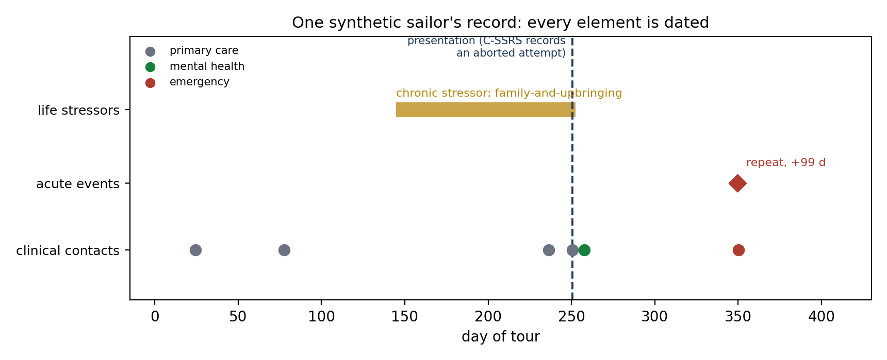
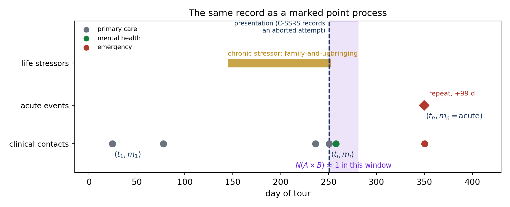
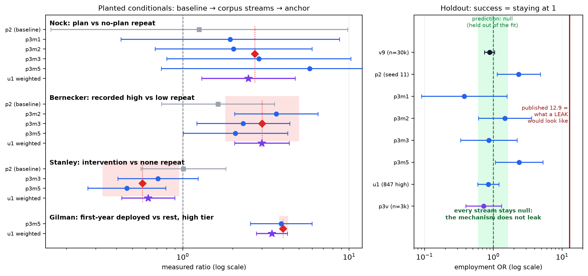
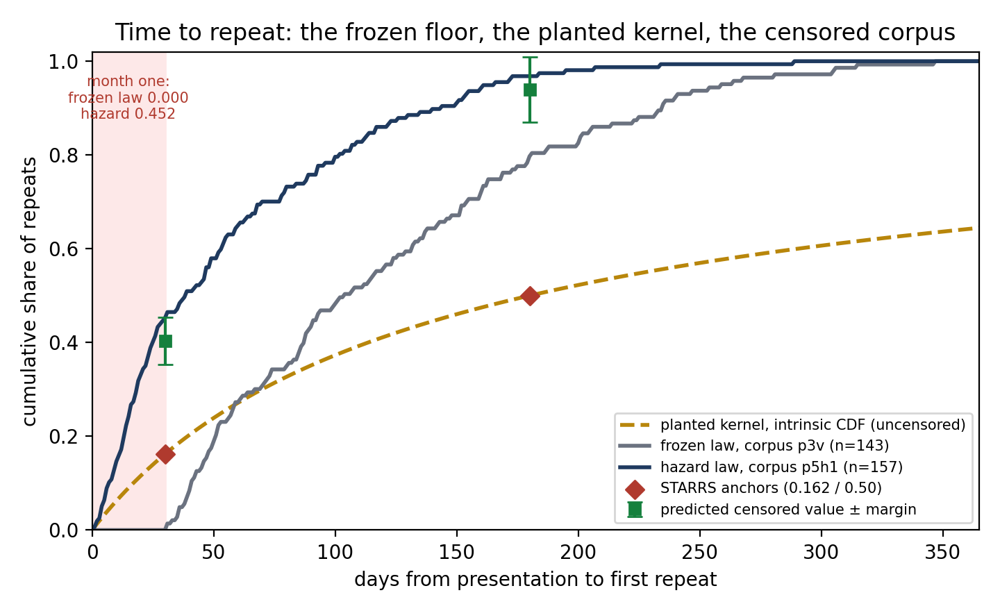
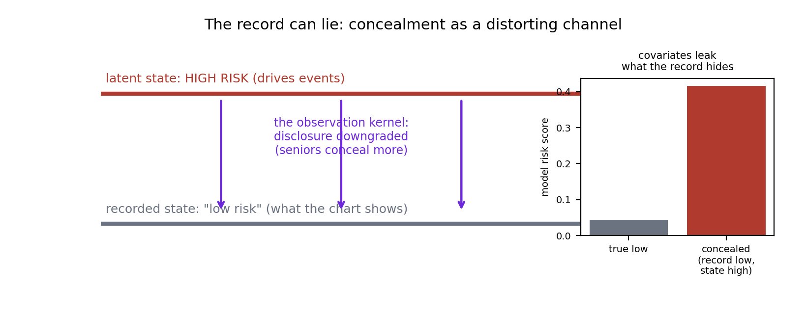
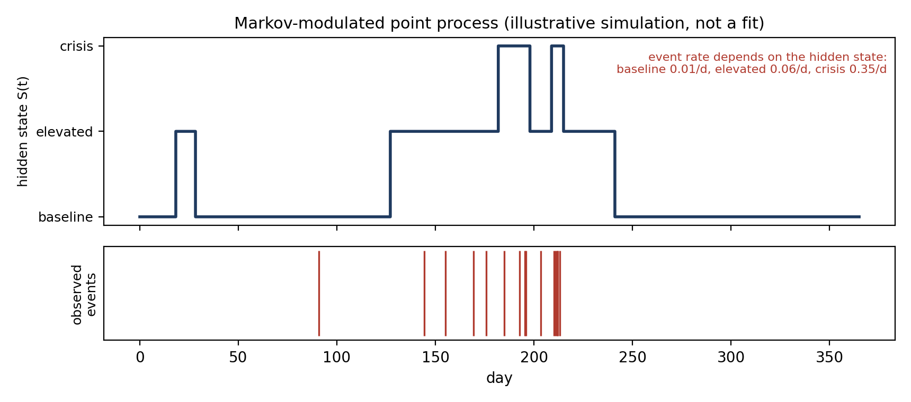
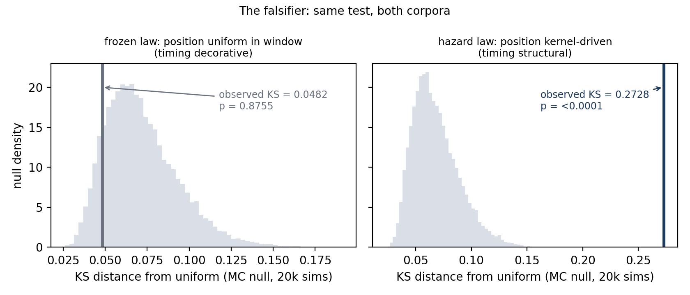

## One sailor, one record {.smaller}

[Start concrete: a single generated record]{.kicker}



This is one synthetic sailor from the current corpus. A chronic family stressor builds for three and a half months. Routine care ticks along. At day 250 the sailor presents, and the C-SSRS records an aborted attempt. A mental-health follow-up happens. Ninety-nine days later, a second acute event, and an emergency contact. Every element is dated, typed, and validated. No real sailor appears here; that is the point, and it is what makes everything on the following slides possible.

::: {.notes}
Do not define anything yet; let the room read the timeline. Member 0241 of corpus_out_p5h1: chronic family-and-upbringing stressor days 144 to 252, presentation day 250 (rung BehaviorAborted), repeat at +99 days. Source: corpus_out_p5h1/scenario_0241.ttl via the standard functional reader. One line on synthetic data if asked early: generated into a space the ontology defines, calibrated to published military studies; slide 4 covers it.
:::

## That record is a marked point process {.smaller}

[The formalism, one definition]{.kicker}



A marked point process: a set of timestamped events, each carrying a mark saying what kind of thing it is. That is the whole definition, and the record already is one. Statistics about it are counting functionals: pick a time window, pick a mark set, count the events. Prevalences, rates per person-year, odds ratios, lag quantiles: all are functions of these counts. Anything the record dates can be counted.

::: {.notes}
Same image as slide 1 with notation added, deliberately: the formalism changes nothing about the record, only what can be asked of it. Definition and the "anything the graph dates can be counted" framing: docs/prism-collected-reports.md, Part II.
:::

## Why this formalism: the studies speak it {.smaller}

[The same mathematical object on both sides]{.kicker}

Published military studies state their findings as counting functionals: a prevalence, an odds ratio, a rate per 100,000 person-years, a share within 30 days.

Choosing the MPP representation makes the corpus statistic and the published statistic the same mathematical object. Calibration becomes a solve-then-measure loop: declare the published target, solve the generator parameters, generate, measure from the re-parsed records, compare.

```{=html}
<div class="rlh-eq"><div class="rlh-eqbox study"><div class="lbl">published study</div><div class="val">OR 3.0</div></div><div class="rlh-eqop">=</div><div class="rlh-eqbox fn"><div class="lbl">counting functional</div><div class="val">N(A &times; B)</div></div><div class="rlh-eqop">=</div><div class="rlh-eqbox corpus"><div class="lbl">corpus measurement</div><div class="val">3.169</div></div></div>
```

No bespoke bridge per source. Ten sources are planted this way today.

::: {.notes}
The "why" slide for the entire approach; if the room absorbs one idea, make it this one. Ten anchored sources (MSMR, Na 2018, Nock 2018, Bernecker 2019, Stanley 2018, Gilman 2014, Ribeiro 2017, Carroll 2014, HEDIS FUM, DoDSER; STARRS-LS for timing). Example pair: Bernecker target ratio 3.0, corpus 3.169 (experiments/analysis/p5h1-functionals.json). Source tables: docs/prism-collected-reports.md.
:::

## The synthetic approach in one loop {.smaller}

[Ontology bounds it, sampler draws it, reasoner completes it]{.kicker}

:::: {.columns}

::: {.column width="52%"}
The ontology defines what a scenario may say and which inferences follow. A sampler draws only the free choices. A reasoner completes everything the pattern entails, and validation is an always-pass contract: zero rejections across every corpus, so the corpus distribution is exactly the sampler's law with no hidden conditioning.

Where the loop shows the vocabulary cannot express something needed, the ontology grows additively, which is why it sits inside the loop rather than beside it.
:::

::: {.column width="48%"}

:::

::::

::: {.notes}
Keep short; most of this audience has seen the diagram. The load-bearing phrase is "the corpus law is exactly the sampler's law": it is what makes the calibration argument sound. Zero rejections; delete-a-shape and planted-violation verification. Source: docs/prism-collected-reports.md Part III.
:::

## Proof it works: recover the studies, and the trap stays empty {.smaller}

[Solve, measure, and try to fail]{.kicker}



Every planted mechanism moved from its independence baseline onto its published anchor, measured from the generated records. One published association is deliberately left out of the calibration as a trap: the system is required to find nothing there. It does: 0.879 with interval 0.74 to 1.04 against a published 12.9, and the null has held at every scale since.

::: {.notes}
If the machinery invented associations, the trap is where it would show. The credibility slide; do not rush it. Holdout employment 0.879 [0.74, 1.04] vs published 12.9 (30k); 0.846 [0.593, 1.207] at umbrella precision; 1.05 [0.65, 1.72] on the hazard corpus. Sources: Prototype-Registry (wiki), corpus_out_u1, experiments/analysis/p5h1-functionals.json.
:::

## Timing became real {.smaller}

[From dates on events to a law of events]{.kicker}



Until recently, repeat crises were placed uniformly in the record window, and the first month after a crisis was structurally empty. The published evidence says the opposite: risk peaks immediately and decays slowly, with about one in six repeat events inside the first month and half within six months. Prototype 5 rebuilt the repeat process as a conditional intensity calibrated to that shape. The first month now carries 45 percent of repeats, and a statistical test, itself validated first, proves the timing is structural (p < 0.0001).

::: {.notes}
STARRS anchors 0.162 within 30 d, ~0.50 within 180 d; kernel c = 99.75 d, gamma = 1.672 hitting both exactly; corpus month-one share 0.452 vs frozen law 0.000; falsifier KS 0.273, p < 0.0001 (MC, 20k sims) vs frozen-law p = 0.876. Sources: experiments/analysis/hazard-solve-report.json, p5h1-functionals.json, p5-stage4-verdicts.json. The censored-window subtlety goes in Q&A (compendium Part V); backup B has the falsifier in full.
:::

## The record can lie: the hidden layer {.smaller}

[Latent state versus what the chart shows]{.kicker}



Sailors conceal. The system models a latent risk state that drives events, observed through a distorting channel: disclosures downgraded, more so for seniors, so a record can read low while the state is high. The rates are anchored to Army research on ideation denial, and a DoD probability survey of 14,000 service members confirms the seniority direction. The leak is measurable: a model reading only the surrounding circumstances, never the clean record, scores concealed members at 0.416 against 0.043 for truly low-risk members.

::: {.notes}
This slide motivates hidden-state models; land the phrase "latent state versus recorded state" because slide 8 builds on it. Probe scores 0.416 (concealed) vs 0.043 (true low): corpus_out_u1/answer-key.json, P4-Move-2-Answer-Key. Denial anchor Bernecker 2019 (378.0 vs 124.8 per 100k person-years); survey confirmation PERSEREC 2018, adjusted OR 1.48 [1.11, 1.97].
:::

## A hidden state driving the event rates: the MMPP {.smaller}

[The model is a small, fittable version of the world we built]{.kicker}

:::: {.columns}

::: {.column width="50%"}
A Markov-modulated point process: an unobserved state moves among a few levels, and the event rate depends on the state. Quiet at baseline, thicker when elevated, bursts in crisis.

The mapping to PRISM is exact:

- hidden state: the C-SSRS ladder, which the ontology already declares unassertable from records
- transitions: the ontology's reified state transitions
- event intensities: state-dependent, the prototype-5 machinery generalized
- concealment: the emission channel between state and record

Fits at small sample sizes, carries corpus-derived priors, and outputs risk over time rather than a single score.
:::

::: {.column width="50%"}

:::

::::

::: {.notes}
Keep the math off this slide; the likelihood and generator matrix live in backup A. Illustration parameters (on the figure): event rates 0.01 / 0.06 / 0.35 per day by state. Source: docs/mpp-mmpp-talk/figures.py (simulation, seed 2).
:::

## The exam no one else can give {.smaller}

[Hidden states are unverifiable, except here]{.kicker}

:::: {.columns}

::: {.column width="46%"}
On real data, a hidden state can never be checked: nobody knows the truth. Our corpus knows every member's true latent state, including exactly who concealed.

So the model can be graded on the thing that matters: does its inferred state match the planted truth, including for the sailors whose records lie? No real dataset can administer this exam. Ours can, with margins declared before the run.
:::

::: {.column width="54%"}
```{=html}
<div class="rlh-two"><div class="rlh-panel"><div class="plbl">reality</div><svg viewBox="0 0 305 140" style="width:100%;font-family:ui-monospace,Menlo,monospace"><text x="152" y="16" font-size="11" fill="#555" text-anchor="middle">the record</text><line x1="20" y1="42" x2="285" y2="42" stroke="#bbb" stroke-width="1.5"/><circle cx="55" cy="42" r="5" fill="#14213d"/><circle cx="110" cy="42" r="5" fill="#14213d"/><circle cx="150" cy="42" r="5" fill="#14213d"/><circle cx="235" cy="42" r="5" fill="#14213d"/><text x="152" y="74" font-size="11" fill="#555" text-anchor="middle">hidden state</text><rect x="20" y="82" width="265" height="46" rx="4" fill="#ededed" stroke="#ccc"/><text x="152" y="115" font-size="34" fill="#a13a30" text-anchor="middle" font-weight="700">?</text></svg><div class="pnote">the hidden state can never be checked</div></div><div class="rlh-panel ours"><div class="plbl">our corpus</div><svg viewBox="0 0 305 140" style="width:100%;font-family:ui-monospace,Menlo,monospace"><text x="152" y="16" font-size="11" fill="#555" text-anchor="middle">the record</text><line x1="20" y1="42" x2="285" y2="42" stroke="#bbb" stroke-width="1.5"/><circle cx="55" cy="42" r="5" fill="#14213d"/><circle cx="110" cy="42" r="5" fill="#14213d"/><circle cx="150" cy="42" r="5" fill="#14213d"/><circle cx="235" cy="42" r="5" fill="#14213d"/><text x="152" y="74" font-size="11" fill="#555" text-anchor="middle">hidden state (planted, known)</text><rect x="20" y="82" width="95" height="46" fill="#9aa1ad"/><rect x="115" y="82" width="95" height="46" fill="#9a6626"/><rect x="210" y="82" width="75" height="46" fill="#a13a30"/><text x="152" y="110" font-size="11" fill="#fff" text-anchor="middle">baseline / elevated / crisis</text></svg><div class="pnote"><span style="color:#2c7a54;font-weight:700">&check;</span> grade the model against the truth</div></div></div>
```
:::

::::

::: {.notes}
The deck's peak claim and the strongest argument that synthetic-first changes what is possible, not just what is convenient. Precedent that grading against planted truth works: the answer-key probe recovered 8 of 9 planted coefficients with a clean label-shuffle null (P4-Move-2-Answer-Key, corpus_out_u1/answer-key.json).
:::

## Where the MMPP sits: one rung of a measured ladder {.smaller}

[The architecture is a measurement result, not a preference]{.kicker}

Candidates, simplest first. Every candidate takes the same exam on the synthetic corpus: recover the planted structure, hold the null, get the rare groups right, flag the concealers, stay calibrated. Margins declared before any run.

```{=html}
<div class="rlh-arch"><div class="rlh-cands"><div class="rlh-cand">Hazard regression<span>auditable baseline</span></div><div class="rlh-cand">Gradient-boosted trees<span>interactions, explainable</span></div><div class="rlh-cand hl">Markov-modulated point process<span>the hidden-state candidate</span></div><div class="rlh-cand">Event-sequence transformer<span>pretrain synthetic, fine-tune real</span></div><div class="rlh-cand">Relational GNN (R-GCN)<span>if unit structure demands it</span></div></div><div class="rlh-arrow">&rarr;</div><div class="rlh-exam">the exam<span>synthetic corpus, known ground truth</span></div><div class="rlh-arrow">&rarr;</div><div class="rlh-win">winner + score<span>per pre-declared margins</span></div></div>
```

::: {.notes}
Lands the GCN conversation graciously: it is on the ladder as R-GCN (typed edges make the relational variant the correct form) and takes the same exam as everything else. Exam criteria trace to the corpus validation machinery (TOST margins in derivegen/tost.py; falsifier in derivegen/p5_stage4.py).
:::

## Backup slides {.center}

## Backup: MMPP mechanics for the statistician {.smaller}

[The generator matrix and the likelihood]{.kicker}

Hidden state S(t): a continuous-time Markov chain with generator Q, transition rates covariate-modulated (the calibrated mechanisms enter here). Events of type k arrive at rate lambda_k(S). The likelihood over a record is a product of matrix exponentials interleaved with mark-intensity matrices: exact, cheap at 3 to 5 states, no simulation needed to fit.

Dwell times are phase-type, which approximate any positive distribution, including the heavy-tailed kernel prototype 5 planted, so the family can represent the law we generate from.

::: {.notes}
Only shown on request. Kernel being approximated: c = 99.75 d, gamma = 1.672. Source: derivegen/hazard-params.json.
:::

## Backup: the falsifier, in full {.smaller}

[Proof the timing is structural]{.kicker}



The same uniformity test on both corpora, its power proven first (false-positive rate 4.9 percent at nominal 5; power 1.00 on kernel draws): the frozen law sits inside its null (KS 0.048, p 0.876), the hazard law far outside it (KS 0.273, p < 0.0001).

::: {.notes}
Pairs with slide 6 if the room wants the evidence rather than the summary. Source: experiments/analysis/p5-stage4-verdicts.json.
:::
